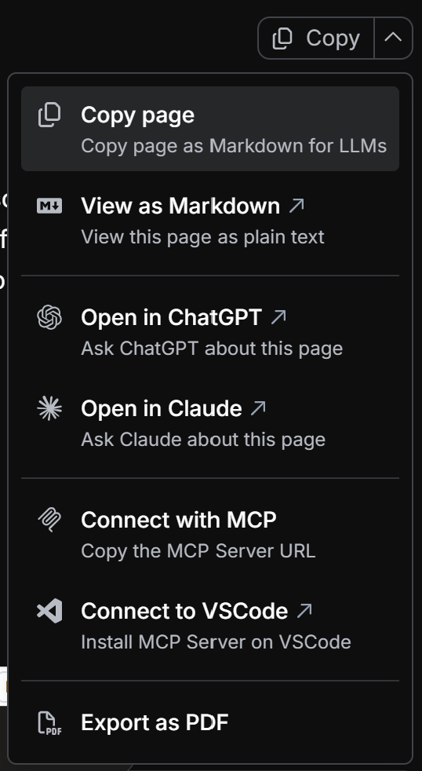

# Using Navixy documentation with AI


{% column width="41.66666666666667%" %}
Every page in the Navixy docs includes built-in shortcuts for working with AI assistants. Use them to copy content, open pages directly in ChatGPT or Claude, or connect the docs directly to your AI tools through MCP.


{% column width="58.33333333333333%" %}
<figure><figcaption></figcaption></figure>



## Built-in page shortcuts

| Shortcut                  | What it does                                      | When to use it                                                                        |
| ------------------------- | ------------------------------------------------- | ------------------------------------------------------------------------------------- |
| **Copy page**             | Copies the full page as Markdown                  | Paste full context into any AI assistant                                              |
| **View as Markdown**      | Opens the page as plain text in a new tab         | Inspect the raw source or copy specific sections manually                             |
| **Copy** (on code blocks) | Copies a code block directly                      | Use for `curl` commands, JSON payloads, and config snippets to avoid selection errors |
| **Open in ChatGPT**       | Opens the page in ChatGPT with content pre-loaded | Ask questions or summarize without pasting anything                                   |
| **Open in Claude**        | Opens the page in Claude with content pre-loaded  | Ask questions or summarize without pasting anything                                   |
| **Export as PDF**         | Downloads the page as a PDF                       | Save a snapshot for offline use or share outside the docs                             |

## Using Open in ChatGPT and Open in Claude

Both shortcuts send the current page as context automatically. You can start prompting immediately without copying or pasting. This is useful when you want a quick answer about a specific page without switching tools manually.



**Good prompts to start with:**

* Summarize this page before I read it in full.
* Turn this into a checklist of prerequisites.
* Generate edge cases and test ideas from this reference.
* Explain what \[parameter] does and when I'd change it.



**Getting better output:**

Add a constraint to shape the response. Ask for "steps only", "return JSON", or "assumptions first". If the page is long, specify which section you want the assistant to focus on.



## Connecting the MCP server to your AI tools

The page shortcuts above work well when you already have the right page open. MCP (Model Context Protocol) goes further: it lets your AI tool search and retrieve any page from the Navixy docs on demand, without you needing to find and open the page first. This is especially useful during active development, when you're moving across multiple API references, device configurations, and integration guides in a single session.

Once connected, your AI tool retrieves answers directly from published documentation and can link to the specific sections it used.

## MCP endpoint

The MCP server is public and requires no authentication:

```
https://navixy.com/docs/~gitbook/mcp
```

You can also copy this URL directly from the **Connect with MCP** option in the page shortcuts menu.

## How to connect Documentation MCP

Use the configuration below for most common tools. MCP works with any client that supports `mcpServers` configuration.




See the [official Claude documentation](https://code.claude.com/docs/en/mcp) for the latest information on using MCPs with Claude.


1. In Claude, go to **Settings** and select **Developer**.
2. Select **Edit Config** to open `claude_desktop_config.json`, then add the following:

```json
{
  "mcpServers": {
    "navixy-docs": {
      "command": "npx",
      "args": [
        "mcp-remote",
        "https://navixy.com/docs/~gitbook/mcp"
      ]
    }
  }
}
```

3. Quit Claude completely and start it again. A window reload is not enough.




See the [official Cursor documentation](https://cursor.com/docs/mcp) for the latest information on using MCPs with Cursor.


1\. Go to **Settings**, open the **MCP** tab, and select **Add new global MCP server**. This opens `~/.cursor/mcp.json`. For a project-scoped setup, create or edit `.cursor/mcp.json` at the root of your project instead.

2. Paste the following into the file:

```json
{
  "mcpServers": {
    "navixy-docs": {
      "command": "npx",
      "args": [
        "mcp-remote",
        "https://navixy.com/docs/~gitbook/mcp"
      ]
    }
  }
}
```

3. Quit Cursor completely and start it again. A window reload is not enough.




See the [official VS Code documentation](https://code.visualstudio.com/docs/copilot/customization/mcp-servers) for the latest information on using MCPs with VS Code.


If you use VS Code, this is the fastest setup path. Select **Connect to VSCode** from the page shortcuts menu. This opens a prompt to install the MCP server directly into your VS Code environment without manual configuration.

1. Open VS Code and go to the settings for your AI assistant extension.

* If the extension supports `mcpServers` configuration, paste:

```json
{
  "mcpServers": {
    "navixy-docs": {
      "command": "npx",
      "args": [
        "mcp-remote",
        "https://navixy.com/docs/~gitbook/mcp"
      ]
    }
  }
}
```

* If the extension supports direct HTTP MCP endpoints, use the URL instead:

```
https://www.navixy.com/docs/~gitbook/mcp
```

Use the method your extension documents.

2. Quit VS Code completely and start it again.



If your tool supports MCP with a local command, paste the following configuration:

```json
{
  "mcpServers": {
    "navixy-docs": {
      "command": "npx",
      "args": [
        "mcp-remote",
        "https://navixy.com/docs/~gitbook/mcp"
      ]
    }
  }
}
```

If it supports MCP over HTTP directly, use the endpoint URL instead:

```
https://www.navixy.com/docs/~gitbook/mcp
```

In both cases, restart the tool fully after adding the server.



## Validate the MCP connection

After setup, run this prompt to confirm the server is responding:

```
Use the docs MCP server navixy-docs.
What pages cover IoT Logic flows?
List the pages you found and link each one.
```

If the response includes links to specific Navixy doc pages, the connection is working. Once confirmed, you can ask the assistant to fetch any page, find endpoints, or trace a full workflow across multiple doc sections.

