# Microsoft Azure

* [First steps](microsoft-azure.md#first-steps)
* [Basics](microsoft-azure.md#basics)
* [Disks](microsoft-azure.md#disks)
* [Networking](microsoft-azure.md#networking)
* [Virtual machine launch](microsoft-azure.md#virtual-machine-launch)
* [Network settings](microsoft-azure.md#network-settings)
* [Remote access](microsoft-azure.md#remote-access)
* [Navixy platform deployment](microsoft-azure.md#navixy-platform-deployment)

When deploying the Navixy On-premise platform, many customers prefer to choose a cloud-based platform. One of the most common and widely recognized solutions is Microsoft Azure. It is a relatively young, but proven and popular platform that makes it easy to run virtual machines with low effort. At the same time, it doesn't yield to other popular platforms in terms of flexibility of customization, security and fault tolerance. This platform is utilized by many of Navixy's largest On-premise customers.

\[

]\(https://azure.microsoft.com/en-us)

Below are the basic steps to deploy a working virtual machine on which you can install the Navixy On-premise solution. If you need to fine-tune your cloud environment and perform more advanced customizations, please refer to the [Azure documentation](https://learn.microsoft.com/en-us/azure/) on Microsoft website.

## First steps

The first thing you need to do is sign up for Azure. You can proceed with a pay-as-you-go pricing plan, or alternatively, if you are using this cloud solution for the first time, you can start with a free account. If you prefer to try the service for free, you will be granted with a 30-day trial period and $200 credits, so you have enough time and funds to make a decision whether to proceed with Azure or switch to another cloud solution. However, you risk losing your instance after the trial period expires, so you need to convert your instance to business solution with pay-as-you-go plan to continue using the service.

After successfully signing up for an account, you will be redirected to the Azure Portal where you will be presented with a list of available products and services.

Since what you are doing is creating a new server to install the Navixy platform, you need to select **Virtual Machines**.

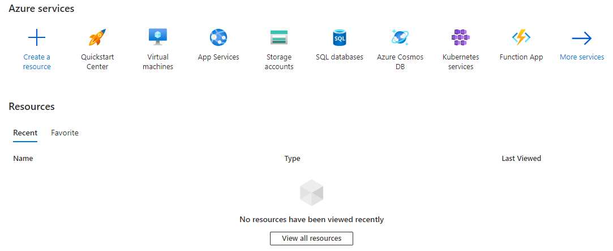

You will be redirected to the Virtual machines menu where you can create a new machine and manage the existing ones (if you already have any).

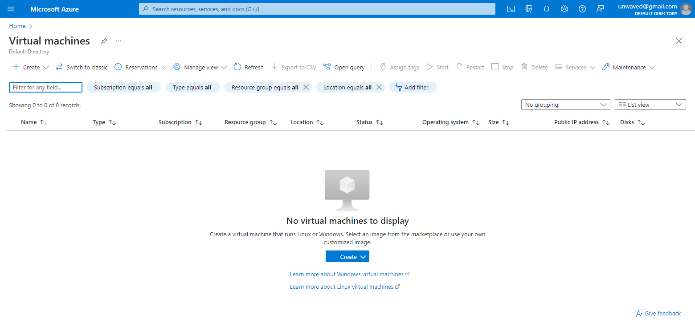

Create your new Azure virtual machine by selecting the appropriate option.

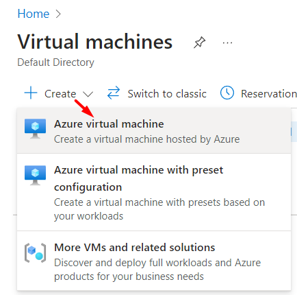

You will be redirected to creation menu where you need to specify all the parameters of your new server.

> \[!INFO] Each option in the following menus is accompanied by ⓘ symbol to provide necessary explanations and references to instructions. If you find it difficult to make a choice, click on this icon and examine the information provided.

> \[!WARNING] Choosing most options directly affects the pricing. Choose options based on your actual needs to avoid additional costs.

## Basics

On a **Basics** tab, you need to select the main parameters of the virtual machine.

* Project Details - this is where you select your subscription (if multiple) and resource group for easy management of your workspace and resources. If you do not specify the respurce group, it will be auto-created based on your machine name.\
  
* Instance details - this is where you specify all the details and features of you future VM:
  * Virtual machine name - any name of your choice identifying your new instance.
  * Region - choose the one that best suits your users in terms of accessibility. Indicates physical location of a data center.
  * Availability options - here you can choose differen high availability solutions provided by Azure. For more information, check [Azure instructions](https://learn.microsoft.com/en-us/azure/virtual-machines/availability).
  * Security type - advanced security features provided by Azure.
  * Image - pre-installed OS that will be deployed to your instance. Ubuntu 20 or 22 recommended.
  * VM architecture - x64 recommended.
  * Run with Azure Spot discount - select **for tests only**, this option is not suitable for product solutions.
  * Size - one of the most important options. It determines the hardware parameters of your server and directly affects performance. You should make a selection based on the planned loads on the server. The selection dramatically affects the pricing.\
    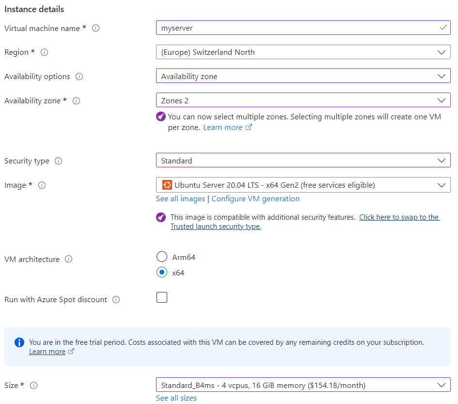
* Administrator account - here you specify the authentication settings on your new server.
  * Authentication type - here you can select between SSH key and password as authentication method. Using SSH key is strongly recommended in terms of security.
  * Username - the administrator user account for your instance. For Linux, this user will be sudoer.
  * SSH public key source - here you can select the source of your public key, and depending on your choice you will need to either generate a new key pair, provide your own public key, or select a previously created key on Azure.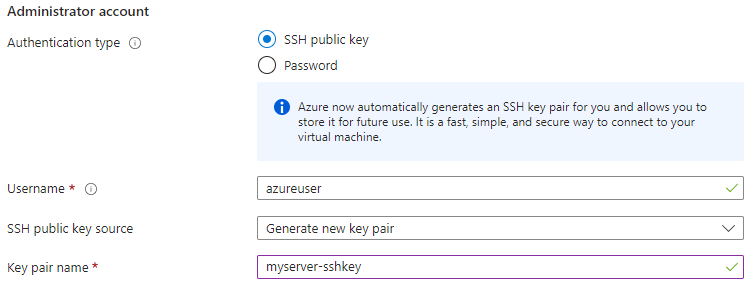
* Inbound port rules - here you select the ports available for external access. Make sure you have port 22 selected for SSH. Ports for connecting trackers and other features of the platform will be configured later on the Networking stage.\
  

## Disks

The second tab of the virtual machine creation menu is **Disks**. This tab is where you manage everything related to disk space.

> \[!INFO] It is highly recommended that you use the SSD disk type for all disks on your server. Using a classic HDD is a bottle neck that significantly reduces performance.

* VM disk encryption - you do not need to configure anything in this section, and Encryption at host is an extra feature available only for specific subscription types.\
  
* OS disk - it is recommended to use a disk capacity larger than the standard one in order to be able to install third-party software and store system logs in the future.\
  
* Data disks - it is strongly recommended to use a dedicated disk to store the database. The disk capacity depends entirely on the planned number of devices. The approximate recommended capacity is specified in the [hardware requirements](../requirements/server-hardware.md) for the platform. Click “Create and attach a new disk”.\
  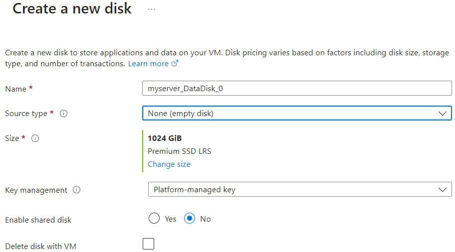 After the disk is created, it will appear in the list of data disks.\
  

## Networking

In the "Network Interface" section, you can leave all the default settings. Azure will create a virtual network, subnet and public IP address for you. However, if you already have any of these previously created, you can choose from the existing ones and not create new ones.

**Note!** Public IP address is mandatory for your server to be accessible from the outside.

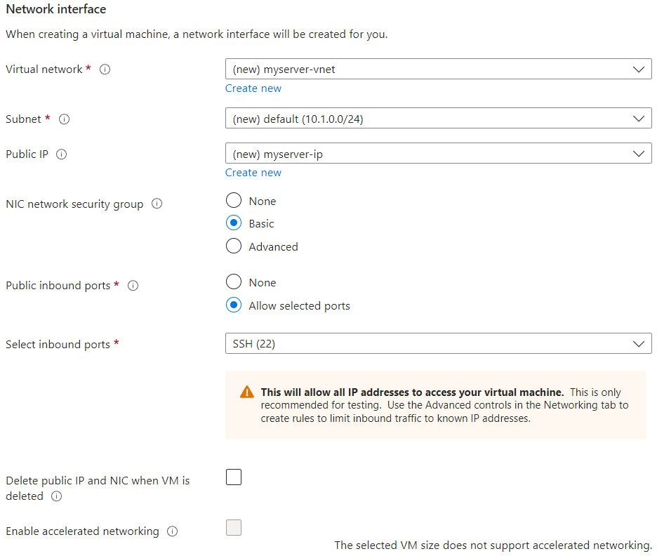

## Virtual machine launch

All other steps in “Create” menu are optional, and you can proceed with default settings.

Click **Review + create**. Azure will take a short time to validate all the settings you specified, and then output the estimated payment amount (per hour) and a summary of all settings.

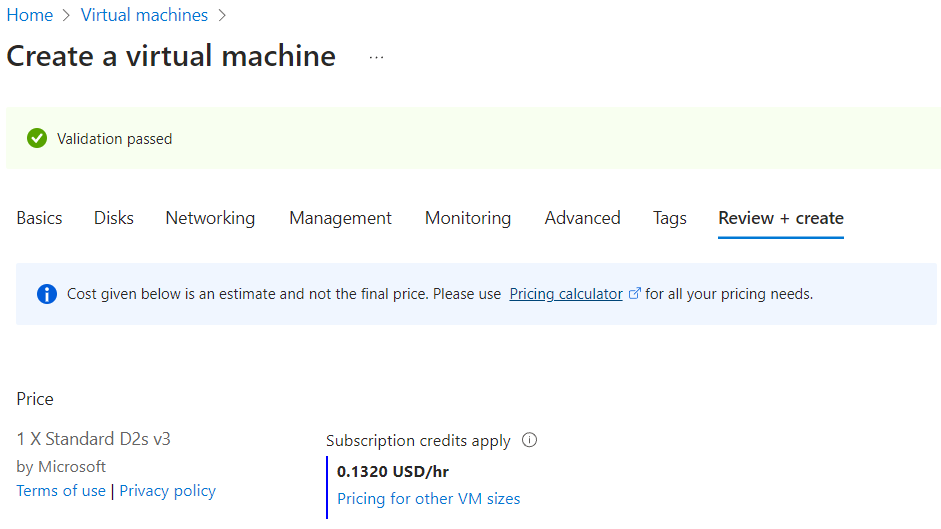

If everything is fine and meets your demands, click **Create**. Azure will initiate your new virtual machine creation.

If you selected "Generate a new key pair" on Basics step, Azure will create SSH keys and prompt you to download the private key. This key is not stored on the cloud platform side, so you need to preserve it on your side.


Next, Azure will start deploying the virtual machine. You will see the progress on your screen.


After a short while, Azure will notify you about successful deployment.

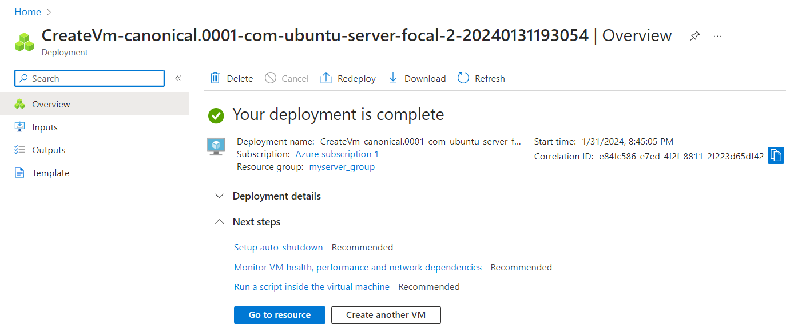

You now have a new virtual machine almost ready to use. Click **Go to resource** to see its details.

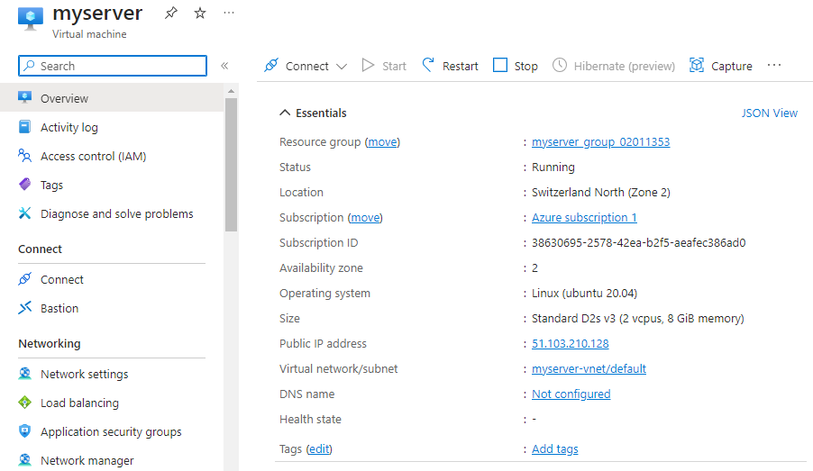

## Network settings

The last step before using the server is to configure the network. You need to open the necessary ports to access the website, to check the license and to connect trackers. The settings are made according to [Network requirements](https://docs.navixy.com/on-premise/network). You only need to open access to the necessary ports - to access the website, to check the license, and to communicate with your trackers. The ports required for particular devices can be found in the [device descriptions](https://www.navixy.com/devices/) on our website.

Open **Network settings** to configure inbound and outbound security rules.

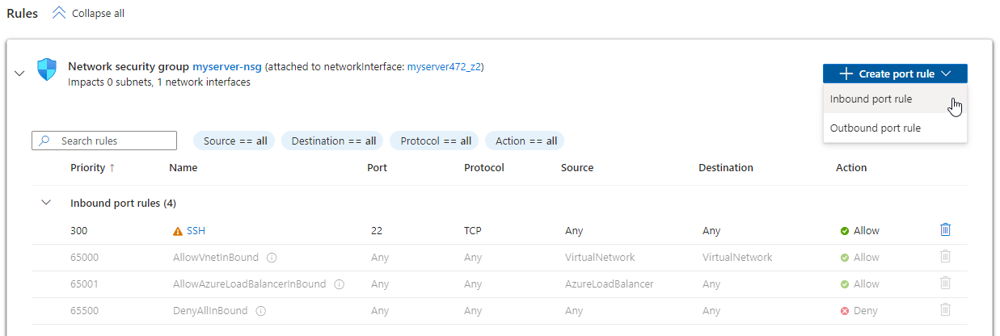

## Remote access

After the rules are created, return to the Overview tab and click Connect.

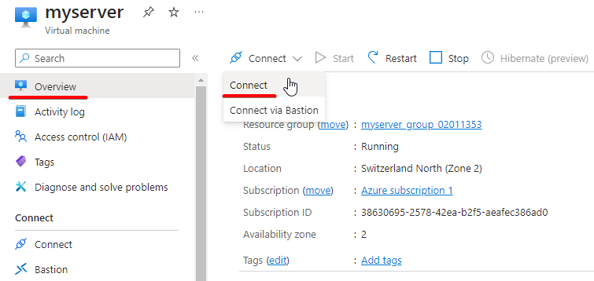

You will find your server’s public IP address.

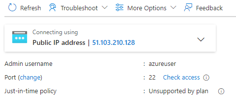

Now you can establish a remote SSH connection to this address. To do it use the admin username (indicated under IP address) and the private key specified for the virtual machine.

On Linux, use the `ssh -i` command to use private key. For example:

```
ssh -i "myserver-sshkey.pem" azureuser@51.103.210.128
```

On Windows, use PuTTY or similar clients. Do not forget to use key. If you have a .pem key (generated by Azure) you need to convert it to .ppk using PuTTYgen.

## Navixy platform deployment

Now you have a working cloud server that you can access remotely.

Proceed to the relevant section of instructions and perform [Navixy On-premise platform installation](https://squaregps.atlassian.net/wiki/spaces/Ponprem/pages/2351038481).
