# Google maps and geocoding

To use Google Maps with Navixy On-premise, you have to obtain valid Google Maps API keys. This documentation page provides a step-by-step guide on how to create Google Maps API keys and configure them for use with the Navixy platform.

The guide will walk you through the process of setting up a Google Cloud Console account, creating a new project, generating the necessary API keys and applying them to your Navixy instance configuration. By following this guide, you will be able to easily integrate Google Maps with Navixy On-premise and take full advantage of the platform's advanced mapping features.

## Creating Google API keys

To create Google API keys for use with the Navixy platform, please follow the guide below. Please note that Google API keys are associated with your account and are subject to Google's API usage policy. For more information, please refer to the links below:

* [Google Maps APIs Terms of Service](https://developers.google.com/maps/terms)
* [Goole Maps FAQ](https://developers.google.com/maps/faq)

### Setting up account and project

1. Navigate to the [Google Cloud Console](https://console.cloud.google.com/projectselector2/apis/dashboard?supportedpurview=project) webpage and log in using your Google account credentials. If you do not have an account, you can create one.
2. API keys are created within a project. If you already have a project, you can choose it from the list. If you do not have any existing projects, click "Create project" to create a new one.
3. Name your project appropriately and click the "Create" button to create a new project


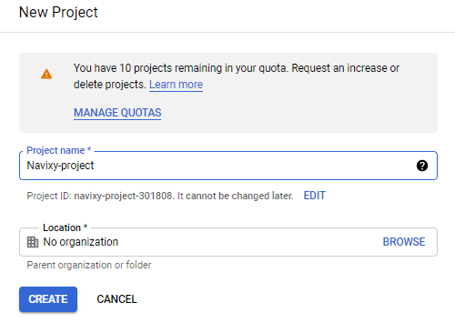

4. Ensure that your newly created project is selected and click “Enable APIs and Services”. You will be taken to Google API library.
5. Type the name of the API you need, select it and click “Enable”. In this case we are adding Maps Javascript API (used for google maps)
6. Repeat the process for APIs you need. Navixy utilizes a total of 5 APIs:

* Google Maps JavaScript API - Google maps in UI
* Google Maps Geocoding API - Geocoding
* Google Maps Geolocation API - LBS point processing
* Google Maps Directions API - Route creation
* Google Static Maps API - Static maps in email


Ensure all enabled APIs are displayed in your dashboard:

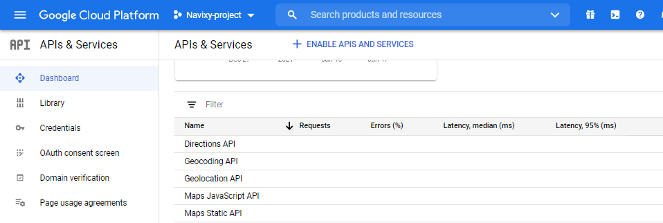

### Generating Google keys

To enable the full range of Navixy functionality, you will need a total of three API keys:

* Key #1 for displaying maps in the user interface
* Key #2 for accessing GIS services (geocoding, routing, and geolocation)
* Key #3 for displaying static Google Maps in email notifications

#### Generating Google key #1 for Maps in UI

1. Go to _Credentials_ tab
2. Press _Create credentials_ and select _API key_
3. Key will be displayed in a new window
4. Press _Restrict key_ to make changes, you will be taken to a setup page
5. Name the key so would be easier to distinguish it from others
6. In _Application restrictions_ select _HTTP referrer_ and specify the domain you use for the platform. E.g [contoso.com/\*](http://contoso.com/*) [gps.contoso.com/\*](http://gps.contoso.com/*)
7. In _API restrictions_ select _Restrict key_ and choose Maps JavaScript API
8. Press _Save_ to apply the changes


#### Generating Google Key #2 for Geocoding, Routing and Geolocation

1. Go to _Credentials_ tab
2. Press _Create credentials_ and select _API key_
3. Key will be displayed in a new window
4. Press _Restrict key_ to make changes, you will be taken to a setup page
5. Name the key so would be easier to distinguish it from others
6. In _Application restrictions_ select _IP adresses_ and specify public IP of your server
7. &#x20;In _API restrictions_ select _Restrict key_ and choose Maps Geocoding API, Maps Geolocation API, Maps Directions API
8. Press _Save_ to apply the changes

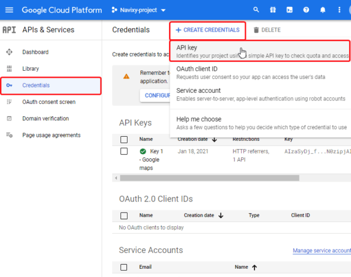

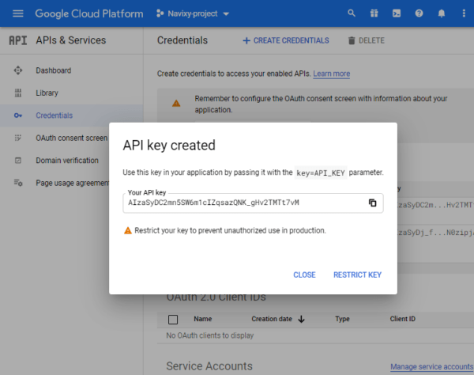

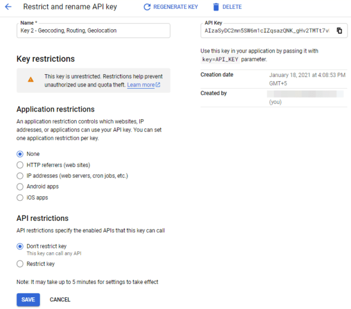

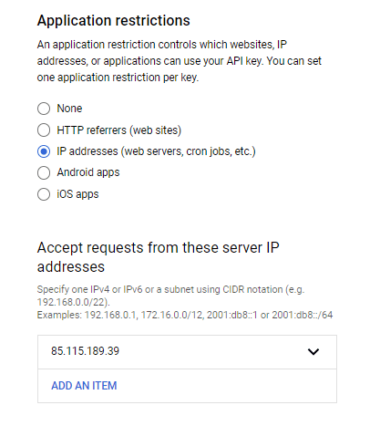

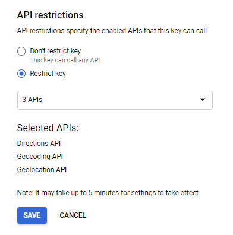

#### **Generating Google Key #3 for Static maps in email notifications**

1. Go to _Credentials_ tab
2. Press _Create credentials_ and select _API key_
3. Key will be displayed in a new window
4. Press _Restrict key_ to make changes, you will be taken to a setup page
5. Name the key so would be easier to distinguish it from others
6. In _Application restrictions_ select _HTTP referrer_ and specify the domain you use for the platform. E.g [contoso.com/\*](http://contoso.com/*) [gps.contoso.com/\*](http://gps.contoso.com/*)
7. In _API restrictions_ select _Restrict key_ and choose Maps Static API
8. Press _Save_ to apply the changes

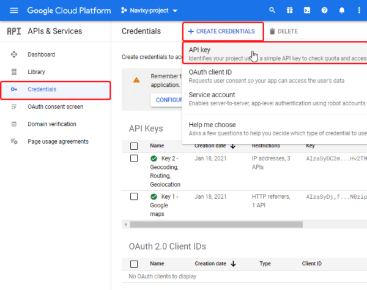


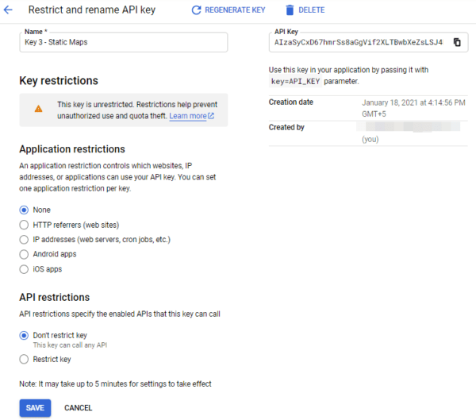

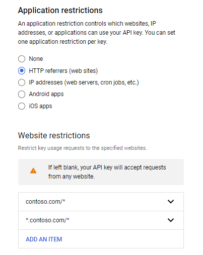

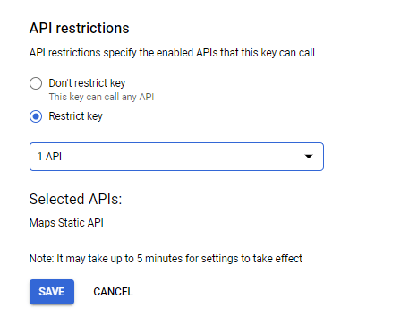

For the Google key #3 you will also need an _URL signing secret_. Please refer to the guide below to generate a URL signing secret for your Static maps key:

1. Go to the _Dashboard_
2. Scroll down to list of APIs and click on Maps Static API
3. You will be forwarded to a new page.
4. Click on _Credentials_ menu
5. Check that Maps Static API is selected
6. Scroll down to URL signing secret to see your current one.


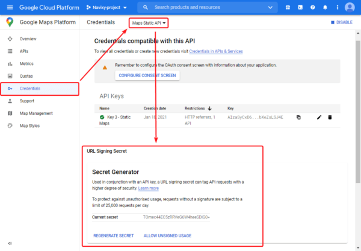

## Applying Google Maps API keys

As described above, we recommend generating three Google Maps API keys and assign the following Google API services to them:

**Google Maps API key #1** – should be restricted by HTTP referrer, which is your user interface URL:

* Google Maps JavaScript API
* Google Street View Image API

**Google Maps API key #2** – should be restricted by server IP:

* Google Maps Geocoding API
* Google Maps Geolocation API
* Google Maps Directions API

**Google Maps API key #3** – should be restricted by HTTP referrer, which is your user interface URL:

* Google Static Maps API (you also need _URL signing secret_ for this key)

All three keys will be stored in the database. They should be inserted into table **dealer\_service\_credentials** of **google** DB with the following query:


```
INSERT INTO dealer_service_credentials (dealer_id, service_type,credentials) VALUES (1, 'google', '{"maps_js_api_key":"FIRST_KEY_HERE","server_api_key":"SECOND_KEY_HERE","static_map_api_key":"THIRD_KEY_HERE", "static_map_crypto_key":"URL_SIGNING_SECRET_HERE"}';
```


If you don't want to use Google Maps for certain services, you can omit the keys that you don't need from the query. For example, use this query to apply the third key only:


```
INSERT INTO google.dealer_service_credentials (dealer_id, service_type, credentials) VALUES (1, "google", '{"static_map_api_key":"THIRD_KEY_HERE", "static_map_crypto_key":"URL_SIGNING_SECRET_HERE"}');
```


**Restart the services**

`restart-navixy`
