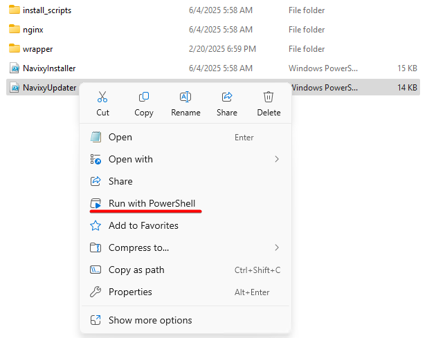
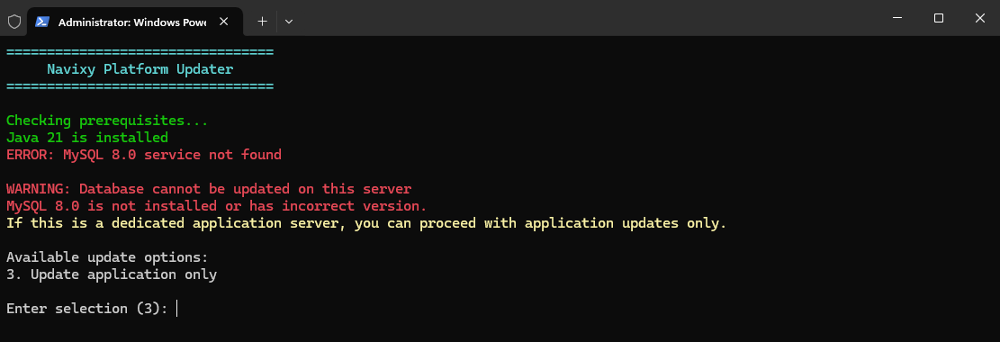

# Automatic update - Windows

This guide describes Navixy On-Premise platform update using automated script. This script is designed for Windows servers that are already running Navixy platform.

For the initial installation of the platform, refer to the [installation instructions](../../advanced-installation/windows-installation/windows-installation.md).

For Linux servers, please refer to the [Easy installation](../../easy-installation.md) instruction or to [advanced installation section for Ubuntu](../../advanced-installation/ubuntu-20/).

## Prerequisites for update

Before starting the update, please make sure that your system meets the following prerequisites:

1. **Java Development Kit 21** \
   Starting from March 2025, the platform deprecated version 17 and older.
2. **MySQL 8.0** \
   Starting from March 2024, the platform deprecated MySQL 5.7. This version reached its EOL and is no longer supported.

Non-compliance with the required software will result in the new version of the platform being unable to start. However, a preliminary update of prerequisites will keep the platform functional.


The update script operation starts with checking the system environment. If any of the required software is missing or has an incompatible version, the script will display a warning.


## Navixy package

Navixy On-premise distribution package is always available for download at the direct link:

[⬇️ Download Navixy package](https://get.navixy.com/latest)


Your browser may warn you that the download is not secure - this is normal for tar.gz archives. Ignore the warning and download the archive safely.


Unpack the newly downloaded archive and navigate to the folder named `\navixy-package`. This will be the main folder this instruction works with.

## Update script

Proceed to `\navixy-package\windows` folder and run the `NavixyUpdater.ps1` script with Powershell:

This will initiate the update process. The script will check the environment, and if all the required software is up to date, you will see the installation type selection menu:

If Java and MySQL of the required versions are not detected, the script will terminate.

If one of the required software is detected, the script will continue execution, but will show a warning:

You can continue the installation in the following cases:

* If MySQL is not detected, but you are updating the application server.
* If Java is not detected, but you are updating the database server.

If you are updating all-in-one server with all components, stop the update and check the versions of the installed software. If they are of the required versions, reinstall or upgrade them.

## Update process

After selecting the desired option, the script will start the update process. If all components or the database are being updated, you will need to enter a login and password to access the database.

The update process is fully automated, all you need to do is keep an eye on the screen and wait.

After a successful update, the script will notify you of completion and terminate.

## Final steps

When the update is complete, check that the platform admin panel and user accounts are available and everything is working correctly. If you were expecting any specific innovations, check if they are present among the platform functionality.

If you find any issues, proceed to the troubleshooting section or contact technical support.
