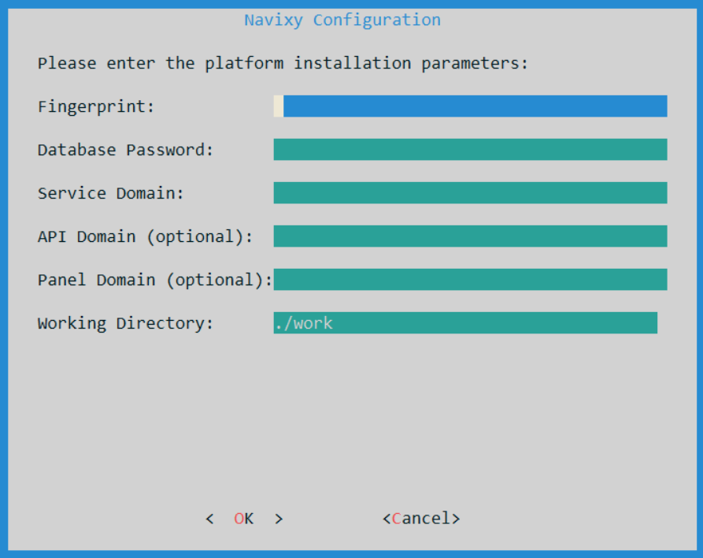
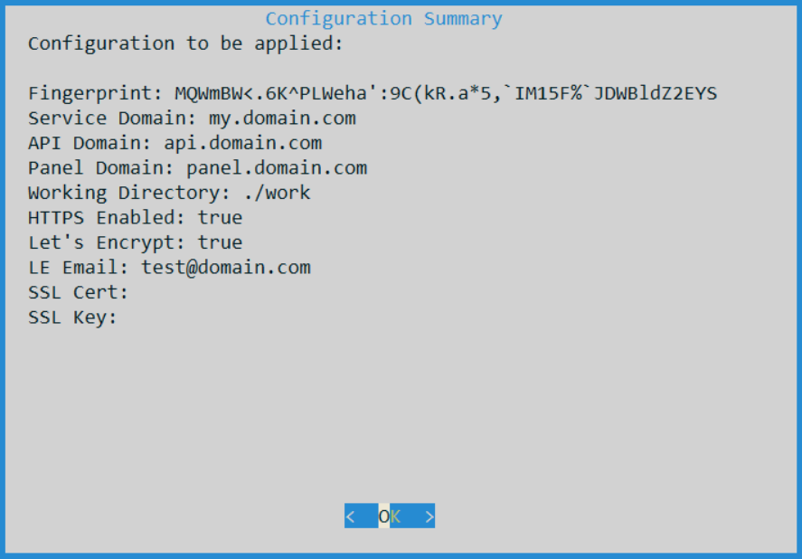
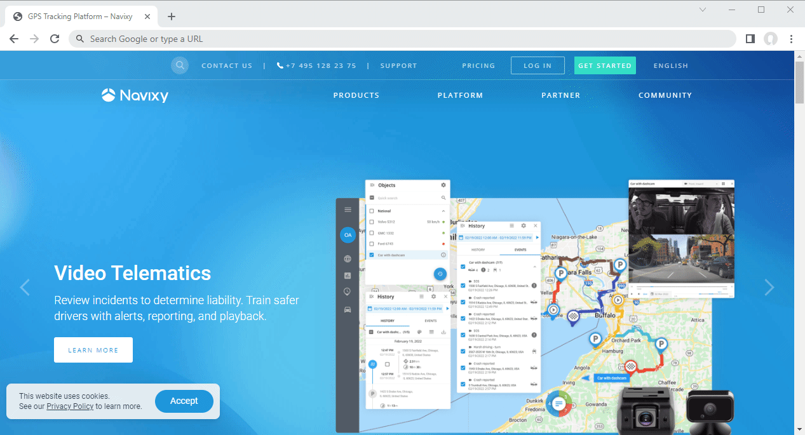

# Easy installation

This guide will help you quickly set up Navixy On-premise platform on your own server. The process is straightforward and requires minimal manual configuration.

Before you start, check the [Requirements](../requirements.md) section and make sure your server and infrastructure are ready to deploy Navixy platform.

> [!INFO]
> This type of deployment uses Docker as the primary means of deployment. However, the process is fully automated, so you don't need to be proficient in this software, just a basic knowledge of Linux administration.

This guide will walk you through the step-by-step process of installing the Navixy Easy solution on a Linux server. While we highly recommend Ubuntu for its user-friendly operation and administration, rest assured that any up-to-date Linux distribution is suitable for the installation. Feel free to choose the one that suits your needs best.

Please note that the installation requires elevated privileges. In the instructions provided below, the installation is demonstrated using the `root` user. Alternatively, you can also perform the installation using the `sudo` command.

## Step 1 - Install Docker and download Navixy build

To prepare for the deployment of the Navixy platform, you can follow these commands.

The initial command will download the installation script for the Navixy On-premise platform to your server. The subsequent command will execute this script, which will install Docker and fetch the most up-to-date version of the platform distribution package.

```
curl -fsSL https://get.navixy.com -o install-navixy.sh
sh ./install-navixy.sh
```

> [!INFO]
> The script verifies whether Docker is installed on the server. If Docker is detected, the script will display a message about it and take a pause. This is done to prevent inadvertent deployment on servers where Navixy is already installed.
> If the installed Docker is not related to Navixy, just wait a while and the script will continue its operation.

You will see the installation process of Docker, after which the platform package distribution will be unpacked.


After the script completes its work, it will report success and display a link leading to the current page.

Further, you need to specify license key and necessary settings, and then deploy the platform as described in the next section.

## Step 2 - Deploy Navixy platform

Our configuration script makes this step effortless.

Open the newly created *“navixy-package”* directory and execute the `easy-configure.sh` script:

```
cd ./navixy-package
./easy-configure.sh
```

The script will run a wizard where you need to specify the necessary parameters of your new Navixy On-premise instance:



- **Fingerprint** \- license key. Unique set of characters received from Navixy technical team. Can be used only once.
- **Database Password** - a password for database user. You can make up any password of your choice or auto-generate it with some third-party tools.
- **Service Domain**\- basic domain of your platform. It will be to access user accounts and to register tracking hardware.
- **API Domain** - domain of API service (**optional** \- not required for one domain installations).
- **Panel Domain** - domain of administrator panel (**optional** \- not required for one domain installations).
- **Working directory** - service directory used to store configuration files, log files and other system files.
  - The default directory is `.../navixy-package/work/` (inside the unpacked Navixy distributive). If not changed, the platform will be installed to this directory.

> [!INFO]
> If optional domain names for API and panel are not specified, these services will be accessible as subdirectories of the service domain, e.g.:
> - `domain.com/api`
> - `domain.com/panel`

After specifying all the parameters, you will be prompted to choose whether you want to enable HTTPS to make your website SSL-protected, or if you do not need this option.


If you answer Yes, you will be prompted to choose to install a free Let's Encrypt certificate or your own SSL certificate from a third-party authority. Select the desired option and follow the installer prompts.


After all settings are done, you will see the configuration summary



Confirm the settings and the script will deploy the Navixy On-premise platform with your parameters. In a short time, the platform will be installed, launched and fully ready to use.

## Step 3 - Check the platform operation

Open your web browser and navigate to the admin panel. The access link will depend on the parameters you specified during the installation. It will be one of the following:

- Panel domain (e.g. `panel.domain.com`)
- Subdirectory of service domain (e.g. `domain.com/panel`)

The default login and password are `admin`.



If you have successfully logged into the platform, change your admin password in *Service preferences* menu.

**The installation process is now complete.**

If you require further guidance on using and configuring the platform, or if you encounter any technical issues, please don't hesitate to reach out for assistance contacting [Navixy technical support](mailto:support@navixy.com).