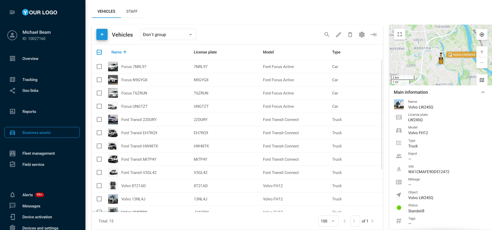

# Vehículos

Los vehículos son un elemento fundamental dentro de los activos operativos, ya que suelen estar equipados con un dispositivo GPS, lo que permite supervisar diversos aspectos como la ubicación, el consumo de combustible, los programas de mantenimiento y el rendimiento general de la flota. Esto facilita operaciones más eficientes y una mejor toma de decisiones.

## Lista de vehículos

La pestaña **Vehículos** ofrece una vista detallada de todos los vehículos de su flota que forman parte de los activos operativos. La información se presenta en formato de tabla, complementada por una barra lateral en el lado derecho de la pantalla. Desde allí, puede agregar o editar los datos del vehículo, asociarlos a depósitos específicos y vincularlos con dispositivos GPS activados.

### Agregar un vehículo

Para agregar un nuevo vehículo, siga estos pasos:

1. Haga clic en  .
2. Complete los campos obligatorios:

* **Nombre**
* **Dispositivo GPS asignado** (denominado **Objeto**)
* **Matrícula**
* **Tipo**

3. Rellene los campos opcionales disponibles en las cuatro pestañas descritas a continuación.
4. Opcionalmente, seleccione un ícono o cargue una foto del vehículo para facilitar su identificación.
5. Haga clic en **Guardar**.

El perfil del vehículo contiene los siguientes campos distribuidos en cuatro pestañas principales:

* **Principal**: Información esencial del vehículo, incluyendo el Objeto (dispositivo GPS) asignado, matrícula, modelo, color, depósito, VIN, tipo y subtipo, etiquetas y notas relevantes.
* **Especificación**: Detalles técnicos como dimensiones, capacidad de carga y pasajeros, configuración de ejes, velocidad permitida, disponibilidad de remolque, números de chasis y bastidor, y año de fabricación.
* **Combustible**: Información relacionada con el combustible: tipo, grado y coste, capacidad del tanque y tasa normal de consumo.
* **Seguro**: Detalles del seguro del vehículo, como número de póliza y fecha de vencimiento.

Casos de uso del consumo de combustible

En Navixy, la configuración del **consumo de combustible** en el perfil del vehículo es un paso clave para estimar el uso de combustible en toda su flota basándose en la distancia recorrida, sin depender de datos OBDII o sensores de combustible especializados.

Este parámetro suele expresarse en litros por cada 100 kilómetros (L/100 km) o en millas por galón (MPG), según la preferencia regional.

Para obtener más información sobre la medición de combustible en Navixy, consulte [Sensor de nivel de combustible](../../dispositivos-y-ajustes/sensores-de-vehculos/sensores-de-vehculos/sensor-de-medicin/sensor-de-nivel-de-combustible.md).

* **Estimación del consumo de combustible**:\
  El valor ingresado como consumo de combustible sirve como base para estimar el uso del vehículo en función de la distancia recorrida. Por ejemplo, si un vehículo está configurado para consumir 10 L/100 km, el sistema estimará un consumo de 10 litros por cada 100 kilómetros.
* **Cálculo del coste estimado de combustible**:\
  Navixy utiliza la tasa de consumo establecida junto con el kilometraje registrado para calcular el coste esperado de combustible. Al introducir el precio por litro o galón, el sistema puede generar informes que estimen cuánto debería estar gastando, ayudando así en la planificación presupuestaria.
* **Comparación con datos reales**:\
  Al combinarse con sensores de nivel de combustible, el sistema puede comparar el consumo estimado con el uso real. Esta comparación permite detectar discrepancias por fraude, conducción ineficiente o problemas mecánicos.

Complete los campos relevantes y haga clic en **Guardar**.

## Importar vehículos

Si gestiona una flota grande y necesita crear perfiles para múltiples vehículos, puede importar toda la información a la vez desde un archivo Excel (XLS, XLSX o CSV), en lugar de hacerlo uno por uno.

### Para importar perfiles de vehículos:

1. Abra la pestaña **Vehículos** en la página de **Activos operativos**, sitúe el cursor sobre el ícono  y haga clic en  .
2. En la ventana de importación encontrará un archivo de ejemplo en formato XLS que puede usar como plantilla.
3. Asegúrese de que las columnas del archivo coincidan con los campos del sistema de seguimiento, ya sea antes o durante el proceso de importación.
4. En el archivo, introduzca información esencial como nombre, matrícula, modelo, etc.
5. Una vez completo el formulario, guarde el archivo en su ordenador.

### Para cargar el archivo en la plataforma:

1. Haga clic en el botón **Explorar**, seleccione su archivo y haga clic en **Continuar**.
2. Si el archivo incluye encabezados, asegúrese de marcar la opción **Usar encabezados de archivos**.
3. Revise los encabezados. Si todo es correcto, haga clic nuevamente en **Continuar**.
4. Si hay errores, el sistema le pedirá que los corrija. Los campos obligatorios vacíos no serán importados.
5. Una vez verificada la información, la importación se completará y los nuevos perfiles aparecerán en la lista de **Vehículos**.
