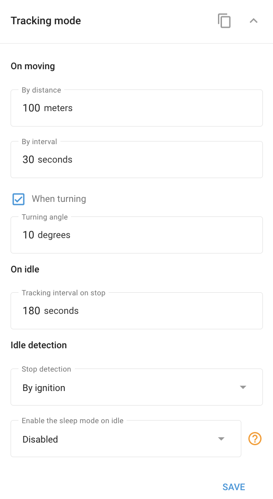

# Widget de modo de seguimiento

El widget de **Modo de seguimiento** le permite configurar la transmisión de datos y los modos de funcionamiento de sus dispositivos de seguimiento GPS. Los ajustes disponibles en este panel pueden variar en función del modelo del rastreador, sus principios de funcionamiento y su funcionalidad.

#### Configuración de los ajustes del modo de seguimiento

Para ajustar la configuración del modo de seguimiento, abra el panel y configure los siguientes parámetros:

* **Por distancia:** La transmisión de datos se produce cuando el aparato se ha desplazado una distancia determinada.
* **Por tiempo:** La transmisión de datos se produce en intervalos de tiempo especificados.
* **Girando:** La transmisión de datos se produce cuando el aparato gira un ángulo determinado.

Los datos se transmitirán cuando se cumpla al menos una de estas condiciones, lo que garantiza actualizaciones puntuales y precisas sobre el estado y la ubicación del dispositivo.
