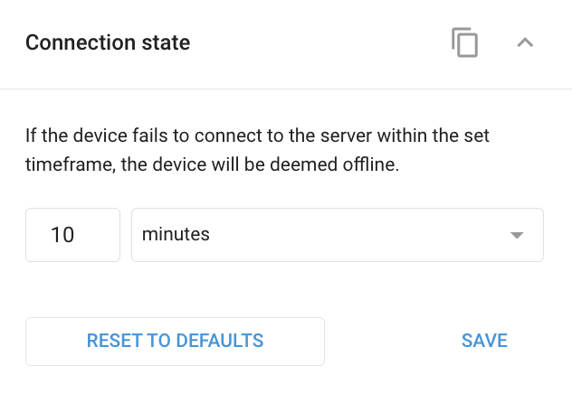

# Widget de estado de la conexión

La configuración del **estado de la conexión** permite definir el intervalo de tiempo tras el cual un dispositivo GPS se considera desconectado si deja de transmitir datos.

Es posible que tengas que ajustar esta configuración para los dispositivos que comunican datos con menos frecuencia. Esto evita que se marquen como desconectados y garantiza que su estado se muestre con precisión, especialmente en el caso de los dispositivos en modo de ahorro de energía.

> \[!INFO] Puede controlar el [Estado de la conexión](https://squaregps.atlassian.net/wiki/spaces/USERDOCS/pages/2732197253/Connection+status) de sus dispositivos GPS, por ejemplo, en el [Lista de o](../seguimiento/lista-de-objetos/)[bjet](../../../wiki/pages/createpage.action)[o](../seguimiento/lista-de-objetos/)[s](../../../wiki/pages/createpage.action)-en la aplicación Seguimiento de la interfaz web y la aplicación móvil X-GPS Monitor. El estado de la conexión se muestra como un indicador circular codificado por colores dentro del widget de cada dispositivo, lo que le proporciona una referencia visual rápida para evaluar si el dispositivo está conectado actualmente, no está conectado o ha perdido la conexión.

El widget de estado de la conexión en **Dispositivos y ajustes** tiene el único ajuste:

* **Intervalo de tiempo**: Establezca la duración tras la cual un dispositivo se considera desconectado si deja de transmitir datos. Puede elegir entre minutos, horas o días.

En **Restablecer valores por defecto** restablece la configuración al tiempo de espera predeterminado si se han realizado cambios. Normalmente es de 10 minutos, pero puede variar en función del modelo de dispositivo.

## Ver también

* [**Estado de la conexión**](../seguimiento/lista-de-objetos/estado-de-la-conexin.md) - explica los estados de conexión de los dispositivos GPS en la plataforma, incluidos sus significados, los indicadores codificados por colores y cómo ayudan a los usuarios a controlar la conectividad en tiempo real y la transmisión de datos de sus dispositivos.
