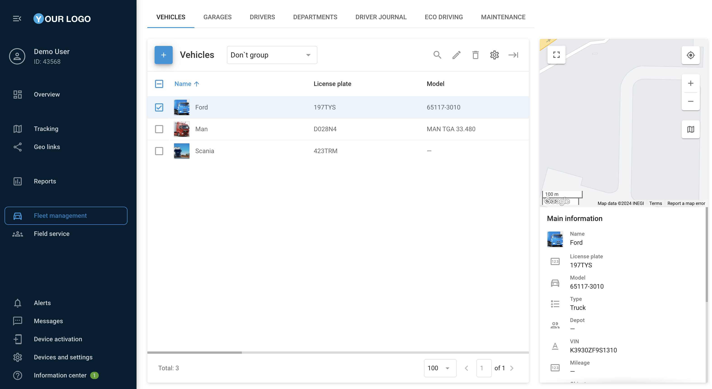

# Gestión de flotas

## Visión general

La aplicación de gestión de flotas de la plataforma Navixy ofrece una gestión optimizada de los vehículos de su organización, proporcionando información detallada y control sobre todos los aspectos de su flota, desde el consumo de combustible hasta las especificaciones de los vehículos, para mejorar su eficiencia operativa.

* [Gestión de vehículos](gestin-de-vehculos.md)
* [Garajes](garajes.md)
* [Conductores](conductores.md)
* [Departamentos](departamentos.md)
* [Registro de conductores](registro-de-conductores.md)
* [Conducción ecológica-Eco Driving](conduccin-ecolgica-eco-driving.md)
* [Mantenimiento](mantenimiento.md)

Toda la información sobre los vehículos de tu organización está en la app **"Gestión de flotas"**.

Facilita el trabajo y lo hace mucho más cómodo. Por ejemplo, si introduces datos sobre el consumo de combustible por cada 100 km (o millas), el sistema de monitorización calculará el consumo de combustible basándose en este indicador para compararlo con las lecturas reales.

### Vehículos

En **“Vehículos”** se muestra información sobre los vehículos del usuario en forma de tabla y un menú adicional visualizado en la parte derecha de la pantalla.

En esta pestaña es posible añadir y editar vehículos, adjuntarlos a los depósitos y vincularlos a los rastreadores activados en la plataforma.

\[

]\(https://www.navixy.com/wp-content/uploads/2020/03/ibjhfk4-1024x503.png)

### Añadir un nuevo vehículo

Pulse 

para añadir un nuevo vehículo.

El botón 

permite añadir una imagen del vehículo.

El apartado **"Principal"** contiene toda la información principal sobre el vehículo e información adicional, como etiquetas o notas de texto.

La ficha **"Especificación"** debe rellenar información adicional sobre el vehículo, como las dimensiones del vehículo, el tamaño y el número de ruedas de la distancia entre ejes, así como la velocidad permitida, la disponibilidad de un remolque y su año de fabricación.

En el apartado de **"Combustible"** se utiliza para rellenar la información sobre el tipo de combustible, la capacidad del depósito y la tasa de consumo por cada 100 km, que es necesaria para los cálculos posteriores en los reportes de combustible.

La ficha **"Seguros"** permite introducir el número de seguro con la fecha de expiración.

\[

]\(https://www.navixy.com/wp-content/uploads/2020/03/ukhzw1q.png)

### Depósitos

La información sobre los propietarios de flotas está disponible en **"Depósitos"** ficha.

\[

]\(https://www.navixy.com/wp-content/uploads/2020/03/t7ibvhm-1024x503.png)

### Añadir un nuevo depósito

Pulse 

para añadir un nuevo depósito.

El perfil del depósito contiene su nombre, dirección, nombre del mecánico y nombre del expedidor. Estos datos pueden utilizarse para una gestión más cómoda y eficaz de las tareas.

\[

]\(https://www.navixy.com/wp-content/uploads/2020/03/dvdlrlz.png)
