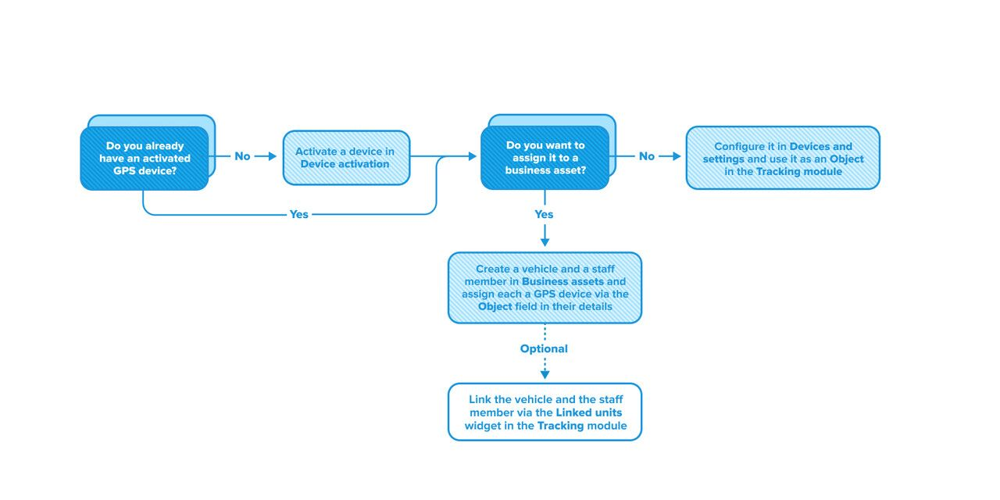

# Activos operativos

## Una forma más inteligente de gestionar su flota

Un **activo operativo** es una unidad rastreable con un propósito empresarial claro. Se trata de una forma estructurada de gestionar su flota más allá del simple monitoreo de dispositivos GPS. Los activos operativos ofrecen un enfoque intuitivo para las operaciones de flota, proporcionando mayor visibilidad, control y eficiencia en la gestión de vehículos y personal.

Los activos operativos brindan las siguientes ventajas:

* Rastrear ubicación, supervisar eventos y consultar el historial de unidades reales de la flota en lugar de dispositivos GPS abstractos.
* Vincular diferentes activos entre sí y elegir qué dispositivo GPS seguir.
* Identificar rápidamente el tipo de activos que se están mostrando.
* Visualizar qué miembro del personal está actualmente asignado a cada vehículo.
* Cambiar el personal asignado de forma manual o automática.
* Identificar vehículos inactivos sin personal asignado.
* Mantener un historial independiente para cada activo, preservando las relaciones entre ellos.

## Tipos de activos

Existen distintos tipos de activos operativos, aunque todos se comportan de manera similar. Cada activo pertenece a un tipo específico que representa una entidad real, como un vehículo o un miembro del personal. Puede vincular activos de diferentes tipos para reflejar relaciones reales, como la asignación de un conductor a un vehículo. Estas vinculaciones son flexibles y pueden modificarse según sea necesario.

Si hay múltiples dispositivos GPS asociados a activos vinculados, sus datos de ubicación seguirán tratándose por separado. La vinculación no afecta la forma en que se recopilan ni se procesan los datos GPS.

Actualmente están disponibles los siguientes tipos de activos:

* **Vehículos**: Unidades físicas de la flota como automóviles, furgonetas o camiones.
* **Personal**: Empleados como conductores o cuadrillas de trabajo.

> \[!NOTE] Por otro lado, los **objetos** representan dispositivos GPS activados, sin ninguna de las funcionalidades adicionales que ofrecen los activos operativos. Puede obtener más información sobre esta diferencia en la sección [Activos operativos vs. objetos](./#activos-vs-objetos).

## Aplicación práctica

Los activos operativos pueden resultar útiles en diversos casos, mejorando la eficiencia operativa de la empresa y facilitando el trabajo de gestores y despachadores. Mientras que los enfoques tradicionales de rastreo GPS se centran únicamente en monitorear la ubicación de dispositivos de forma individual, los activos operativos permiten crear entidades unificadas y rastreables que generan una visión integral de las operaciones al mantener historiales independientes de viajes y eventos, mientras reciben datos GPS desde dispositivos distintos.

Por ejemplo, una empresa de entregas puede crear activos de vehículos que representen unidades reales de la flota y activos de personal para los conductores. Al vincular estos activos, los gestores pueden ver fácilmente qué conductor está asignado a qué vehículo y alternar entre el seguimiento del GPS del vehículo y el del dispositivo móvil del conductor, garantizando un monitoreo continuo incluso si uno de los dispositivos no está disponible.

Este enfoque integrado ofrece una imagen operativa mucho más completa en comparación con el simple rastreo de dispositivos GPS, manteniendo al mismo tiempo la flexibilidad para aplicar la metodología de rastreo más adecuada según las necesidades específicas del negocio.

## Activos operativos vs. objetos

Entonces, ¿cuál es la diferencia entre gestionar activos operativos y simplemente rastrear dispositivos GPS? Navixy admite ambos enfoques:

* **Activos operativos**: Entidades estructuradas que representan vehículos y personal, que pueden vincularse, rastrearse y supervisarse tanto de forma conjunta como por separado.
* **Objetos basados en dispositivos GPS**: Rastreo básico de dispositivos GPS (etiquetados como **Objetos** en el módulo de [Seguimiento](../seguimiento/) y gestionados desde [Dispositivos y ajustes](../dispositivos-y-ajustes/)). Este enfoque permite un seguimiento simple sin necesidad de vinculación, manteniendo [los grupos existentes](https://squaregps.atlassian.net/wiki/spaces/UDOCES/pages/2922550740#grupos).

Ambos enfoques funcionan de manera independiente, pero puede asignar cualquiera de sus objetos existentes a un activo seleccionándolo en el campo **Objeto** al crear o editar un vehículo o miembro del personal. A partir de ese momento, dejará de funcionar como entidad separada y pasará a formar parte integral del activo.

También es posible realizar una importación masiva utilizando una plantilla de Excel.

Para obtener más información sobre la creación e importación de activos, consulte Vehículos y Personal.

