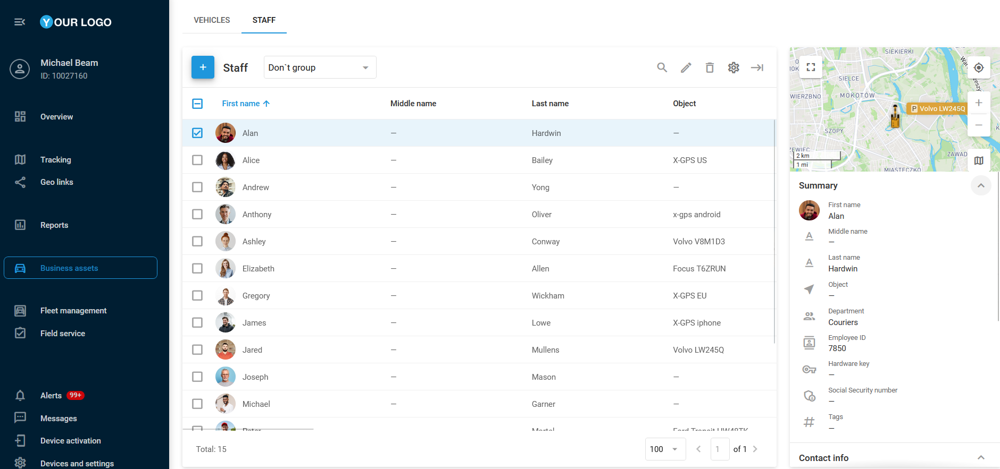

# (new)Personal

La página **Personal** está diseñada para gestionar a los miembros de su equipo. Le permite ver y editar información detallada de cada empleado. Mantener registros completos de los conductores contribuye a optimizar las operaciones de flota, mejorar la responsabilidad del personal y elevar el rendimiento general.

## Lista de personal

La **lista de personal** facilita una gestión rápida y eficiente de su fuerza laboral. La información se muestra en una tabla, complementada con una barra lateral a la derecha de la pantalla. Desde allí, puede agregar empleados, editar sus datos, asignarlos a departamentos específicos y vincularlos con dispositivos GPS activados.

### Agregar personal

Para agregar un nuevo miembro del personal, siga estos pasos:

1. Haga clic en 
.
2. Complete los campos obligatorios:
  - **Nombre**
  - **Dispositivo GPS asignado** (denominado **Objeto**)
3. Complete cualquier campo opcional, como departamento, número de empleado o llave de hardware.
4. Opcionalmente, seleccione un ícono o cargue una foto para facilitar la identificación.
5. Haga clic en **Guardar**.

## Importar personal

Si necesita añadir varios empleados a la vez, puede subirlos mediante un archivo Excel (XLS, XLSX, CSV).

Para importar miembros del personal:

1. Abra la pestaña **Personal** en la página de **Activos operativos**, sitúe el cursor sobre el ícono 
 y haga clic en 
.
2. En la ventana de importación encontrará un archivo de ejemplo en formato XLS que puede usar como plantilla.
3. Asegúrese de que las columnas del archivo coincidan con los campos del sistema.
4. En el archivo, introduzca información esencial como nombre, correo electrónico, número de licencia de conducir, etc.
5. Guarde el archivo en su ordenador.

### Para cargar el archivo en la plataforma:

1. Haga clic en el botón **Explorar**, seleccione el archivo y haga clic en **Continuar**.
2. Si el archivo contiene encabezados, marque la opción **Usar encabezados del archivo**.
3. Revise los encabezados. Si son correctos, continúe.
4. Corrija cualquier campo erróneo. La información de campos obligatorios vacíos no será importada.
5. Una vez verificada la información, la importación finalizará y los nuevos miembros aparecerán en la lista de **Personal**.