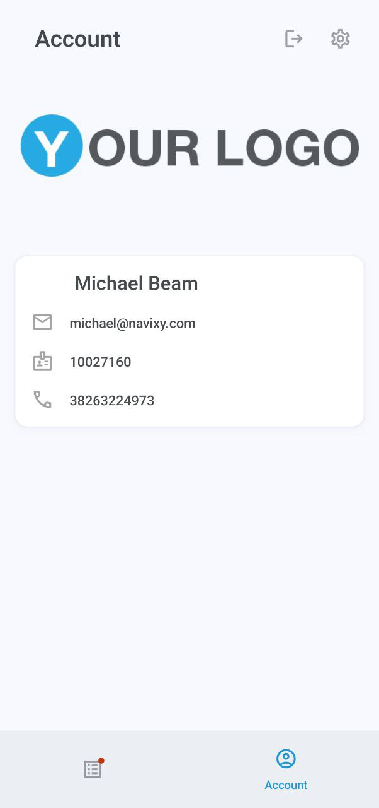

# Cuenta y configuración

### Cuenta

La pantalla de Cuenta muestra su logotipo, nombre, correo electrónico y número de teléfono.

### Configuración

Esta pantalla le permite configurar la aplicación y acceder rápidamente a la configuración de notificaciones de su dispositivo.

