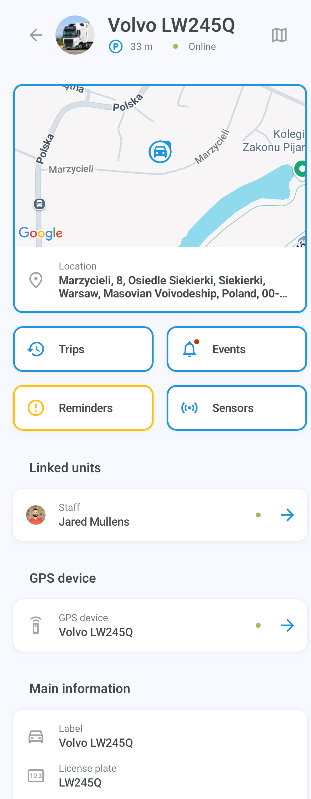

# Inicio rápido de X-GPS Mobile

Siga estos pasos para aprender a trabajar con X-GPS Mobile.

### Paso 1. Descargue la aplicación

1. Abra Google Play o App Store e ingrese X-GPS Mobile en el campo de búsqueda.
2. Selecciónela y toque **Instalar**.

### Paso 2. Inicie sesión

1. Abra la aplicación.
2. Ingrese su nombre de usuario y contraseña y toque **Iniciar sesión**.
3. Si es necesario, ingrese la URL de su servidor (por defecto, se utiliza el servidor Navixy). Alternativamente, use un código QR para evitar ingresar la URL y configurar automáticamente sus ajustes.

> \[!INFO] Si olvidó su contraseña, toque el botón correspondiente e ingrese su dirección de correo electrónico. Recibirá un correo electrónico con un enlace para restablecer su contraseña.

### Paso 3. Configure los permisos

Permita que la aplicación le envíe notificaciones y acceda a la ubicación del dispositivo mientras usa la aplicación. Tenga en cuenta que recibirá notificaciones push para todos los activos en su flota.

### Paso 4. Abra la pantalla principal

La pantalla principal muestra sus activos: vehículos, personal y objetos (unidades que representan dispositivos GPS) con iconos que indican su estado de movimiento.

Puede filtrarlos por categoría o estado (en movimiento, estacionado, etc.) y ordenarlos por nombre o estado.

Para ordenar o filtrar la lista de activos y acceder a las herramientas de monitoreo, toque los iconos en la esquina superior derecha:&#x20;

|                                                                       |                                                                                                                                                                                         |
| --------------------------------------------------------------------- | --------------------------------------------------------------------------------------------------------------------------------------------------------------------------------------- |
|              | Abre el [registro de eventos](https://squaregps.atlassian.net/wiki/spaces/~7120201a6252f8d34242e3bdb7409b5d34d953/pages/3182821465/new+Assets+list#events-list) para todas las unidades |
|  | Le permite ingresar una consulta de búsqueda                                                                                                                                            |
|            | Abre el menú de [filtrado y ordenación](https://squaregps.atlassian.net/wiki/spaces/~7120201a6252f8d34242e3bdb7409b5d34d953/pages/3182821465/new+Assets+list#sorting-and-filtering)     |
|               | Abre la [pantalla del mapa](https://squaregps.atlassian.net/wiki/spaces/~7120201a6252f8d34242e3bdb7409b5d34d953/pages/3182821465/new+Assets+list#map-fullscreen)                        |

Use el panel inferior para cambiar entre la pantalla principal y su perfil.

### Paso 5. Comience a trabajar

Toque un activo para ver su ubicación, estado, historial de viajes y eventos, sensores, recordatorios, detalles del dispositivo GPS y otra información.

