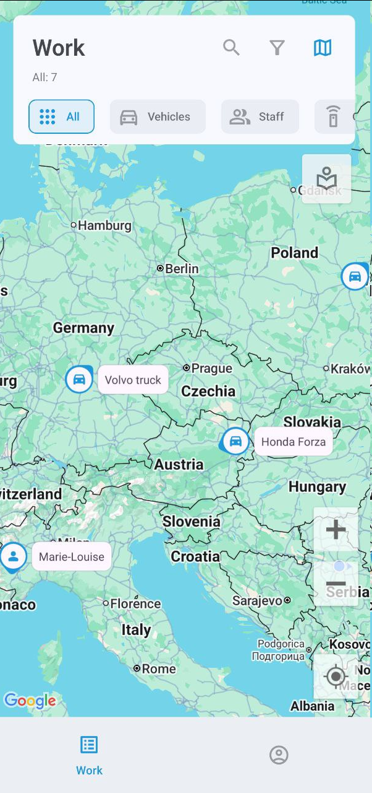

# Lista de activos

Esta pantalla muestra todos sus activos: vehículos, personal y objetos (dispositivos GPS no asignados). Para ver más información sobre cualquiera de sus activos, simplemente toque su entrada. Para encontrar un activo específico, toque 

 e introduzca su nombre.

El icono a la derecha de cada activo indica su estado de movimiento, como en movimiento o estacionado.

### Eventos

Toque 

 para ver los eventos.

Esta pantalla muestra varios eventos que ocurren con sus activos, como salir o entrar a una geocerca, quedarse en ralentí, exceso de velocidad, completar tareas y más. Para filtrar por tipo de categoría, toque **Todos**, **Vehículos**, **Personal** o **Objetos**.

El segundo menú muestra sus filtros actuales, todos los cuales pueden configurarse: período de tiempo, vehículos o personal específicos y tipos de eventos. El filtro **No leídos** mostrará solo las notificaciones no leídas, mientras que **Emergencia** reducirá su búsqueda a eventos urgentes.

### Mapa

Toque 

 para abrir un mapa interactivo que muestra sus activos.

Puede acercar y alejar y centrar el mapa en sus propias coordenadas GPS. Toque el icono del vehículo para seguir su ruta y ver su estado y ubicación actuales. Toque 

 nuevamente para abrir los detalles del vehículo.

Toque 

 para mostrar el menú de opciones del mapa:

Aquí puede seleccionar lugares (como ubicaciones de clientes para entregas), geocercas y tipo de mapa. Tenga en cuenta que la selección del tipo de mapa actualmente solo está disponible en dispositivos Android.

### Ordenación y filtrado

La lista tiene dos métodos de filtrado: por categoría y por estado.

Para filtrar por categoría, toque **Todos**, **Vehículos**, **Personal** o **Objetos**.

Para filtrar por estado (en movimiento, detenido, estacionado, en ralentí y fuera de línea), toque 

 para abrir el menú **Filtro y Ordenación**. Además de filtrar, este menú también permite ordenar los activos por nombre.

