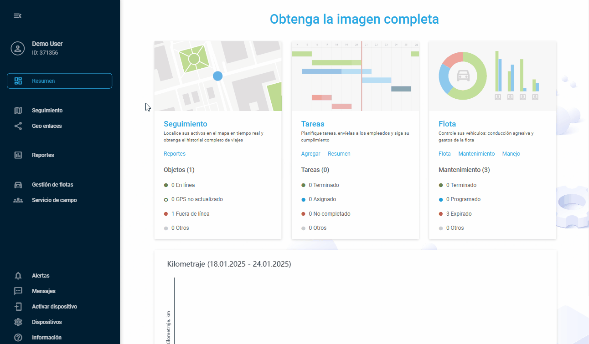

# Aplicaciones

**Visión general**

Esta función le permite ampliar y personalizar la funcionalidad de su plataforma integrando a la perfección herramientas de terceros y complementos personalizados. Las aplicaciones son bloques de construcción que le permiten crear un espacio de trabajo personalizado en el que todas sus herramientas esenciales están al alcance de un clic. Si necesita analizar datos complejos, agilizar la comunicación o integrar herramientas especializadas del sector, esta funcionalidad lo hace posible sin necesidad de conocimientos técnicos.

Tú eliges cómo se integran las herramientas externas en tu espacio de trabajo. Algunas aplicaciones funcionan mejor si se integran directamente en la interfaz y pasan a formar parte de tu flujo de trabajo diario. A otras les conviene abrirse en nuevas pestañas, ofreciéndote la experiencia de pantalla completa cuando sea necesario. El sistema se adapta a sus preferencias, manteniendo la seguridad y la facilidad de uso gracias a funciones como los parámetros de URL, la identificación de usuarios y la gestión segura de sesiones.

Estas son las principales ventajas de utilizar las **aplicaciones de usuario**:

- **Personalización a medida**  
Amplíe la plataforma para satisfacer necesidades empresariales específicas con funciones y flujos de trabajo personalizados.
- **Integración perfecta**  
Conecte fácilmente aplicaciones de terceros para agilizar su flujo de trabajo. Reduzca los cambios de contexto y ahorre tiempo accediendo a todo desde una única plataforma.
- **Mayor control**  
Tome las riendas de sus operaciones diarias con una configuración flexible de la plataforma, descubriendo potencialmente formas innovadoras de aprovechar nuestra plataforma.
- **Fomentar la innovación**  
Desarrolle y acceda a nuevas aplicaciones y soluciones directamente desde Navixy, impulsando la innovación dentro de su organización.
- **Crecimiento de la comunidad**  
Amplíe nuestra red telemática profesional y comparta información valiosa de sus desarrollos personalizados.

2. **Acceso a las aplicaciones de usuario**

En función del nivel de acceso definido por el rol del usuario, la disponibilidad de la función puede variar:

- **Los Propietarios de Cuenta** tienen acceso completo a la gestión de aplicaciones. Pueden crear nuevas aplicaciones, ver todas las aplicaciones existentes en la cuenta y y ellas.
- **Los usuarios** con cuenta sólo pueden ver las aplicaciones habilitadas para ellos en la barra lateral de la plataforma.

El espacio **Aplicaciones de usuario** está disponible para **los Propietarios de cuenta** en la sección **Configuración de la cuenta**. Para acceder a él:

1. Haga clic en el icono de perfil situado en la esquina superior izquierda de la pantalla para abrir la configuración de su cuenta.
2. En la barra lateral de configuración, seleccione **Aplicaciones de usuario**

Verás una lista completa con todos los complementos existentes y la posibilidad de crear otros nuevos.

**Contenido de la sección**

Más información sobre cómo crear y configurar aplicaciones de usuario:

- [Creación para nuevas aplicaciones de usuario](aplicaciones/creacin-para-nuevas-aplicaciones-de-usuario.md)
- [Gestión de las aplicaciones de usuario existentes](aplicaciones/gestin-de-las-aplicaciones-de-usuario-existentes.md)