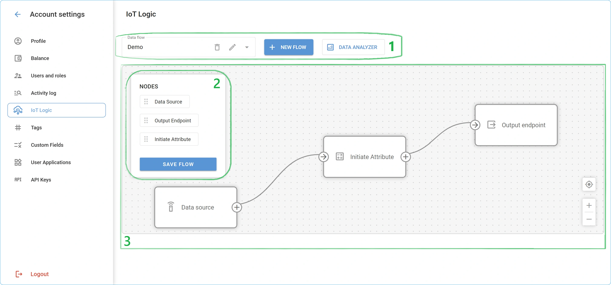
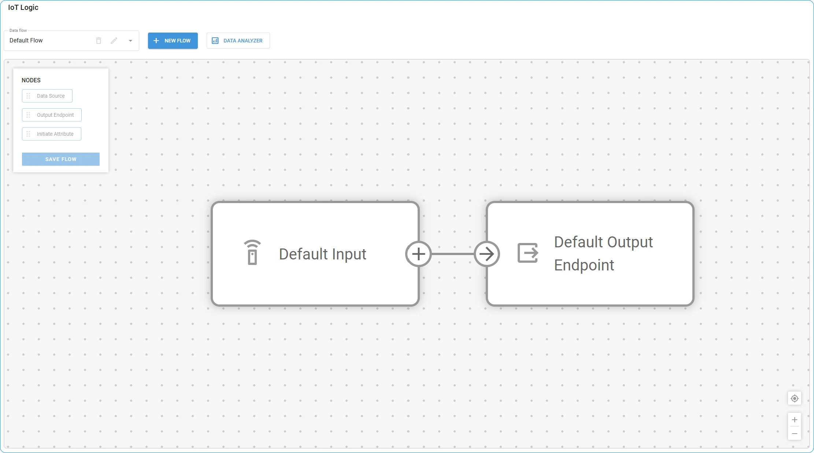
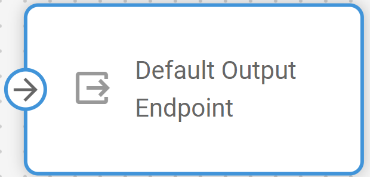

# Espacio de trabajo y flujo por defecto

## Espacio de trabajo de IoT Logic

El espacio de trabajo consta de tres secciones: **Barra de configuración de flujos (1)**, **Panel de nodos (2)** y **Lienzo (3)**.

### 1 - Barra de configuración de flujos

Los principales controles para gestionar sus flujos de datos están reunidos en la barra de menú superior:

- **Flujo de datos:** Muestra una lista de los flujos existentes. Si ya tiene algunos flujos de datos creados, puede seleccionar el flujo necesario en el desplegable para abrir su configuración.
  - **Icono del lápiz:** Permite editar la información del flujo como **Nombre del flujo** y **Descripción**, y también activarlo/desactivarlo. El botón sólo se activa si se selecciona un flujo y no está predeterminado.
  - **Icono de papelera:** Elimina la configuración actual del flujo. Si ya no necesita un flujo, puede eliminarlo completamente de la plataforma.
- **Nuevo flujo:** Este botón abre la [ventana de creación de flujo](https://squaregps.atlassian.net/wiki/spaces/UDOCES/pages/3232334081/Flow+management#Creating-a-new-flow), donde puede especificar toda la información sobre su nuevo flujo.
- **Analizador de datos:** Este botón abre [la herramienta Analizador de flujo de datos](https://squaregps.atlassian.net/wiki/spaces/UDOCES/pages/3232334554/Data+Stream+Analyzer?atlOrigin=eyJpIjoiOTlmZDIxMzVhNWU3NDUxYWEwZWQ0MDY2YjdmMGJlMDkiLCJwIjoiYyJ9), que le ayudará a ver los datos de diferentes fuentes y atributos y será útil para el diagnóstico.

### 2 - Panel de nodos

Los nodos disponibles se encuentran en un panel independiente a la izquierda. Puede arrastrarlos y soltarlos en el lienzo del flujo actual. La opción para guardar la configuración del flujo actual también se encuentra en este panel. Por el momento, están disponibles los siguientes nodos:

- [Fuente de Datos](https://squaregps.atlassian.net/wiki/spaces/UDOCES/pages/3232334220/Data+Source+node?atlOrigin=eyJpIjoiNzEzZDNkMjU0ZjdmNGEzNGFmNDJmNTc3MThjYjk0YzgiLCJwIjoiYyJ9)**:** Nodo que define de dónde proceden los datos para el flujo actual. Un flujo puede contener múltiples fuentes reales.
- [Iniciar Atributo](https://squaregps.atlassian.net/wiki/spaces/UDOCES/pages/3232334272/Initiate+Attribute+node?atlOrigin=eyJpIjoiMmU0Njk2YmU0Y2VjNGZiNDkwYzM2ZjdkOGNiMjU2YzAiLCJwIjoiYyJ9): Nodo que se encarga del enriquecimiento de los datos mediante cálculos personalizados antes de enviarlos a un destino.
- [Punto de Salida](https://squaregps.atlassian.net/wiki/spaces/UDOCES/pages/3232334428/Output+Endpoint+node?atlOrigin=eyJpIjoiYTNlYzcwNTM2ZmM2NDdlYzljYWJmZTNjYmUyNTcyYzEiLCJwIjoiYyJ9): Un nodo transmisor de salida que define dónde se envían los datos desde el flujo actual.

Un flujo puede contener varios nodos de cada tipo. La combinación de varios nodos en un mismo flujo permite crear canalizaciones de datos complejas.

> [!INFO]
> El botón **Guardar flujo** guarda la configuración actual del flujo. Si edita algo en el flujo, no olvide guardar los cambios. Los cambios no guardados pueden ser descartados al recargar la página.

### 3 - Lienzo

Es el principal elemento interactivo del espacio de trabajo donde se visualizan sus flujos:

- **Bloques de nodos**: Todos los nodos que arrastre y suelte en el lienzo aparecen como bloques. Puede colocarlos como desee para que la imagen de su flujo sea clara e intuitiva. Al pasar el ratón por encima de un nodo, aparece una ventana de edición.  
**Nota**. También puede abrir la ventana de edición haciendo doble clic en un nodo.
- **Transiciones**: Las flechas representan conexiones entre nodos, definiendo el camino que siguen sus datos dentro del flujo. Los bloques de nodos también muestran pistas sobre las direcciones de conexión que admiten. Para crear una transición, basta con hacer clic en un elemento de conexión de un nodo de inicio y arrastrarlo al de destino. Si intenta conectar nodos en una dirección no admitida (por ejemplo, desde un **punto final de salida** a un **origen de datos**), el intento fallará. De esta forma, la plataforma evita una configuración accidental de un flujo de datos incorrecto.
- **Centro (**
 **)**: Este botón le permite centrarse rápidamente en el área del lienzo que contiene los elementos reales, asegurándose de que todo el flujo es visible. Es especialmente útil para flujos grandes y complejos, pero al mismo tiempo ofrece un práctico atajo para ajustar automáticamente el tamaño del organigrama a la ventana.
- **Acercar/alejar (**
 **)**: Funcionalidad común para gestionar la escala del organigrama. También puede acercarse o alejarse utilizando la rueda del ratón.

## Flujo por defecto

Navixy ofrece un flujo de datos preconfigurado que incluye todos los dispositivos conectados a la cuenta y envía sus datos directamente a la plataforma. Este flujo está disponible en todas las cuentas y no puede editarse. Consta de dos nodos básicos: **Default Inp\`ut** y **Punto de salida predeterminado**.

El flujo por defecto sirve como ruta fundacional de transmisión de datos en el sistema Navixy. Su objetivo principal es garantizar que los datos procedentes de dispositivos no incluidos en ningún flujo personalizado no se pierdan y se transmitan al destino por defecto: la plataforma Navixy.

### Características clave del flujo por defecto

- Presente en todas las cuentas Navixy, independientemente de si se utiliza activamente IoT Logic
- No se puede eliminar, editar ni modificar de ninguna manera
- Incluye automáticamente todos los dispositivos no asignados a flujos personalizados
- Proporciona transmisión directa de datos sin transformaciones
- Mantiene la estabilidad del sistema protegiendo la ruta de transmisión de datos por defecto

Cuando se crean flujos personalizados y se les asignan fuentes de datos específicas, esos dispositivos se eliminan automáticamente del flujo predeterminado para evitar la duplicación de datos. Esto garantiza que los datos de cada dispositivo se procesen exactamente a través de un flujo en un momento dado.

### Default Input

El nodo **Default Input** sirve como colector de datos universal para su cuenta. Recibe automáticamente datos de todos los dispositivos activos que no están asignados explícitamente a flujos personalizados.

Este nodo funciona como un contenedor dinámico que ajusta su ámbito en función de las configuraciones de sus flujos personalizados. Al crear nuevos flujos personalizados y asignarles dispositivos, éstos se eliminan del ámbito de la entrada por defecto. Del mismo modo, si elimina un flujo personalizado, los dispositivos gestionados anteriormente por ese flujo vuelven al ámbito de la entrada predeterminada.

Este comportamiento dinámico garantiza una cobertura de datos completa en toda su cuenta, al tiempo que evita el procesamiento duplicado de datos.

### Punto de salida predeterminado

El nodo **Punto de salida predeterminado** proporciona un destino preconfigurado para enviar los datos del dispositivo a la plataforma Navixy. Este nodo está preconfigurado con los ajustes óptimos para la transmisión directa a los servidores de Navixy.

El punto final garantiza que todos los datos recopilados a través del flujo predeterminado se formateen y transmitan correctamente a la plataforma Navixy, lo que permite una visibilidad completa de sus dispositivos en la interfaz principal de Navixy.

> [!NOTE]
> El nodo **Punto de salida predeterminado** también está disponible para su uso en flujos personalizados. Cada flujo personalizado debe mantener conexiones con este nodo de salida para garantizar que los datos de los dispositivos se envían a la plataforma, lo que permite las capacidades de supervisión mediante las herramientas Navixy. Si se elimina la salida Navixy de un flujo personalizado, los datos de los dispositivos implicados en ese flujo dejarán de llegar a la plataforma.

## Uso de Analizador de flujo de datos con el flujo predeterminado

**El Analizador de flujo de datos** responde en tiempo real a los datos entrantes**.** El uso de la herramienta dentro del flujo predeterminado le permite solucionar problemas y supervisar la transmisión de datos de todos los dispositivos de esta cuenta que no estén asignados a ningún flujo personalizado. En caso de que no haya ningún flujo personalizado en la cuenta, puede supervisar todos los dispositivos de la cuenta a través del flujo predeterminado. Esta funcionalidad es especialmente útil para diagnosticar problemas de conectividad o de datos con dispositivos que no están asignados a ningún flujo personalizado.

Para acceder a esta función, seleccione el flujo predeterminado y haga clic en el botón en el menú superior.

Para obtener instrucciones detalladas sobre el uso de la herramienta, consulte [Analizador de flujo de datos](https://squaregps.atlassian.net/wiki/spaces/UDOCES/pages/3232334554/Data+Stream+Analyzer?atlOrigin=eyJpIjoiYzc5NDk2NWI3OGFhNDg0OGI0Yjc3ODI1NTUxMGU4ZDYiLCJwIjoiYyJ9).

## Comprender las relaciones entre flujos

La relación entre el flujo predeterminado y los flujos personalizados sigue estos principios:

1. **Cada dispositivo de su cuenta debe tener una** **ruta para transmitir datos** - El sistema IoT Logic garantiza que todos los dispositivos conectados a su cuenta tengan siempre una ruta definida para sus datos. Esto garantiza que nunca se pierdan datos de dispositivos debido a problemas de configuración de rutas, manteniendo una visibilidad completa de su flota de dispositivos.
2. **Cada dispositivo sólo puede asignarse a un flujo a la vez** - Para evitar el procesamiento duplicado de datos y garantizar una gestión coherente, los dispositivos se asignan exclusivamente a un único flujo. Esto crea rutas de datos claras y elimina posibles conflictos entre las diferentes configuraciones de procesamiento.
3. El flujo predeterminado gestiona **automáticamente cualquier dispositivo no asignado explícitamente a otro lugar** - El flujo predeterminado sirve como mecanismo "catch-all" que gestiona automáticamente todos los dispositivos no configurados específicamente en flujos personalizados. Esto garantiza que los dispositivos recién añadidos o eliminados de los flujos personalizados siempre tengan una ruta inmediata para la transmisión de datos.
4. Los flujos personalizados **tienen prioridad sobre el flujo predeterminado para la asignación de dispositivos** - Cuando se crea un flujo personalizado y se incluyen dispositivos específicos, dichos dispositivos se eliminan automáticamente del flujo predeterminado. Este sistema de priorización le permite aplicar un tratamiento especializado a los dispositivos seleccionados, manteniendo el tratamiento por defecto para los demás.

Este enfoque sistemático garantiza una cobertura completa de los datos al tiempo que permite un tratamiento personalizado de los mismos cuando sea necesario.