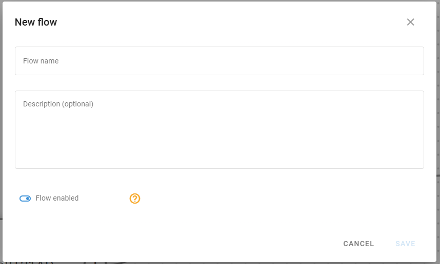
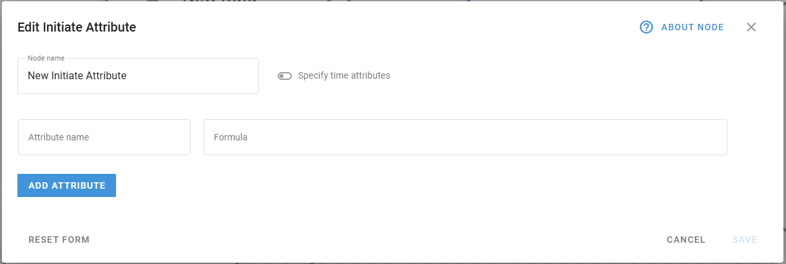
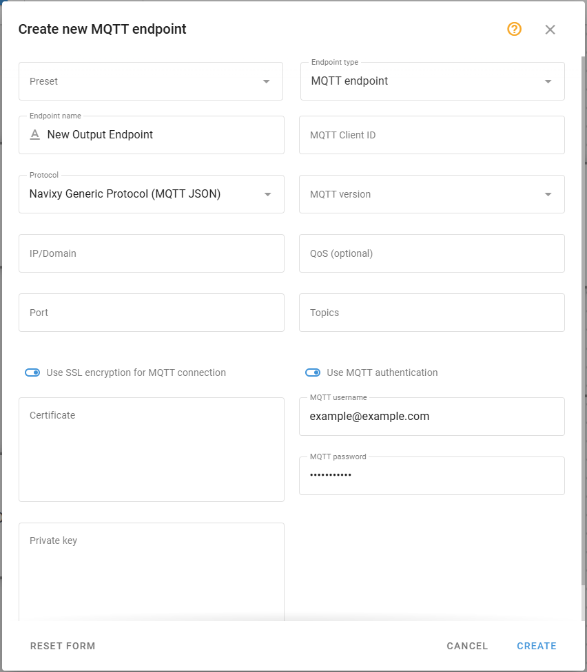
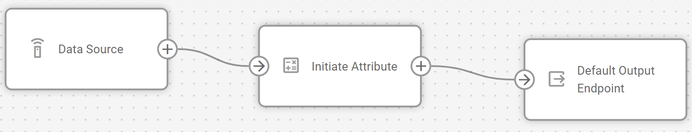
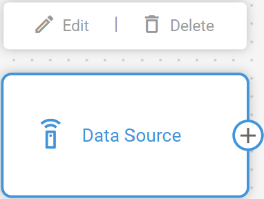
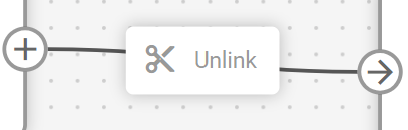

# Gestión de flujos

IoT Logic proporciona un entorno de lienzo flexible en el que puede crear flujos de datos personalizados para procesar, transformar y enrutar la telemetría de los dispositivos. Cada flujo consta de nodos interconectados que realizan funciones específicas dentro de su canal de procesamiento de datos, desde la recepción de datos brutos de dispositivos hasta el reenvío de información enriquecida a sistemas externos.

## Creación de un nuevo flujo

IoT Logic comienza con un espacio de trabajo vacío en el que puede diseñar su flujo de procesamiento de datos.

Siga estos sencillos pasos para crear un flujo:

1. Haga clic en el botón **Nuevo flujo** en la parte superior de la pantalla para abrir el cuadro de diálogo de creación de flujo.
2. Introduzca un **Nombre del flujo** y una **Descripción opcional** para mostrar claramente detalles específicos sobre la funcionalidad o el propósito de este flujo.
3. Asegúrese de que el conmutador **Flujo habilitado** esté activado (a menos que esté creando un flujo que inicialmente deba permanecer inactivo).
4. Haga clic en **Guardar** para crear su flujo y acceder al espacio de trabajo del flujo.

El nombre y la descripción del flujo le ayudarán a identificar cada flujo cuando tenga varias configuraciones. El conmutador activado/desactivado ofrece una forma cómoda de detener temporalmente el procesamiento de datos sin borrar toda la configuración del flujo.

> \[!WARNING] Los flujos desactivados no envían datos. Las lecturas de los dispositivos implicados en un flujo desactivado no llegan a ningún destino, incluida la plataforma Navixy. Esto significa que deshabilitar un flujo puede interrumpir sus capacidades de monitorización y recopilación de datos para los dispositivos afectados. Desactive los flujos sólo cuando desee detener deliberadamente la transmisión de datos por completo.

Después de guardar, su nuevo flujo aparecerá en el área de trabajo y podrá empezar a añadir nodos de procesamiento desde el panel de menú de la izquierda.

## Configuración de los componentes del flujo

Cada flujo consta de nodos interconectados que definen cómo se mueven los datos a través de su sistema. Los componentes básicos disponibles en el panel **Nodos** incluyen:

### Nodo Fuente de Datos

Este nodo establece el punto de entrada para los datos de dispositivos en su flujo. Procesa dispositivos específicos de su cuenta Navixy que usted puede:

* Filtrar por fabricante y modelo
* Especifique el protocolo de comunicación
* Seleccione de uno a un número ilimitado de dispositivos para enviar datos al flujo
* Seleccione fácilmente todos los grupos de dispositivos

Para conocer las opciones de configuración detalladas, consulte el [nodo Fuente de datos](https://squaregps.atlassian.net/wiki/spaces/UDOCES/pages/3232334220/Data+Source+node?atlOrigin=eyJpIjoiYWNjOWE2MWJiYWM4NDY5MjkyM2QxYWU3OGE4ZjIyM2MiLCJwIjoiYyJ9).

### Nodo Iniciar Atributo

Este nodo permite la transformación de datos a través del [Lenguaje de Expresión Navixy](https://squaregps.atlassian.net/wiki/spaces/NAV/pages/3107553932/Navixy+IoT+Logic+Expression+Language?atlOrigin=eyJpIjoiNzgwZGYwNGRhMmJkNDgyM2I5Mzk4ZTYzNGE4NzdmZDkiLCJwIjoiYyJ9). Le permite:

* Crear nuevos atributos calculados en función de los parámetros del dispositivo
* Realizar conversiones de unidades y operaciones matemáticas
* Aplicar cálculos basados en el tiempo

Para obtener información detallada sobre las opciones de configuración, la sintaxis y ejemplos de expresiones, consulte el nodo [Iniciar Atributo](https://squaregps.atlassian.net/wiki/spaces/UDOCES/pages/3232334272/Initiate+Attribute+node?atlOrigin=eyJpIjoiN2E0OGI2YzMyZGQ5NDg5NGJiNTVmMzA1ZmE2MGU0NWMiLCJwIjoiYyJ9).

### Nodo Punto de Salida

Este nodo define dónde y cómo se transmiten los datos procesados. En su configuración, puede

* Especificar los detalles de la conexión de destino (IP/dominio, puerto)
* Seleccionar protocolos de transporte y versiones de protocolo
* Configurar medidas de seguridad como SSL y autenticación
* Configurar parámetros MQTT como ID de cliente, temas y niveles de QoS
* Cree perfiles de punto final reutilizables para configuraciones coherentes

Para obtener detalles completos sobre las opciones de transmisión de datos, consulte el [nodo Punto de Salida](https://squaregps.atlassian.net/wiki/spaces/UDOCES/pages/3232334428/Output+Endpoint+node?atlOrigin=eyJpIjoiNDMyNjc1OTQ0ZjYyNDBkNjk3MWEwNjQ1N2MzOTEyZmYiLCJwIjoiYyJ9).

> \[!INFO] Su flujo debe incluir un **Punto de** **salida predeterminado** para enviar datos a la plataforma. Mantener esta conexión garantiza que los datos de su dispositivo permanezcan disponibles para su visualización y gestión en la interfaz Navixy.

## Construir su flujo

Para montar su secuencia de tratamiento de datos

1. Arrastre los nodos desde el menú de la izquierda y suéltelos en el área de trabajo.
2. Haga clic en cada nodo para abrir su panel de configuración y establecer los parámetros necesarios.
3. Conecte los nodos haciendo clic en el conector de salida de un nodo y arrastrándolo hasta el conector de entrada del nodo de destino.

Su flujo debe comenzar con al menos un nodo **Fuente de Datos** y terminar con uno o más nodos **Punto de Salida**. Entre estos, puede añadir nodos de transformación para manipular los datos según sus necesidades.

Los nodos pueden conectarse en varias configuraciones:

* Un único nodo **Fuente de Datos** puede alimentar varios nodos para su procesamiento en paralelo.
* Varios nodos **Fuente de Datos** pueden conectarse a un único nodo **Punto de salida** para consolidar flujos de datos.
* Los nodos **Iniciar Atributo** pueden encadenarse secuencialmente para cálculos de varias etapas.

## Edición de flujos existentes

Después de crear un flujo, puede modificar su configuración a medida que evolucionen sus necesidades.

### Modificación de los detalles del flujo

Para cambiar el nombre, la descripción o el estado activado del flujo:

1. Haga clic  en junto al nombre del flujo
2. Actualice los campos deseados
3. Guardar los cambios

### Eliminar elementos

Cuando necesite reestructurar su flujo, puede eliminar nodos o conexiones:

**Eliminar un nodo:**

1. Sitúe el cursor sobre el nodo que desea eliminar
2. Haga clic en el icono de eliminación que aparece en la esquina superior derecha del nodo

> \[!INFO] Cuando elimine un nodo, también se eliminarán todas sus conexiones.

**Eliminar una conexión:**

1. Haga clic en la línea de conexión que desea eliminar
2. Haga clic en **Desvincular** o pulse la tecla de retroceso del teclado

### Gestión de varios flujos

Para pasar de un flujo a otro:

1. Haga clic en el desplegable **Flujo de datos**
2. Seleccione el flujo que desea ver o editar, se abrirá en el área de trabajo

> \[!INFO] Cualquier cambio no guardado en el flujo actual se perderá al cambiar, se le pedirá que confirme la acción.

## Guardar y activar flujos

Después de configurar su flujo

1. Haga clic en el botón **Guardar flujo** para almacenar la configuración de su flujo
2. Asegúrese de que el flujo está activado para que comience a procesar datos

Una vez activado, su flujo

* Recibirá datos en tiempo real de los dispositivos configurados
* Aplicar las transformaciones definidas a través de los nodos de atributos Initiate
* Enviar los datos procesados a los puntos finales especificados en el formato del [Navixy Generic Protocol](https://squaregps.atlassian.net/wiki/spaces/NAV/pages/3107553589/Navixy+Generic+Protocol?atlOrigin=eyJpIjoiYzQyMzE5YjBlYTgzNDVkNGEyNmRmNTU4Mjk3ZTljYTkiLCJwIjoiYyJ9).

Si necesita desactivar temporalmente el procesamiento de datos, puede alternar el estado activado del flujo sin perder la configuración.

## Ejemplos de configuración

Encontrará descripciones detalladas paso a paso de un ejemplo de creación de flujo en [Ejemplo de configuración de flujo](https://squaregps.atlassian.net/wiki/spaces/UDOCES/pages/3232334496/Flow+configuration+example?atlOrigin=eyJpIjoiZjA4NGFmOWU2MjEzNDgzN2E0YjRkOGMyMmRmMzRmZjUiLCJwIjoiYyJ9). El ejemplo también contiene explicaciones sobre algunas opciones comunes de enriquecimiento de datos. No dude en utilizar este ejemplo como plantilla para sus flujos personalizados.
