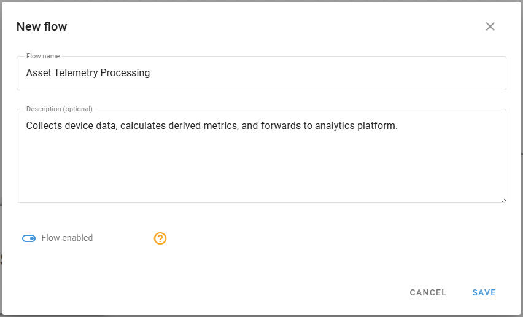
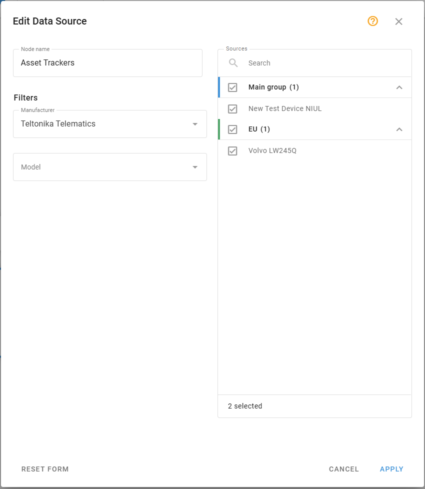
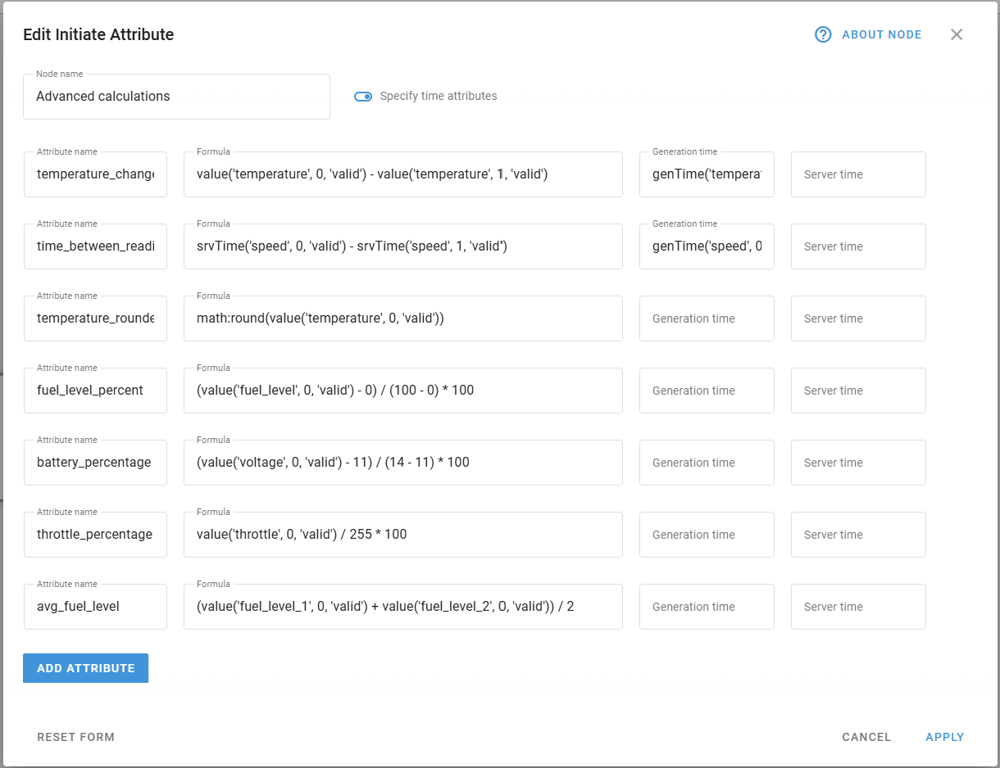
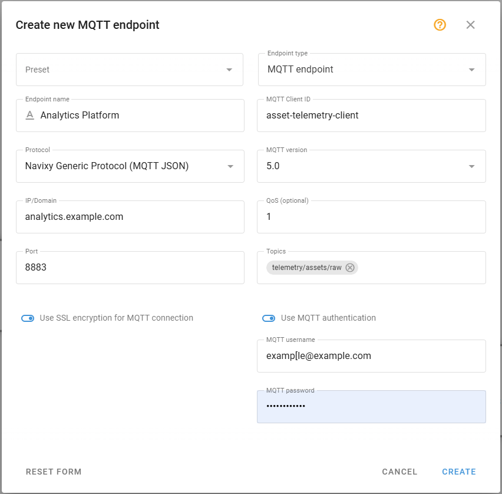
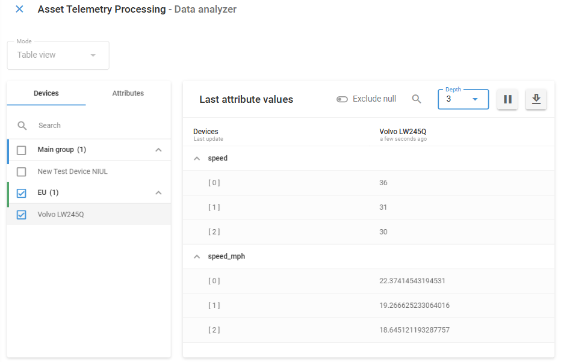

# Ejemplo de configuración de un flujo

Este ejemplo demuestra cómo configurar un flujo que recopila datos de dispositivos IoT, realiza cálculos para derivar métricas relevantes para el negocio y reenvía los datos enriquecidos a un sistema externo. El ejemplo utiliza un patrón de flujo lineal que puede adaptarse a diversos casos de uso del sector.

# Escenario empresarial

En este escenario, una organización ha desplegado rastreadores IoT en sus activos y necesita procesar datos de estos dispositivos para análisis de negocio. La organización recibe los siguientes parámetros directamente de sus dispositivos de seguimiento:

- `speed`: Velocidad del vehículo en kilómetros por hora
- `temperature`: Temperatura ambiental en grados Celsius
- `odometer`: Distancia recorrida en kilómetros
- `ignition`: Estado de ignición del motor (1 = encendido, 0 = apagado)
- `fuel_level`: Medición actual del nivel de combustible
- `pressure_psi`: Lectura de presión en PSI
- `voltage`: Voltaje de la batería en voltios
- `throttle`: Posición del pedal del acelerador desde CAN bus (0-255)
- `fuel_level_1`: Primera medición del nivel del depósito de combustible
- `fuel_level_2`: Segunda medición del nivel del depósito de combustible

La organización necesita:

1. Recopilar datos telemétricos sin procesar de los dispositivos para mantener un registro completo de las operaciones de los activos.
2. Convertir las unidades de medida para que coincidan con su formato de informe estándar (unidades imperiales) para mantener la coherencia con los sistemas empresariales existentes.
3. Calcular métricas basadas en el tiempo que indiquen patrones de uso para optimizar la utilización de los activos y los programas de mantenimiento.
4. Crear métricas derivadas para generar perspectivas operativas no proporcionadas directamente por el hardware.
5. Enviar los datos enriquecidos a un sistema de análisis externo para su integración con plataformas de inteligencia empresarial.
6. Enviar los datos brutos sin modificar a Navixy para su supervisión

Este flujo transformará los datos brutos del dispositivo en un formato que apoye directamente la toma de decisiones empresariales, manteniendo la integridad de las mediciones originales.

# Pasos de configuración del flujo

Siga estos pasos para crear un flujo completo de transformación y reenvío de datos:

## Paso 1: Cree un nuevo flujo

1. Haga clic en el botón **Nuevo flujo** en la parte superior de la interfaz de IoT Logic
2. Introduzca *Procesamiento de telemetría de activos* como nombre del flujo
3. Añada una descripción: *"Recopila datos de dispositivos, calcula métricas derivadas y las reenvía a la plataforma de análisis.*"
4. Asegúrese de que el conmutador **Flujo habilitado** está activado
5. Haga clic en **Guardar** para crear el flujo

## Paso 2: Configure la Fuente de Datos

1. Arrastre un nodo **Fuente de Datos** del menú de la izquierda al área de trabajo
2. Haga doble clic en el nodo para abrir su panel de configuración
3. En **Nombre de nodo** escriba *Rastreadores de activos*
4. Seleccione los dispositivos a incluir en este flujo de la lista filtrada
  - Para este ejemplo, seleccione al menos dos dispositivos con capacidades similares
5. Haga clic en **Crear** para guardar la configuración del nodo

## Paso 3: Configure transformaciones básicas de datos

1. Arrastre un nodo **Iniciar Atributo** del menú de la izquierda al área de trabajo
2. Conecte el nodo **Fuente de Datos** a este nodo **Iniciar Atributo**
3. Haga doble clic en el nodo para abrir su configuración
4. En **Nombre de nodo** escriba *Conversión de unidades*
5. Cree los siguientes atributos para la conversión de unidades:
  1. Añade un nuevo atributo para la conversión de velocidad (km/h a mph):
    1. Nombre del atributo *velocidad\_mph*
    2. Valor: `value('speed')/1.609`
  2. Añada un nuevo atributo para la conversión de temperatura (Celsius a Fahrenheit):
    1. Nombre del atributo *temperatura\_F*
    2. Valor: `value('temperature')*1.8 + 32`
  3. Añada un nuevo atributo para la conversión de distancia (kilómetros a millas):
    1. Nombre del atributo: *distancia\_millas*
    2. Valor `value('odometer')/1.609`
  4. Añada un nuevo atributo para la conversión de presión (PSI a Bar):
    1. Nombre del atributo *presión\_bar*
    2. Valor: `value('pressure_psi') * 0.06895`
6. Haga clic en **Aplicar** para guardar la configuración del nodo

> [!NOTE]
> Para obtener explicaciones sobre los cálculos introducidos en este paso, consulte [Conversiones básicas de unidades](https://squaregps.atlassian.net/wiki/spaces/UDOCES/pages/3232334496/Ejemplo+de+configuraci+n+de+un+flujo#Conversiones-b%C3%A1sicas-de-unidades).

## Paso 4: Cree métricas calculadas avanzadas

1. Arrastre otro nodo **Iniciar Atributo** del menú de la izquierda al área de trabajo.
2. Conecte el primer nodo **Iniciar Atributo** a este nuevo nodo.
3. Haga doble clic en el nodo para abrir su configuración.
4. En **Nombre de nodo** escriba *Cálculos avanzados*
5. Cree los siguientes atributos para las métricas avanzadas:
  1. Añada un atributo para la detección de cambios de temperatura:
    1. Nombre del atributo: *cambio\_temperatura*
    2. Valor: `value('temperature', 0, 'valid') - value('temperature', 1, 'valid')`
    3. Tiempo de generación: `genTime('temperature', 0, 'valid')`
  2. Añada un atributo para encontrar el tiempo transcurrido entre dos últimas lecturas:
    1. Nombre del atributo *tiempo\_entre\_lecturas\_ms*
    2. Valor: `srvTime('speed', 0, 'valid') - srvTime('speed', 1, 'valid')`
    3. Tiempo de generación: `genTime('speed', 0, 'valid')`
  3. Añada un atributo para redondear la temperatura al entero más próximo:
    1. Nombre del atributo: *temperatura\_redondeada*
    2. Valor: `math:round(value('temperature', 0, 'valid'))`
  4. Añada un atributo para el cálculo del valor normalizado (normalizar el nivel de combustible a 0-100%):
    1. Nombre del atributo: *nivel\_combustible\_porcentaje*
    2. Valor: `(value('fuel_level', 0, 'valid') - 0) / (100 - 0) * 100`
  5. Añada un atributo para el cálculo del porcentaje de carga de la batería:
    1. Nombre del atributo: *porcentaje\_bateria*
    2. Valor: `(value('voltage', 0, 'valid') - 11) / (14 - 11) * 100`
  6. Añada un atributo para el cálculo de la posición del acelerador:
    1. Nombre del atributo: *porcentaje\_acelerador*
    2. Valor: `value('throttle', 0, 'valid') / 255 * 100`
  7. Añada un atributo para el nivel medio de combustible de múltiples sensores:
    1. Nombre del atributo: *avg\_fuel\_level*
    2. Valor: `(value('fuel_level_1', 0, 'valid') + value('fuel_level_2', 0, 'valid')) / 2`
6. Haga clic en **Aplicar** para guardar la configuración del nodo

> [!NOTE]
> Para obtener explicaciones sobre los cálculos introducidos en este paso, consulte [Cálculos avanzados de métricas](https://squaregps.atlassian.net/wiki/spaces/UDOCES/pages/3232334496/Ejemplo+de+configuraci+n+de+un+flujo#C%C3%A1lculos-avanzados-de-m%C3%A9tricas).

## Paso 5: Configure el Punto de Salida

1. Arrastre un nodo **Punto de Salida** desde el menú de la izquierda al área de trabajo.
2. Conecte el segundo nodo **de atributo Initiate** a este nodo **Output endpoint**
3. Haga clic en el nodo para abrir su configuración
4. Configure los siguientes parámetros:
  - **Tipo de Punto de Salida**: *Punto de salida MQTT*
  - **Nombre del Punto de Salida**: *Plataforma de análisis*
  - **Protocolo**: *Protocolo de Navixy* por defecto *(JSON)*
  - **IP/Dominio**: Introduzca la dirección del sistema de destino (por ejemplo,*"*[*analytics.example.com*](http://analytics.example.com)")
  - **Puerto**: *8883* (por defecto para MQTT, puede dejarlo vacío)
  - **Usar SSL**: *activar*
  - **Versión MQTT**: *5.0*
  - **ID de cliente MQTT**: *asset-telemetry-client*
  - **Tema**: *telemetría/activos/sin procesar*
  - **QoS**: *1*
  - **Usar autenticación MQTT**: *Sí* (si lo requiere su sistema de destino)
  - **Nombre de usuario y contraseña MQTT**: Introduzca las credenciales si procede
5. Haga clic en **Crear** para guardar la configuración del nodo

## Paso 6: Añada punto final por defecto

1. Arrastre un nodo **Punto de Salida** desde el menú de la izquierda al área de trabajo.
2. En **Tipo de punto de salida** seleccione **Punto de salida predeterminado**
3. Haga clic en **Guardar** para aplicar la configuración del nodo
4. Conecte el nodo *Rastreadores de activos* (**Fuente de Datos**) a él

Esto garantiza que los datos sin procesar se envían a Navixy directamente desde los dispositivos, sin transformaciones ni enriquecimientos.

## Paso 7: Guarde y probar el flujo

Su configuración final tendrá este aspecto:

Haga clic en el botón **Guardar flujo** del panel **Nodos** para guardar la configuración del flujo.

> [!TIP]
> Utilice [Analizador de flujo de datos](https://squaregps.atlassian.net/wiki/spaces/UDOCES/pages/3232334554/Data+Stream+Analyzer?atlOrigin=eyJpIjoiOWE5ZTdiNjQ4Nzc5NGVmOTg0NjI0MDU2NjI1ZjgwNDUiLCJwIjoiYyJ9) para supervisar los datos entrantes y verificar:
> - Los dispositivos envían datos al flujo
> - Los cálculos funcionan según lo previsto
> - Los datos se envían al destino
> Por ejemplo, comprobemos que las conversiones de velocidad se calculan correctamente en un camión. Para hacerlo en DSA, necesitamos seleccionar el dispositivo **Volvo** y los atributos **speed** y **speed\_mph**:
> 
> ¡Todo bien! Los datos se reciben y se convierten correctamente.

# Explicación de las transformaciones de datos

Examinemos los cálculos clave utilizados en este flujo.

## Conversiones básicas de unidades

El primer nodo **Iniciar Atributo** realiza conversiones de unidades sencillas:

- **Velocidad**: Convierte km/h a mph dividiendo por 1,609.
- **Temperatura**: Convierte Celsius a Fahrenheit mediante la fórmula °F = °C × 1,8 + 32
- **Distancia**: Convierte kilómetros a millas dividiendo por 1,609.
- **Presión**: Convierte PSI a Bar multiplicando por 0,06895, lo que lo hace compatible con las normas internacionales de medición de la presión.

Estas conversiones garantizan la coherencia con los formatos de informe estándar y hacen que los datos puedan utilizarse inmediatamente para el análisis. Las conversiones de unidades son especialmente valiosas para las organizaciones multinacionales que operan en regiones con distintos estándares de medición.

## Cálculos avanzados de métricas

El segundo nodo **Iniciar Atributo** realiza cálculos más complejos:

- **Detección de cambios de temperatura**: Calcula la diferencia entre las lecturas de temperatura actual y anterior para identificar cambios repentinos. Esto ayuda a detectar problemas en los equipos, como fallos de refrigeración en los vehículos de transporte o problemas de climatización en las instalaciones. Por ejemplo, un aumento repentino de 5 °C en un contenedor refrigerado podría indicar un fallo del sistema de refrigeración que requiere atención inmediata.
  - **Hora generada**: Usar `genTime('temperature', 0, 'valid')` es crucial aquí porque preserva la marca de tiempo exacta cuando la lectura de temperatura fue generada por el dispositivo, asegurando un análisis preciso basado en el tiempo de los cambios de temperatura.
  - **Hora del servidor**: El valor por defecto `now()` captura automáticamente cuando el servidor recibió los datos. Como no necesitamos modificar esta marca de tiempo, podemos dejar este campo vacío durante la configuración.
- **Tiempo entre lecturas**: Mide el intervalo entre transmisiones de datos consecutivas comparando las marcas de tiempo del servidor. Este cálculo ayuda a identificar problemas de comunicación o a validar que los dispositivos informan con la frecuencia esperada. Los intervalos irregulares podrían indicar problemas de conectividad, mientras que los retrasos constantes podrían sugerir congestión de la red o problemas de configuración de los dispositivos.
- **Redondear valores**: Aplica el redondeo matemático a las lecturas de temperatura, reduciendo la precisión decimal a números enteros. Esto simplifica la visualización de los datos y la elaboración de informes, al tiempo que reduce los requisitos de almacenamiento de los datos históricos. Los valores redondeados son especialmente útiles para la visualización de cuadros de mando y alertas basadas en umbrales en los que no es necesaria la precisión decimal.
  - **Hora generada**: Especificar `genTime('speed', 0, 'valid')` conecta estos metadatos directamente con la marca de tiempo de la lectura original, lo que permite analizar tanto el intervalo de tiempo como cuándo se produjo.
  - **Hora del servidor**: El valor por defecto `now()` captura automáticamente el momento en que el servidor recibió los datos. Como no necesitamos modificar esta marca de tiempo, podemos dejar este campo vacío durante la configuración.
- **Cálculo del valor normalizado**: Normaliza las lecturas brutas del sensor a una escala porcentual (0-100%). Esta estandarización facilita la comparación de lecturas entre diferentes tipos de sensores y modelos de vehículos. Para la gestión de flotas, esto permite obtener informes coherentes del nivel de combustible independientemente de la implementación específica del sensor de combustible en cada modelo de vehículo, lo que permite alertas uniformes de bajo nivel de combustible y análisis de consumo.
- **Cálculo del porcentaje de carga de la batería**: Normaliza las lecturas de tensión de la batería (rango 11V-14V) a una escala de 0-100% para facilitar la supervisión. Por ejemplo, una lectura de 12,5 V se normalizaría al 50%, lo que proporciona un indicador intuitivo del estado de la batería en distintos tipos de vehículos.
- **Cálculo de la posición del acelerador**: Convierte los datos brutos de posición del acelerador (rango 0-255) del bus CAN del vehículo en una escala de porcentajes. Esta estandarización ayuda a los operadores a comprender rápidamente el comportamiento del conductor y el rendimiento del vehículo sin necesidad de interpretar los valores brutos de los sensores.
- **Promedio del nivel de combustible de varios sensores**: Combina las lecturas de dos sensores de combustible independientes para obtener una medición global del nivel de combustible más precisa. Esto es especialmente valioso para vehículos con depósitos de formas complejas o depósitos múltiples, en los que un solo sensor podría no proporcionar lecturas fiables debido al desplazamiento del combustible durante el movimiento.

# Resumen del flujo de ejemplo

Esta configuración de flujo demuestra varias capacidades clave de IoT Logic:

1. **Estandarización**: Convierte las lecturas específicas de cada dispositivo en métricas empresariales estandarizadas.
2. **Enriquecimiento**: Crea métricas nuevas y significativas no disponibles directamente a partir de los sensores de los dispositivos.
3. **Transformación**: Modificación de las unidades para adaptarlas a las necesidades de información de la empresa
4. **Contexto histórico**: Utiliza lecturas anteriores para calcular métricas basadas en tendencias
5. **Determinación del estado**: Crea valores categóricos basados en múltiples entradas de sensores.

Esta combinación de capacidades transforma los datos brutos de los dispositivos en inteligencia empresarial procesable, apoyando directamente la toma de decisiones operativas al tiempo que mantiene la integridad de las mediciones originales.