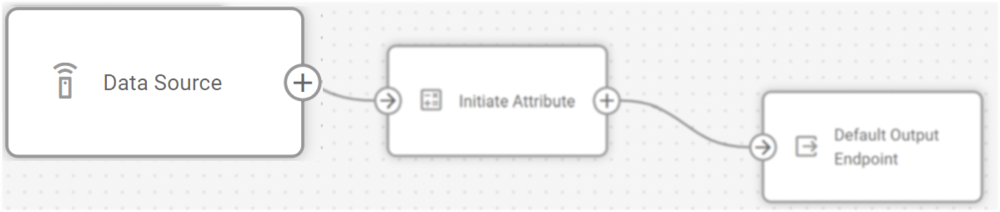
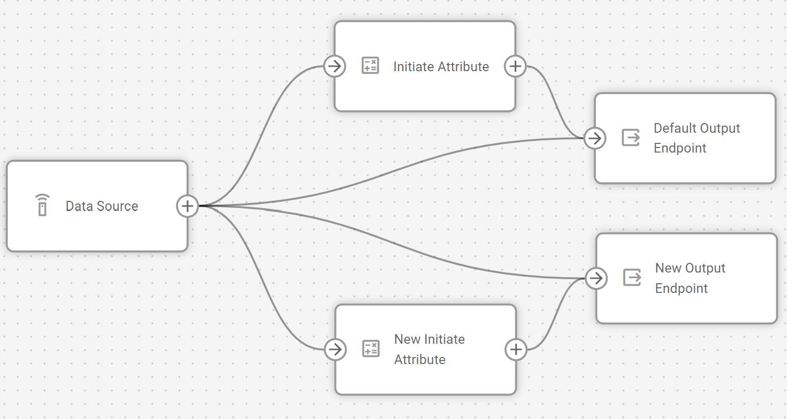

# El nodo Fuente de Datos

## Resumen técnico y capacidades

El nodo **Fuente de Datos** es un punto de entrada para los datos de telemetría procedentes de dispositivos IoT y plataformas OEM en el sistema IoT Logic. Funciona como un traductor universal, recibiendo datos a través de protocolos TCP/UDP/HTTP en interfaces de red y a través de colas MQTT, decodificando a continuación los flujos de datos entrantes según el protocolo seleccionado. El nodo transforma los mensajes del dispositivo en un formato estandarizado que puede procesarse posteriormente en su flujo.

### Integración de la arquitectura de flujo

El nodo **Fuente de Datos** funciona como punto de entrada de datos en un flujo IoT Logic. Un único flujo puede contener múltiples nodos fuente, cada uno con configuraciones independientes. Esta arquitectura permite:

- Adquisición inicial de datos de múltiples tipos de dispositivos y formatos de protocolo.
- Transformación estandarizada de datos de varios fabricantes en formatos unificados.
- Vías de procesamiento en paralelo mediante la conexión de una fuente de datos a varios nodos posteriores.
- Filtrado selectivo de dispositivos para incluir en el flujo sólo las fuentes de datos relevantes.

### Capacidades del nodo

El nodo **Fuente de Datos** ofrece por sí mismo

- **Diversidad de protocolos**: Soporta múltiples fabricantes de dispositivos, incluyendo Teltonika, Queclink, Suntech, Jimi y otros, a través de parsers y decodificadores Navixy heredados.
- **Flexibilidad de transporte**: Admite protocolos TCP, UDP, HTTP y conexiones de broker MQTT.
- **Transformación unificada de datos**: Convierte los mensajes específicos de cada dispositivo a un formato estandarizado para un procesamiento coherente.
- **Filtrado de dispositivos**: Proporciona capacidades de filtrado para seleccionar modelos o protocolos específicos.
- **Procesamiento en tiempo real**: Gestiona los flujos de datos telemétricos entrantes en tiempo real para su procesamiento inmediato.

## Opciones de configuración

El nodo **Fuente de Datos** requiere configuración para establecer qué dispositivos enviarán datos a su flujo. Deberá especificar el protocolo, el protocolo de transporte y seleccionar los dispositivos específicos que desea incluir.

Veamos qué elementos utiliza este nodo y qué puede configurar cuando trabaje con él:

### Pasos de configuración

1. Especifique **nombre de nodo**: Introduzca un nombre descriptivo para esta fuente de datos.
  - Utilice un nombre que le ayude a identificar el fabricante, los modelos u otra información relevante.
  - Este nombre se mostrará en el diagrama de flujo para facilitar la identificación.
2. Seleccione el **fabricante**: Elija el protocolo de comunicación utilizado por sus dispositivos.
  - Seleccione uno de los protocolos disponibles del fabricante (Teltonika, Queclink, Suntech, Jimi, etc.)
  - La selección del protocolo filtrará los modelos de dispositivos disponibles en el siguiente paso.
  - Los protocolos suelen estar asociados a fabricantes específicos.
3. Elija **modelo**: Especifica cómo se transmiten los datos.
  - Las opciones disponibles incluyen HTTP, TCP, UDP o MQTT.
  - Esta selección debe coincidir con la forma en que sus dispositivos están configurados para comunicarse.
4. Seleccione **Fuentes**: En la lista filtrada de la parte derecha de la interfaz, seleccione los dispositivos que desea incluir.
  - Sólo los dispositivos registrados en su cuenta de usuario Navixy estarán disponibles para su selección.
  - La lista se filtra automáticamente en función de sus selecciones de protocolo y modelo.
  - Los dispositivos ya utilizados en otros flujos se marcarán con un signo de exclamación.

> [!INFO]
> Si cambia la configuración del fabricante o del modelo después de seleccionar los dispositivos, el sistema le notificará si alguno de los dispositivos seleccionados no coincide con los nuevos parámetros, pero no los eliminará automáticamente de su selección.

### Procesamiento de datos

El nodo **Fuente de Datos** hereda todos los analizadores y descodificadores de Navixy, lo que proporciona compatibilidad con una amplia gama de dispositivos IoT. Cuando los datos llegan a este nodo, pasan por el siguiente proceso:

1. El flujo de datos entrante se recibe a través del protocolo de transporte especificado
2. Los datos se pasan al descodificador de protocolo adecuado en función de su configuración
3. Los mensajes de los dispositivos se transforman en un formato estandarizado que IoT Logic puede procesar
4. Los datos unificados se pasan al siguiente nodo de su flujo

Este proceso de estandarización le permite crear flujos de procesamiento coherentes, independientemente del formato de datos original de los distintos fabricantes de dispositivos.

## Preguntas más frecuentes

### ¿Puedo utilizar varios nodos Fuente de Datos en un flujo?

Sí, puede utilizar varios nodos **Fuente de Datos** en un espacio de trabajo. Esto es útil cuando necesita procesar datos de diferentes tipos de dispositivos de diferentes maneras o desea fusionar varios flujos de datos después de transformaciones específicas.

### ¿Qué ocurre si un dispositivo ya se utiliza en otro flujo?

Los dispositivos que ya se utilizan en otros flujos no aparecen en la lista, por lo que no puede seleccionar el mismo dispositivo dos veces en diferentes flujos.

### ¿Están todos mis dispositivos Navixy automáticamente disponibles en IoT Logic?

Sí, todos los dispositivos de su cuenta de usuario Navixy se pueden utilizar en el procesamiento de IoT Logic. Esto incluye dispositivos GPS, plataformas OEM, dispositivos y pasarelas MQTT y conectores MQTT/Kafka.

### ¿Cómo sé qué fabricante debo seleccionar para mis dispositivos?

El protocolo debe coincidir con el protocolo de comunicación utilizado por el fabricante de su dispositivo. La mayoría de los dispositivos utilizan un protocolo asociado a su fabricante (por ejemplo, los dispositivos Teltonika utilizan el protocolo Teltonika). Compruebe la documentación de su dispositivo o consulte con su proveedor de dispositivos si no está seguro.

### ¿Puedo conectar un nodo Fuente de Datos a varios nodos de procesamiento?

Sí, puede conectar un nodo **Fuente de Datos** a varios nodos de transformación para crear rutas de transformación paralelas. Esto le permite aplicar diferentes transformaciones al mismo flujo de datos. He aquí un ejemplo:

