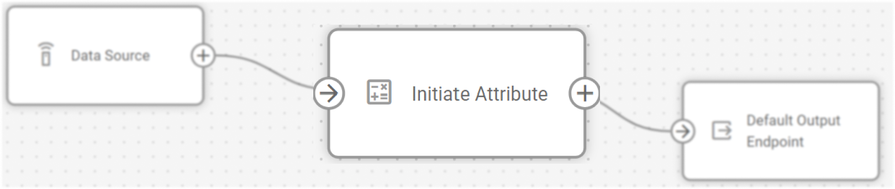

# El nodo Iniciar Atributo

## Resumen técnico y capacidades

En IoT Logic, el nodo **Iniciar Atributo** transforma las lecturas de los dispositivos creando nuevos atributos de datos basados en la telemetría entrante. Este nodo le permite manipular datos mediante fórmulas matemáticas, renombrar parámetros existentes y realizar operaciones a nivel de bits utilizando el [Navixy Expression Language](https://squaregps.atlassian.net/wiki/spaces/NAV/pages/3107553932/Navixy+IoT+Logic+Expression+Language?atlOrigin=eyJpIjoiY2ZlMzg5MzI0YWFkNGNlYmExZjRkN2Y4MTMzYTFhNWMiLCJwIjoiYyJ9). El nodo sirve como componente clave en un flujo, permitiéndole enriquecer los datos antes de enviarlos a sus sistemas de destino.

El nodo **Iniciar Atributo** se configura para cada flujo en la interfaz de usuario de la plataforma Navixy. Para opciones de sintaxis específicas y referencia detallada del lenguaje de expresión, consulte [Navixy Expression Language](https://squaregps.atlassian.net/wiki/spaces/NAV/pages/3107553932/Navixy+IoT+Logic+Expression+Language?atlOrigin=eyJpIjoiY2ZlMzg5MzI0YWFkNGNlYmExZjRkN2Y4MTMzYTFhNWMiLCJwIjoiYyJ9) en la documentación del usuario.

### Integración en la arquitectura de flujos

El nodo **Iniciar Atributo** funciona dentro de la arquitectura de flujo proporcionando capacidades de transformación de datos y habilitando:

- Procesar datos de telemetría sin procesar en métricas empresariales significativas.
- Creación de campos calculados basados en múltiples valores de parámetros.
- Conversión de unidades de medida (por ejemplo, kilómetros a millas).
- Cálculo de las diferencias entre las lecturas actuales y las anteriores.
- Generación de análisis basados en el tiempo sobre el comportamiento del dispositivo.

> [!INFO]
> El nodo de atributo Iniciar requiere que al menos un nodo de **Fuente de Datos** esté conectado a él. No se realizarán cálculos sin conexiones de datos de entrada.

### Capacidades del nodo

El nodo **Iniciar Atributo** ofrece por sí mismo:

- **Transformación de atributos de datos**: Crear atributos completamente nuevos aplicando operaciones matemáticas a los procedentes de fuentes de datos.
- **Conversión de unidades**: Convierte unidades de medida (por ejemplo, velocidad de *km/h* a *mph*, o temperatura de *°C* a *°F*)
- **Cálculos basados en el tiempo**: Compara las lecturas actuales con los valores anteriores para determinar los cambios
- **Manipulación del tiempo**: Personalice las marcas de tiempo de cuándo se generó el atributo en un dispositivo y cuándo lo recibió el servidor para evitar incoherencias en la línea de tiempo y unificar los formatos de hora.

## Opciones de configuración

El nodo **Iniciar Atributo** permite definir cómo se transforman los parámetros del dispositivo en atributos, que estarán disponibles para su posterior procesamiento en el flujo de datos.

Veamos qué elementos utiliza este nodo y qué se puede configurar al trabajar con él:

### Pasos de configuración

1. **Especifique el nombre del nodo**: Introduzca un nombre descriptivo para resaltar el propósito del nodo.
  - Utilice un nombre que le ayude a identificar los cálculos que se realizarán dentro de este nodo.
  - Este nombre se mostrará en el diagrama de flujo para facilitar su identificación.
2. **Defina las propiedades del atributo**: Configure las siguientes opciones para el nuevo atributo.  
Cada atributo requiere una expresión de nombre y valor como mínimo.
  - **Nombre del atributo**: Un nombre descriptivo para el nuevo atributo.
  - **Valor**: La expresión que define cómo se calcula el valor del atributo.
  - Active **Especificar atributos de tiempo** si necesita manipular marcas de tiempo de eventos, esto habilita dos opciones más:
    - **Hora de generación**: Cuando se crearon los datos (por defecto es `now()`).
    - **Hora del servidor**: Cuando los datos fueron recibidos por IoT Logic (por defecto es `now()`).
3. **Utilice expresiones para definir valores**: Aplicar el Lenguaje de Expresiones Navixy para calcular valores de atributos.
  - Utilizar `value('parameter_name')` para hacer referencia a parámetros de dispositivo existentes.
  - Aplicar operaciones matemáticas para transformar valores.
  - Utilizar funciones temporales para acceder a valores históricos.
4. **Añada un nuevo atributo** (opcional): Haga clic en **Agregar Atributo** para crear un nuevo atributo de datos si necesita que se realicen varios cálculos dentro del mismo nodo.  
Esto abre el cuadro de diálogo de configuración de atributos donde definirá todas las propiedades de los atributos.

Veamos un ejemplo práctico de configuración de atributos:

En este ejemplo, estamos creando un atributo que convierte la velocidad de kilómetros a millas por hora dividiendo el parámetro de velocidad CAN por 1,609.

Para obtener más información sobre los cálculos de nuevos atributos, consulte [Ejemplos de cálculo](https://squaregps.atlassian.net/wiki/spaces/UDOCES/pages/3232334409/Calculation+examples?atlOrigin=eyJpIjoiNzQyYzllN2E0Mzk0NDkwMmFkN2I5YzdjY2JhMTIwYjAiLCJwIjoiYyJ9).

Además, puede encontrar un ejemplo detallado del uso de atributos calculados en un flujo en [Ejemplo de configuración de flujo → pasos 3 y 4](https://squaregps.atlassian.net/wiki/spaces/UDOCES/pages/3232334496/Ejemplo+de+configuraci+n+de+un+flujo#Paso-3%3A-Configurar-transformaciones-b%C3%A1sicas-de-datos).

## Consideraciones sobre el flujo de datos

Después de configurar su nodo **Iniciar Atributo**, asegúrese de:

1. Conectar el nodo al menos a un nodo **Fuente de Datos** como entrada
2. Conecte la salida a un nodo de **Punto de Salida** para enviar los datos transformados

Dentro del nodo **Iniciar Atributo**, los valores de los parámetros se procesan según sus expresiones cada vez que el dispositivo proporciona datos. A la salida, recibirá:

- Todos los parámetros originales del dispositivo
- Todos los atributos calculados con sus valores
- Valores actualizados de la hora de generación y la hora del servidor según lo configurado

Si utiliza el mismo nombre para un atributo calculado que un parámetro existente, el atributo sustituirá al parámetro original en el paquete de datos de salida.

## Preguntas más frecuentes

### ¿Puedo hacer referencia a valores no más recientes en mis cálculos?

Sí. Utilice el parámetro index en la función value para acceder a valores históricos. Por ejemplo, `value('temperature', 1, 'valid')` hace referencia al valor válido anterior del parámetro temperatura.

### ¿Cómo puedo realizar cálculos con la hora?

Utilice las funciones `genTime()` y `srvTime()` para trabajar con marcas de tiempo. Puede calcular diferencias horarias, añadir desfases o dar formato a las marcas de tiempo para su visualización.

### ¿Qué ocurre si elimino un atributo?

El atributo dejará de calcularse para los nuevos datos recibidos, pero los datos históricos permanecerán inalterados. El atributo no aparecerá en ningún paquete de datos nuevo después de la eliminación.

### ¿Puedo utilizar atributos creados en un nodo Iniciar Atributo en otro?

Sí. Los atributos creados con anterioridad en el flujo pueden referenciarse en nodos **Iniciar Atributo** posteriores, lo que permite realizar cálculos en varias etapas.

