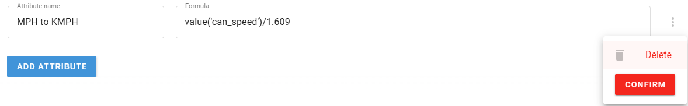

# Gestión de atributos

El nodo **Iniciar Atributo** permite crear, editar y gestionar atributos de datos en todo el flujo de IoT Logic. Esta guía cubre las operaciones esenciales de gestión de atributos: crear, editar y eliminar.

## Creación de atributos

A continuación se explica cómo crear un nuevo atributo en el nodo **Iniciar Atributo**:

1. Haga clic en el botón **Agregar atributo**
2. Introduzca un nombre para el atributo (por ejemplo, "Velocidad mph")
3. Defina la expresión del valor (por ejemplo, `value('can_speed')/1.609`)
4. Opcionalmente, configure la hora de generación y la hora del servidor; para ello, active el conmutador **Especificar parámetros de tiempo**  
Para más detalles, consulte [Ajustes de tiempo para atributos](https://squaregps.atlassian.net/wiki/spaces/UDOCES/pages/3232334380/Gesti+n+de+atributos#Time-settings-for-attributes)
5. Haga clic en **Guardar** para confirmar la configuración del nodo

El nuevo atributo se guarda en el nodo y el cálculo configurado se aplica inmediatamente en el flujo.

### Ajustes de tiempo para atributos

La configuración de la hora le permite controlar las marcas de tiempo asociadas a sus atributos:

- **Hora generada**: Cuando se crearon los datos.
  - Utilice `now()` para establecer la hora actual en milisegundos.
  - Utilice `genTime('partameter_name', 0, 'valid')` para utilizar la hora de generación propia del parámetro.
- **Hora del servidor**: Cuando los datos fueron recibidos por IoT Logic.
  - Utilice `now()` para establecer la hora actual en milisegundos.
  - Utilice `srvTime('partameter_name', 0, 'valid')` para utilizar la hora del servidor del parámetro.
  - Añadir compensaciones para ajustar las zonas horarias (por ejemplo, `srvTime('can_speed', 0, 'valid') + 120000` añade 2 minutos).

> [!INFO]
> La configuración de la hora es importante para el análisis y la sincronización de los datos. Una configuración horaria adecuada garantiza que sus datos mantengan la integridad cronológica en todo el flujo.

## Edición de atributos existentes

Para modificar un atributo existente:

1. Abra la ventana de configuración del nodo pasando el ratón por encima del nodo para mostrar las acciones rápidas, o haciendo doble clic en el nodo
2. Busque el atributo que desea editar en la lista de atributos.
3. Realice los cambios necesarios en los campos de texto de las propiedades del atributo: **Nombre del atributo**, **Fórmula** o **Parámetros de tiempo**
4. Si necesita editar otros atributos en este nodo, repita el paso 3 para ellos
5. Haga clic en **Guardar** para aplicar los cambios a la configuración del nodo.

> [!INFO]
> Cuando edite un atributo, los cambios sólo se aplicarán a los nuevos datos recibidos después de guardar. Los datos históricos ya recogidos no se recalcularán.

## Eliminación de atributos

Para eliminar un atributo que ya no es necesario:

1. Abra la ventana de configuración del nodo pasando el ratón por encima del nodo para ver las acciones rápidas, o haciendo doble clic en el nodo.
2. Busque el atributo que desea eliminar en la lista de atributos y pase el ratón por encima para que aparezca el menú .
3. Haga clic en el menú que aparece y seleccione **Eliminar**
4. Confirme su decisión de eliminar el atributo
5. Haga clic en **Guardar** para aplicar los cambios a la configuración del nodo

> [!INFO]
> Al eliminar un atributo, éste ya no se calculará para los nuevos datos, pero los datos históricos que contengan este atributo permanecerán inalterados en la base de datos.