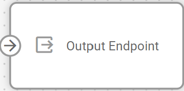
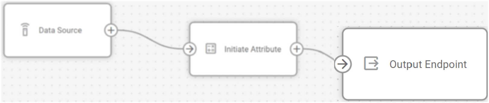
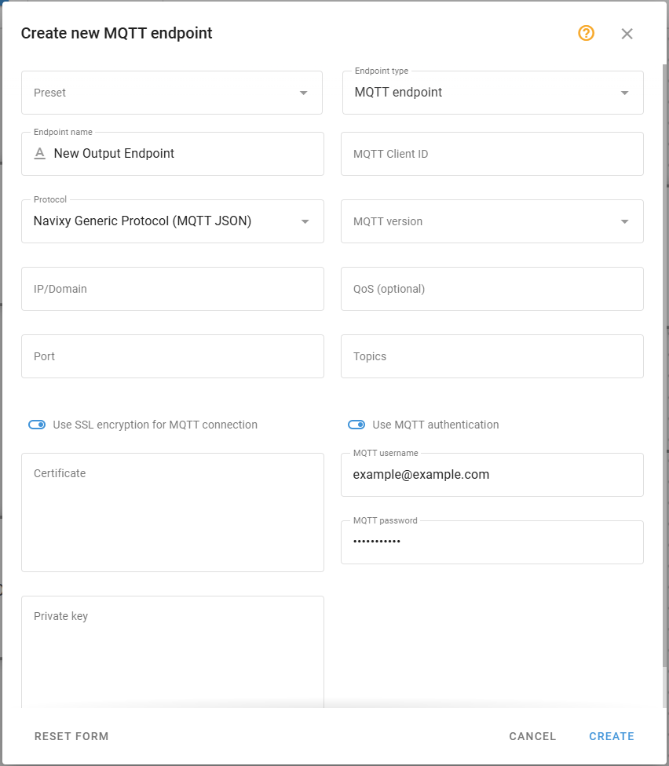
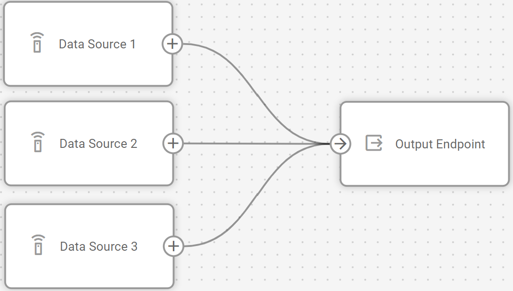

# El nodo Punto de Salida

## Resumen técnico y capacidades

El nodo **Punto de Salida** sirve como componente de transmisión de datos dentro de los flujos de IoT Logic, definiendo dónde se envían los datos procesados del dispositivo. Su función principal es estandarizar los datos heterogéneos de los dispositivos en un formato coherente antes de transmitirlos a sistemas o servicios externos. Todos los datos se transfieren en un formato unificado, habilitado por [Navixy Generic Protocol](https://squaregps.atlassian.net/wiki/spaces/NAV/pages/3107553589/Navixy+Generic+Protocol?atlOrigin=eyJpIjoiYjUyODU4MGFhODNhNDY3MzkyMTk2YjczMTVhOTg0ZTUiLCJwIjoiYyJ9).

Para más detalles sobre el formato en que se transmiten los datos, véase [Formato de los datos de salida](https://squaregps.atlassian.net/wiki/spaces/UDOCES/pages/3232334428/El+nodo+Punto+de+Salida#Formato-de-los-datos-de-salida).

### Integración de la arquitectura de flujo

Un único flujo IoT Logic puede contener múltiples nodos de salida, cada uno con configuraciones independientes. Esta arquitectura permite:

- Transmisión de datos multidestino a diferentes sistemas externos simultáneamente
- Manejo de múltiples fuentes de datos con diferentes formatos de datos entrantes
- Enrutamiento selectivo de datos que permite escenarios flexibles de flujo de datos

> [!INFO]
> Cada flujo incluye un nodo Navixy endpoint por defecto. Se recomienda mantener conexiones entre sus nodos **Fuente de Datos** y esta salida. La conexión garantiza que los datos de los dispositivos se envíen a la plataforma, lo que permite las capacidades de supervisión mediante las herramientas Navixy. Si se elimina la salida Navixy, los datos de los dispositivos implicados en el flujo dejarán de llegar a la plataforma.

### Capacidades del nodo

El nodo **Punto de Salida** ofrece por sí mismo:

- **Transmisión segura**: Implementa mecanismos de encriptación SSL y autenticación para la protección de datos durante el tránsito.
- **Garantía de entrega configurable**: Proporciona selección de nivel de QoS MQTT para equilibrar entre las garantías de entrega y la sobrecarga de la red.
- **Reutilización de la configuración**: admite la creación de perfiles de punto final que pueden reutilizarse en varios flujos, lo que garantiza la coherencia de la configuración.
- **Procesamiento simultáneo**: Acepta entradas de múltiples fuentes de datos dentro de un flujo, lo que permite una transmisión de datos consolidada.
- **Selección de la versión del protocolo de transporte**: Admite tanto MQTT 3.1.1 como 5.0 para adaptarse a diversas implementaciones del broker.

## Opciones de configuración

La configuración de un nodo **Punto de Salida** determina cómo y dónde se entregarán los datos de un flujo concreto. Cada opción de configuración sirve a un propósito específico a la hora de establecer una transmisión de datos fiable.

Veamos qué elementos utiliza este nodo y qué puedes configurar cuando trabajes con él:

### Pasos de configuración

1. Seleccione **Tipo de punto de salida**: Elija qué tipo de transmisión utilizar para este endpoint
  - **Punto de salida predeterminado** \- configuración estándar para enviar datos de flujo a la plataforma Navixy que no se puede editar
  - **Punto de salida MQTT** \- configuración personalizada que utiliza MQTT como transporte para enviar datos de flujo a sistemas de terceros.
2. Seleccione **un preestablecido** (opcional): Abra el menú desplegable **Preestablecido** y seleccione un preestablecido que se ajuste a sus necesidades. Hay disponibles varias configuraciones preestablecidas para destinos comunes, como los servidores Navixy.  
**Nota:** Una vez guardado un punto, puede utilizarse como preconfiguración para crear nuevas salidas.

2. Especifique el **nombre del punto de salida**: Introduzca un nombre único y descriptivo para esta configuración de punto final.
  - Utilice un nombre que le ayude a identificar el destino al que se envían los datos.
  - Este nombre se mostrará en el diagrama de flujo para facilitar la identificación.
3. **Seleccione protocolos**:
  - **Protocolo**: Seleccione un protocolo para la transmisión de datos a servicios de terceros en una lista desplegable. Actualmente, sólo se admite el **Navixy Generic Protocol (JSON)**. En el futuro, se podrán considerar otros formatos como opciones adicionales para la transmisión de datos.
4. **Configure los parámetros de conexión**:
  - Introduzca la **IP/Dominio** de destino en el formato: *123.123.123.123* o [*example.example.com*](http://example.example.com).
  - Especifique el número de **puerto**. Por defecto, *1883* se utiliza para MQTT estándar, *8883* \- para SSL).
  - **Active SSL** para conexiones seguras. Esta acción establece automáticamente el puerto en *8883* si no se ha cambiado manualmente.
5. **Establezca parámetros MQTT**:
  - Introduzca **ID de cliente**. La parte receptora tiene una lista fija de clientes. En este campo debe especificarse el valor correcto para que no se rechacen los datos.
  - Seleccione la **versión de MQTT**: 3.1.1 o 5.0.
  - Especifique **Temas** en forma de etiquetas que se utilizarán para la transmisión de datos.
  - Elija el nivel de **QoS** que determina la lógica de la transmisión de datos:
    - **QoS 0** - sin confirmación de entrega.
    - **QoS 1** - entrega garantizada con posible duplicación.
    - **QoS 2** - entrega garantizada sin duplicación.
6. **Configure** la **autenticación MQTT** (opcional):
  - Active la **autenticación MQTT**.
  - Introduzca **el nombre de usuario** **MQTT** y la **contraseña MQTT** de la parte receptora en los campos que aparecen.
7. **Guarde** la configuración.

> [!NOTE]
> Asegúrese de conectar los nodos de datos relevantes a su nueva salida; de lo contrario, no recibirá ningún dato.

## Formato de los datos de salida

La principal capacidad del nodo es la estandarización del formato de datos a través [Navixy Generic Protocol](https://squaregps.atlassian.net/wiki/spaces/NAV/pages/3107553589/Navixy+Generic+Protocol?atlOrigin=eyJpIjoiYTlmMzBlNWMyOGI2NDk5OWI3YmYxYjBkZGQ1YWZlODQiLCJwIjoiYyJ9). Esta estandarización resuelve un reto fundamental en las implementaciones de IoT: la diversidad de protocolos específicos de dispositivos que requieren un trabajo de integración personalizado.

Normalmente, cada tipo de dispositivo utiliza su propio formato de datos, lo que requiere gestores de protocolo específicos en los sistemas receptores. Este enfoque aumenta exponencialmente la sobrecarga de desarrollo y mantenimiento a medida que se amplían las flotas de dispositivos. IoT Logic soluciona este problema normalizando todos los datos de los dispositivos en una estructura JSON estandarizada, independientemente del fabricante original o del protocolo.

La especificación [Navixy Generic Protocol](https://squaregps.atlassian.net/wiki/spaces/NAV/pages/3107553589/Navixy+Generic+Protocol?atlOrigin=eyJpIjoiYTlmMzBlNWMyOGI2NDk5OWI3YmYxYjBkZGQ1YWZlODQiLCJwIjoiYyJ9) incluye campos normalizados para la identificación de dispositivos, datos de localización, valores de telemetría y metadatos. Este formato admite la comunicación bidireccional, permitiendo tanto la transmisión de datos desde IoT Logic a sistemas externos como la ingestión de datos desde fuentes externas a la plataforma.

Al implementar un único protocolo, el nodo **Punto de Salida** permite:

- Un único patrón de integración para los sistemas receptores en lugar de múltiples manejadores específicos de cada dispositivo.
- Estructura de datos coherente que permanece uniforme en todos los dispositivos conectados.
- Reducción de la sobrecarga de procesamiento del lado del servidor mediante la normalización de protocolos.
- Escalado simplificado al añadir nuevos tipos de dispositivos a las implantaciones existentes.
- Capacidad de intercambio bidireccional de datos con sistemas externos.

El nodo implementa MQTT como protocolo de transporte para esta carga útil JSON estandarizada, proporcionando un mecanismo de transmisión fiable y ligero adecuado para despliegues IoT.

## Preguntas más frecuentes

### ¿Puedo conectar varias fuentes de datos a un único nodo de Punto de Salida?

Sí. El nodo **Punto de Salida** acepta entradas de múltiples nodos **Fuente de Datos** simultáneamente. Todos los datos procesados, incluidas las coordenadas de ubicación, los identificadores de dispositivo, los parámetros de telemetría y los atributos calculados, se serializan de acuerdo con la especificación del [Navixy Generic Protocol](https://squaregps.atlassian.net/wiki/spaces/NAV/pages/3107553589/Navixy+Generic+Protocol?atlOrigin=eyJpIjoiYTlmMzBlNWMyOGI2NDk5OWI3YmYxYjBkZGQ1YWZlODQiLCJwIjoiYyJ9) antes de la transmisión.

### ¿Qué ocurre si modifico un punto que se utiliza en varios flujos?

Las configuraciones de los puntos se almacenan como recursos reutilizables en toda la cuenta de cliente. Las modificaciones a una configuración de punto existente afectarán a todos los nodos que hagan referencia a ese punto en todos los flujos. Este comportamiento facilita la estandarización de la configuración, pero requiere una gestión cuidadosa de los cambios cuando se actualizan los parámetros del punto.

### ¿Qué prácticas de seguridad se recomiendan para las implantaciones de producción?

Para implementaciones que requieran altos estándares de seguridad (sanidad, finanzas, etc.), active SSL e implemente la autenticación MQTT. Aunque esto aumenta ligeramente la sobrecarga del protocolo, proporciona la protección de datos necesaria durante la transmisión. Las implementaciones estándar deben utilizar como mínimo el nivel 1 de QoS para garantizar la confirmación de entrega.