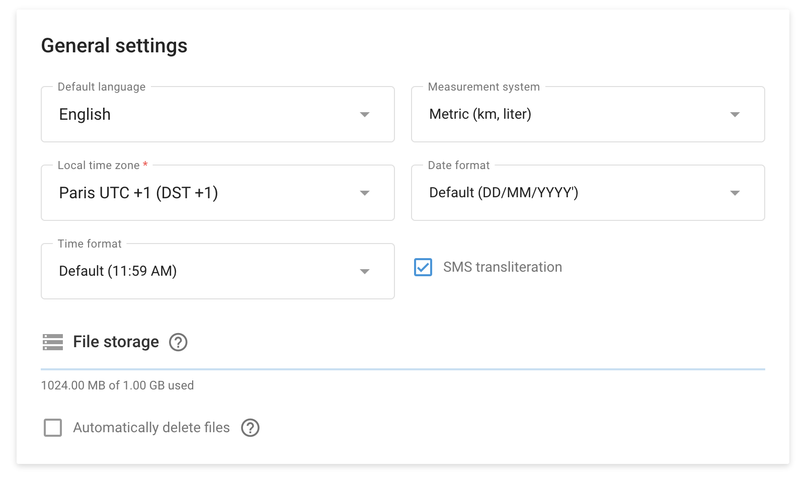

# Preferencias del usuario

La sección Preferencias del usuario situada en **Configuración de la cuenta → Perfil permite** puedes personalizar varios ajustes para adaptarlos mejor a tus necesidades y preferencias individuales. Esto incluye opciones de idioma, sistema de medición, zona horaria, formato de fecha y gestión de almacenamiento de archivos.

## Preferencias generales del usuario

1. **Idioma por defecto:** Establezca el idioma predeterminado de su cuenta. Por ejemplo, en la captura de pantalla anterior está seleccionado el inglés.
2. **Sistema de medición:** Elige el sistema de medida que prefieras. Las opciones suelen incluir el sistema métrico (km, litros) o el imperial (millas, galones).
3. **Zona horaria local:** Establezca la zona horaria local de su cuenta. Esta configuración es crucial para un seguimiento y notificación precisos de la hora. Por ejemplo, la captura de pantalla muestra París UTC +1 (DST +1).
4. **Formato de la fecha:** Seleccione el formato de visualización de las fechas. Los formatos disponibles ayudan a garantizar que las fechas se muestren de la forma que le resulte más familiar, como DD/MM/AAAA.
5. **Formato de la hora:** Elija el formato de visualización de la hora. El formato predeterminado suele ser de 12 horas (11:59 AM).
6. **Transliteración SMS:** Activa o desactiva la transliteración de SMS. Este ajuste puede ser útil si necesita enviar mensajes SMS en un conjunto de caracteres específico.

## Almacenamiento de archivos

- **Resumen de uso.** Monitoriza el uso de tu almacenamiento de archivos. La captura de pantalla muestra que se utilizan 1024 MB de los 1 GB disponibles.
- **Eliminación automática:** Active la opción de eliminar automáticamente los archivos cuando se alcance el límite de almacenamiento. Esto ayuda a gestionar el almacenamiento de forma eficiente sin intervención manual.