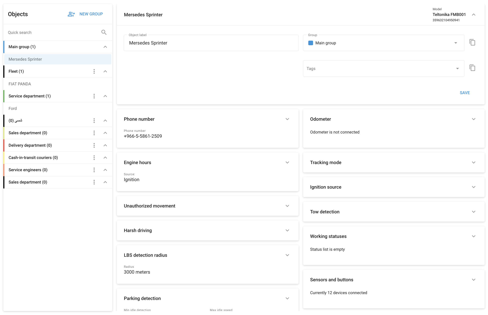

# Dispositivos y ajustes

En **Dispositivos y ajustes** de Navixy es una interfaz completa que permite a los gestores de flotas configurar y gestionar sus dispositivos de seguimiento a distancia. Esta sección es esencial para ajustar el rendimiento del dispositivo, configurar los sensores y aplicar ajustes específicos adaptados a cada activo de la flota.

#### Características principales y opciones de configuración

1. **Nombre del objeto:**
  - Es la etiqueta asignada a cada dispositivo. Ayuda a identificar y gestionar fácilmente los dispositivos de su flota.
2. **Asignación en grupo:**
  - Los dispositivos pueden agruparse por departamento, función o cualquier otra categorización que se adapte a las necesidades de su flota. Esta organización ayuda a gestionar varios dispositivos de forma eficaz.
3. **Etiquetas:**
  - Las etiquetas permiten clasificar y buscar dispositivos en la plataforma de forma rápida y sencilla. Esta función mejora la organización y recuperación de la información de los dispositivos.
4. **Número de teléfono:**
  - Muestra el número de teléfono asociado a la tarjeta SIM instalada en el dispositivo, crucial para la comunicación y la transmisión de datos.
5. **Modo de seguimiento:**
  - Configura el comportamiento de seguimiento en función del tiempo, la distancia o las curvas. Esto te permite ajustar la frecuencia con la que el dispositivo informa de su posición, equilibrando la precisión de los datos con los costes de transmisión.
6. **Detección de estacionado:**
  - Establece parámetros para definir cuándo se considera que el vehículo está aparcado. Esto incluye condiciones como el tiempo mínimo de ralentí y la velocidad máxima de ralentí después de que se detenga el movimiento.
7. **Detección de conducción brusca:**
  - Utilice el acelerómetro integrado para detectar y notificar eventos de conducción bruscos, como aceleraciones rápidas, frenadas bruscas o giros bruscos. Estos ajustes ayudan a controlar el comportamiento del conductor y a mejorar la seguridad.
8. **Detección de remolque:**
  - Para los dispositivos que admiten la detección por arrastre, configure la sensibilidad para garantizar una detección precisa y minimizar las falsas alarmas.
9. **Sensores y botones:**
  - Asigna las entradas del dispositivo a los sensores conectados y define los tipos de sensores. Esto incluye configurar sensores de nivel de combustible, aplicar datos de calibración y configurar otras entradas conectadas.
10. **Reenvío de datos:**
  - Reenvíe los datos del dispositivo de seguimiento GPS a otros servidores en el formato o protocolo que prefiera. Esta función es vital para integrar Navixy con otras plataformas, para el cumplimiento de normativas o para la obtención de datos personalizados en tiempo real.
11. **Estado de la conexión:**
  - Supervisa el estado de conexión del dispositivo, incluidos los ajustes de tiempo de espera para cuando el dispositivo se considera desconectado.
12. **Características adicionales:**
  - En función del modelo de dispositivo, puede haber disponibles opciones de configuración adicionales, como el seguimiento de las horas de motor, la configuración de la fuente de ignición, la detección de movimientos no autorizados, etc.

## Acciones de grupo

Navixy le permite aplicar ajustes a varios dispositivos simultáneamente mediante acciones de grupo. Esta función agiliza el proceso de configuración de dispositivos similares, ahorrando tiempo y garantizando la coherencia en toda la flota:

- **Copiar ajustes:**
  - En la esquina superior derecha de cualquier widget de configuración, encontrarás el icono de copia. Utilízalo para aplicar los mismos ajustes a otros dispositivos de tu flota. Si un dispositivo no aparece en la lista desplegable, significa que los ajustes seleccionados son incompatibles con ese modelo de dispositivo.