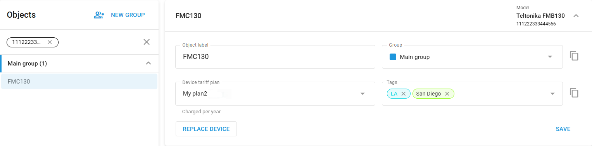

# Widget de etiqueta de objeto

La **Etiqueta del objeto** te permite gestionar los principales datos de identificación de tu dispositivo. Este widget contiene los siguientes campos:

* **Etiqueta del objeto:** Aquí es donde asignas un nombre al dispositivo. El nombre puede ser cualquier nombre que te ayude a identificar el dispositivo fácilmente, como la marca y el modelo del vehículo, el nombre del propietario o cualquiera otra descripción que se adapte a tus necesidades.
* **Grupo:** Este campo le permite asignar el dispositivo a un grupo específico. Agrupar dispositivos puede ser útil para organizar la flota por departamento, función o ubicación.
* **Etiquetas:** Las etiquetas proporcionan una forma adicional de categorizar y buscar dispositivos dentro de la plataforma, lo que facilita la gestión de grandes flotas con criterios de etiquetado específicos.
* **Modelo:** Muestra el modelo del dispositivo en uso, que aparece en la esquina superior derecha junto con el número IMEI o ID del dispositivo.

Después de realizar cualquier cambio, haga clic en "Guardar" para aplicar las actualizaciones.

## Reemplazo de dispositivos

Puede sustituir fácilmente un localizador GPS conectado a la plataforma. Tanto si se trata de una actualización como si el dispositivo no funciona correctamente, el mecanismo de sustitución garantiza una transición sin problemas, ya que conserva la configuración, los ajustes y los datos históricos del dispositivo original. Accesible a través de la sección de la interfaz **Dispositivos y ajustes**, este proceso intuitivo y ágil minimiza el tiempo de inactividad y maximiza la comodidad, manteniendo sus operaciones en continuo funcionamiento.

> \[!INFO] **Importante**
>
> * Algunos dispositivos, como los teléfonos inteligentes utilizados como rastreadores a través de la aplicación X-GPS, no son compatibles con el mecanismo de sustitución y no tienen un botón de **Reemplazar dispositivo** disponible para ellos.
> * Los datos históricos sólo estarán disponibles una vez que el nuevo dispositivo se haya activado correctamente.

### Cómo sustituir un dispositivo

1. **Seleccione el dispositivo**\
   Vaya a la sección Dispositivos y configuración y seleccione el dispositivo deseado de la lista de objetos haciendo clic sobre él.
2. **Iniciar la sustitución**\
   Haga clic en Reemplazar dispositivo en el panel de información del dispositivo.
3. **Revise las instrucciones del sensor**
4. Confirme que el nuevo hardware es compatible con la configuración del dispositivo original.
5. Si se conectaron sensores adicionales al dispositivo original, asegúrese de que se vuelven a conectar a entradas idénticas en el nuevo dispositivo para conservar los datos históricos.
6. Lea atentamente y siga todas las instrucciones que aparezcan en pantalla sobre los sensores del dispositivo antes de continuar. Siga las directrices específicas que se le proporcionen y, a continuación, haga clic en **Siguiente paso**.
7. **Conectar un dispositivo de sustitución**\
   Los pasos son similares a la conexión de un nuevo dispositivo a la plataforma, excepto el nombre del objeto, hereda el nombre del dispositivo original y no se puede cambiar.
8. **Seleccione el nuevo modelo de dispositivo:** Seleccione el nuevo modelo de dispositivo de la lista proporcionada y haga clic en **Siguiente paso**.
9. **Introduzca los detalles del dispositivo:** Especifique el número de teléfono, la configuración APN y el ID del dispositivo (IMEI) para el nuevo dispositivo.
10. **Complete la sustitución:** Haga clic en **Reemplazar** para finalizar el proceso. La plataforma enviará comandos de activación al nuevo dispositivo y supervisará su estado de activación.

> \[!INFO] Tenga en cuenta que una vez pulsado el botón **Reemplazar**, el proceso de reemplazo no se puede cancelar.

Estos pasos garantizan que el dispositivo de sustitución esté correctamente configurado y listo para tomar el relevo del anterior, minimizando el tiempo de inactividad y manteniendo las operaciones de la flota sin problemas.

### Resolución de problemas de activación

Si el dispositivo no se activa, puede repetir el proceso de sustitución con el mismo dispositivo o probar con otro diferente. Si el problema persiste, puede configurar manualmente el dispositivo siguiendo sus instrucciones.
