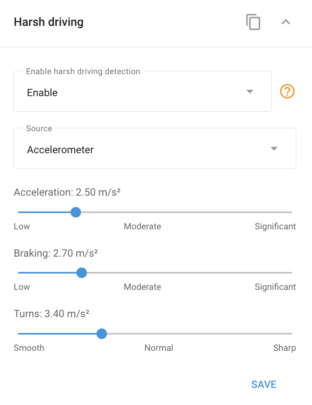

# Widget de conducción brusca

Muchos dispositivos GPS avanzados para vehículos incorporan un **detector de conducción dura**. Este detector supervisa continuamente los valores de aceleración durante el cambio de velocidades, el frenado y el giro. Cuando estos valores superan los umbrales predefinidos, el sistema genera el correspondiente incidente de "conducción brusca". Estos eventos pueden seguirse y analizarse mediante [Notifica](/wiki/pages/createpage.action?spaceKey=UDOCES&title=Harsh%20driving&linkCreation=true&fromPageId=2922551564)[c](../../reglas-y-alertas/safety/conduccin-dura.md)[ion](/wiki/pages/createpage.action?spaceKey=UDOCES&title=Harsh%20driving&linkCreation=true&fromPageId=2922551564)[e](../../reglas-y-alertas/safety/conduccin-dura.md)[s](/wiki/pages/createpage.action?spaceKey=UDOCES&title=Harsh%20driving&linkCreation=true&fromPageId=2922551564) y [Reportes sobre ecoconducción](../../gestin-de-flotas/conduccin-ecolgica-eco-driving.md), lo que permite una evaluación detallada del comportamiento al volante.

## Configuración de los umbrales del detector de conducción brusca

Como los vehículos varían en sus características técnicas -por ejemplo, la capacidad de un auto para acelerar más rápido que un autobús-, los valores críticos de aceleración también difieren. Navixy permite personalizar los parámetros de conducción brusca de los dispositivos GPS en función del tipo específico de vehículo que se esté supervisando.

Para acceder al **Widget de conducción brusca** en Navixy, navegue hasta la sección **Dispositivos y ajustes,** seleccione el dispositivo deseado y a continuación, despliegue el widget "Conducción brusca" para ajustar la configuración.

En el widget, puedes ajustar los valores del umbral de aceleración, frenado y giro. La superación de estos umbrales activará diferentes tipos de eventos, que pueden analizarse posteriormente mediante reportes de eventos o reportes de eco-conducción. Esta personalización garantiza que el sistema refleje con precisión las condiciones de conducción y los requisitos de seguridad de su flota.