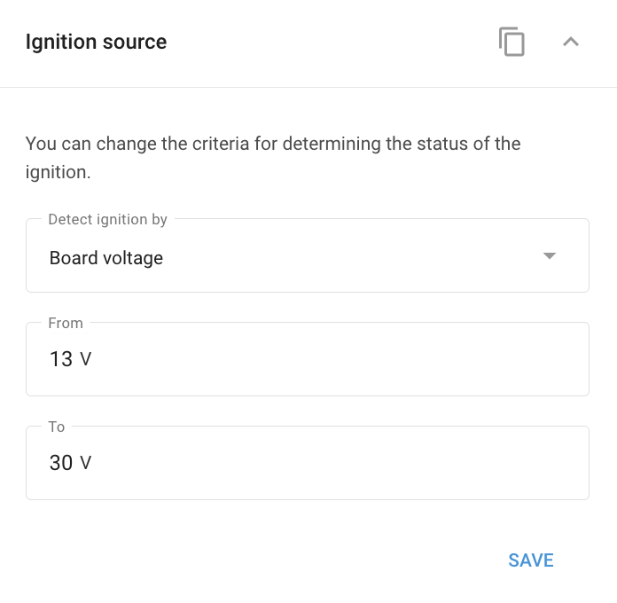

# Widget de fuente de ignición

Muchos dispositivos GPS avanzados ofrecen la flexibilidad de determinar el **Estado de encendido** no sólo con una conexión directa del cable de encendido, sino también utilizando un **fuente de ignición virtual** en función de las lecturas del sensor de movimiento o de la tensión de a bordo del vehículo.

## Opciones de fuente de ignición virtual

- **Detección de encendido por tensión**: Cuando el motor está en marcha, el generador del vehículo suministra energía a una tensión superior a la de la batería para mantenerla cargada. Al controlar este aumento de tensión, el dispositivo puede determinar con precisión cuándo el encendido está activado.
- **Detección de ignición mediante sensor de movimiento**: Esta opción es útil cuando el dispositivo no está conectado al sistema eléctrico del vehículo. El estado de encendido se deduce del movimiento del vehículo. Sin embargo, tenga en cuenta que este método también puede detectar el encendido cuando el vehículo está siendo remolcado, incluso si el motor no está en marcha.

## Configuración de la fuente de ignición virtual

Para configurar la fuente de ignición en Navixy, utilice la opción **Widget de fuente de ignición** en la aplicación "Dispositivos y ajustes":

1. Seleccione la fuente de ignición deseada en la lista desplegable del widget "Fuente de ignición".
2. Si utiliza la tensión de a bordo del vehículo, especifique el intervalo de tensión dentro del cual se considera que el encendido está "activado".

Esta configuración permite una supervisión flexible y precisa del estado de encendido del vehículo, adaptándose a diferentes escenarios de instalación.

#### Ejemplo de configuración

Esta captura de pantalla ilustra las opciones disponibles para seleccionar la fuente de ignición en la plataforma Navixy.

El widget "Fuente de ignición" permite a los usuarios elegir los criterios para determinar el estado de la ignición. Puede seleccionar entre las siguientes opciones:

1. **Tensión de la placa**: Detecta el encendido en función de la tensión de a bordo del vehículo, útil cuando la tensión aumenta a medida que el motor funciona.

2. **#1 estado de entrada**: Utiliza el estado de una entrada específica, normalmente un cable de encendido, para determinar si el encendido está conectado o desconectado.

3. **Movimiento**: Detecta el encendido en función del movimiento del vehículo, ideal para situaciones en las que el dispositivo no está conectado directamente al sistema eléctrico del vehículo. Sin embargo, este método también puede registrar el encendido durante el remolque u otros movimientos no relacionados con el motor.