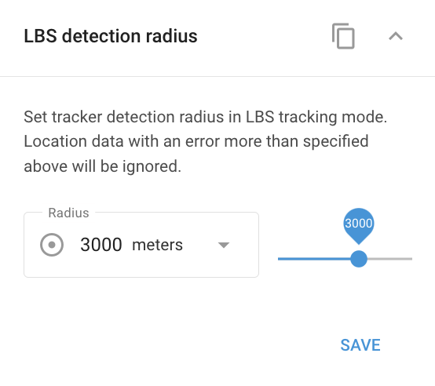

# Widget de radio de detección LBS

En **Radio de detección LBS (Location-Based Service)** determina la distancia a la que el sistema buscará señales de estaciones base de telefonía móvil o puntos Wi-Fi para localizar un dispositivo. Este ajuste es crucial para garantizar un seguimiento preciso de la ubicación en función del entorno en el que funcione el dispositivo.

* **Zonas rurales**: En localidades rurales con menos estaciones base, es aconsejable aumentar el radio LBS. Esto permite al sistema utilizar estaciones base más distantes, mejorando las posibilidades de localizar el dispositivo.
* **Zonas urbanas**: En ciudades con una alta densidad de estaciones base, el radio LBS debe mantenerse más pequeño. La proximidad de varias estaciones base proporciona señales suficientes para un seguimiento preciso de la ubicación, por lo que un radio menor ayudará a mantener una mayor precisión.

Ajuste el radio de detección de LBS en función del entorno operativo del dispositivo para equilibrar la precisión y la cobertura de la señal.

En Navixy, las ubicaciones LBS se muestran en el mapa como círculos. El centro indica la ubicación estimada, mientras que el radio muestra la posible imprecisión. Un círculo más pequeño indica una mayor precisión, lo que suele ocurrir en las zonas urbanas, mientras que un círculo más grande indica una mayor imprecisión, lo que suele ocurrir en las zonas rurales.
