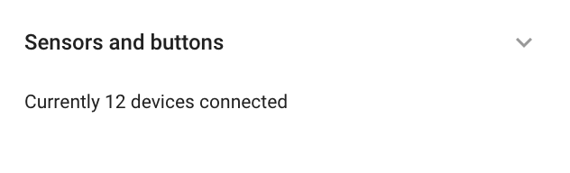

# Sensores de vehículos

En el widget de **Sensores y botones** en Navixy, le permite gestionar y configurar varios sensores conectados a sus dispositivos GPS. Esta función es esencial para controlar diversos parámetros del vehículo, como los niveles de combustible, la temperatura y el diagnóstico del motor, directamente a través de la plataforma.

## Visión general

En **Sensores y botones** se encuentra en el widget **Dispositivos y ajustes** a la que puede acceder haciendo clic en la opción correspondiente del menú principal de la interfaz web.

El widget plegado ofrece una visión general del número de sensores ya conectados al dispositivo seleccionado. Si amplía el panel, podrá añadir nuevos sensores o editar los existentes.

El número y el tipo de sensores que puedes conectar dependen del modelo de dispositivo GPS. Por ejemplo, algunos dispositivos permiten configurar parámetros de datos transmitidos a través del bus CAN o del conector de diagnóstico OBDII.

## Añadir y editar sensores

Para gestionar sus sensores, puede utilizar los siguientes botones:

* **Añadir sensor**: Permite añadir un nuevo sensor.
* **Editar sensor**: Permite modificar los parámetros de un sensor existente.
* **Borrar sensor**: Elimina el sensor seleccionado del sistema.

### Tipos de sensores

Navixy admite varios tipos de sensores, entre ellos:

* [**Sensores discretos**](sensores-discretos/): Se utiliza para entradas binarias como estado de encendido, puerta abierta/cerrada, etc.
* [**Sensores de medición**](sensores-de-vehculos/sensor-de-medicin/): Estos sensores miden e informan de valores continuos como la temperatura, el nivel de combustible o las RPM del motor.
* [**Sensores de agregación**](sensores-de-vehculos/sensores-de-acumulacin.md): Combinar datos de múltiples fuentes en un único valor visible.
* [**Sensores virtuales**](sensores-de-vehculos/sensores-virtuales/): Derivado de datos calculados o valores combinados de sensores.

### Copia de los ajustes del sensor

Para agilizar la configuración, puede copiar los ajustes de los sensores de un dispositivo a otro, siempre que los dispositivos sean del mismo modelo. Esto resulta especialmente útil cuando se gestionan grandes flotas con tipos de vehículos similares.

**Pasos para copiar los ajustes del sensor:**

1. Pulsa el botón de copiar (📋).
2. Seleccione los dispositivos a los que desea aplicar la configuración copiada.
3. Haga clic en **Solicitar**.

**Nota:** Al copiar los ajustes de los sensores, se sobrescribirán los ajustes actuales de los dispositivos seleccionados. Asegúrese de seleccionar únicamente los dispositivos que desea actualizar.
