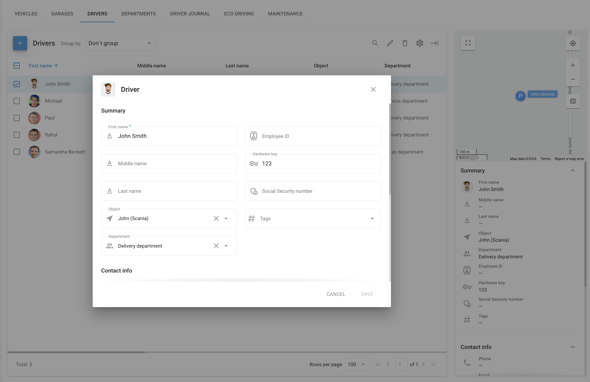

# Conductores

La pestaña de **Conductores** en la plataforma Navixy está diseñada para ayudar a los administradores de flotas a gestionar y supervisar eficazmente a sus conductores. Esta sección le permite crear y gestionar perfiles detallados de conductores, vinculándolos a vehículos u objetos específicos de su flota. Al mantener registros completos de los conductores, puede agilizar las operaciones de la flota, mejorar la responsabilidad de los conductores y mejorar el rendimiento general de la flota.

## Lista de controladores

En **Conductores** se puede visualizar una lista de todos los conductores asociados a su flota. Cada perfil de conductor contiene información esencial, como el nombre del conductor, el vehículo u objeto asignado, el departamento y otros detalles críticos como su ID de empleado, clave de hardware e información de contacto. Estos datos se muestran en forma de tabla para facilitar el acceso, y se proporciona un resumen visual en la parte derecha de la pantalla para una referencia rápida.

### Personalización de listas

Haciendo clic en el botón **Columnas** puede seleccionar qué campos desea que sean visibles, como el nombre, los apellidos, el objeto, el departamento y otros datos del conductor. Esta función proporciona flexibilidad en la forma de ver y gestionar la información del conductor, permitiéndole adaptar la interfaz a sus necesidades específicas.

### Barra lateral con información detallada

Al seleccionar un conductor de la lista, aparece un resumen de su perfil en la parte derecha de la pantalla. Este resumen incluye detalles clave como el nombre del conductor, el vehículo asociado, el departamento, el ID de empleado, la clave de hardware y el número de la seguridad social, si procede. Además, proporciona información de contacto, incluidos números de teléfono y direcciones de correo electrónico, que son cruciales para mantener una comunicación clara con sus conductores.

## Perfil del conductor

El **Perfil del conductor** es un registro que contiene información esencial sobre cada conductor de su flota. Incluye detalles como el nombre del conductor, información de contacto, vehículo asignado, departamento y números de identificación como ID de empleado y llave de hardware. El perfil también puede contener datos adicionales como información sobre el permiso de conducir y etiquetas, lo que ayuda a los gestores de flotas a supervisar y gestionar eficazmente a los conductores dentro del sistema.

Para añadir un nuevo controlador, pulse el botón **Añadir conductor** botón. Se abrirá un formulario en el que podrá introducir todos los datos pertinentes sobre el conductor, incluida su información de contacto, su ubicación y los datos de su permiso de conducir. También puede vincular al conductor a un vehículo o departamento específico dentro de su organización. Además, puede subir una foto del conductor para mejorar su perfil.

## Identificación del conductor

La identificación eficaz del conductor es esencial para una gestión precisa de la flota, garantizando que cada conductor se asigna correctamente al vehículo adecuado. Navixy ofrece soluciones sólidas para la identificación automática y manual de conductores, que satisfacen las diversas necesidades de los gestores de flotas.

### Identificación automática del conductor

Navixy admite la identificación automática del conductor mediante el uso de llaves electrónicas, como i-Button o dispositivos RFID. Esta función permite asignar sin problemas los conductores a los vehículos.

#### **Configuración de la identificación automática**

1. **Asignación de la llave hardware:**

* Para permitir la identificación automática, la llave electrónica del conductor debe estar vinculada a su perfil. Esto implica introducir manualmente el código único de la llave Hardware, que se encuentra en el i-Button o en el dispositivo RFID, en el campo designado dentro de la tarjeta de empleado del conductor.

2. **Asignación automática:**

* Una vez especificada la llave electrónica en el perfil del conductor y conectada al lector i-Button del vehículo, la plataforma identificará automáticamente al conductor y lo asignará al vehículo adecuado tras la detección de la llave.

**Requisitos para la identificación automática:**

* El dispositivo de seguimiento debe soportar la interfaz 1-Wire para la conexión de la llave electrónica.
* La función "Llave de hardware" debe estar activada para el modelo de seguidor específico, lo que puede comprobarse en [Página de dispositivos compatibles con Navixy](https://www.navixy.com/devices/). Si la opción "Llave hardware" está disponible en el **Campos estatales** de su dispositivo, entonces es compatible con la función de identificación de controladores.

### Identificación manual del conductor

En los casos en que la identificación automática no es posible o preferible, Navixy ofrece un proceso de asignación manual de conductores:

#### Asignación manual de controladores

* Después de crear tarjetas de empleado para sus conductores, puede asignarlos manualmente a vehículos dentro de la plataforma Navixy. Para ello, vaya a la aplicación Seguimiento, seleccione un objeto y asigne un conductor mediante el panel de widgets.

### Reportes basados en el conductor

Para las operaciones de flota en las que varios conductores utilizan el mismo vehículo, Navixy proporciona reportes detallados específicos para cada conductor. Esta función permite a los gestores de flotas generar reportes de viaje organizados por conductor, así como reportes de cambio de turno, ofreciendo una visión clara de los viajes y las horas de trabajo de cada conductor.

Estos reportes tienen un valor incalculable para controlar el rendimiento de los conductores, gestionar las cargas de trabajo y garantizar el cumplimiento de la normativa sobre horas de trabajo.
