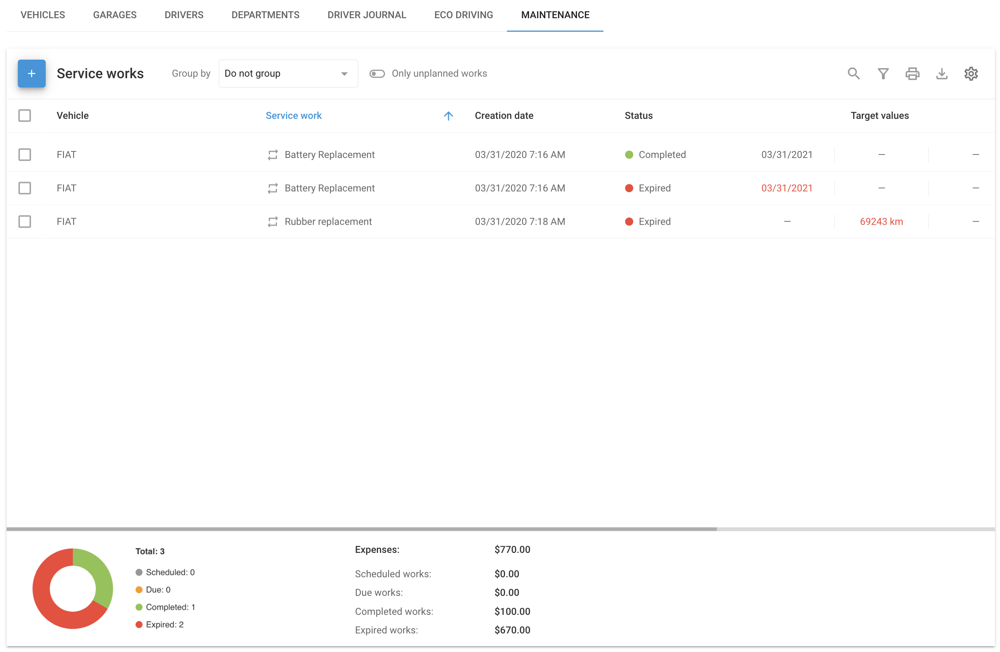
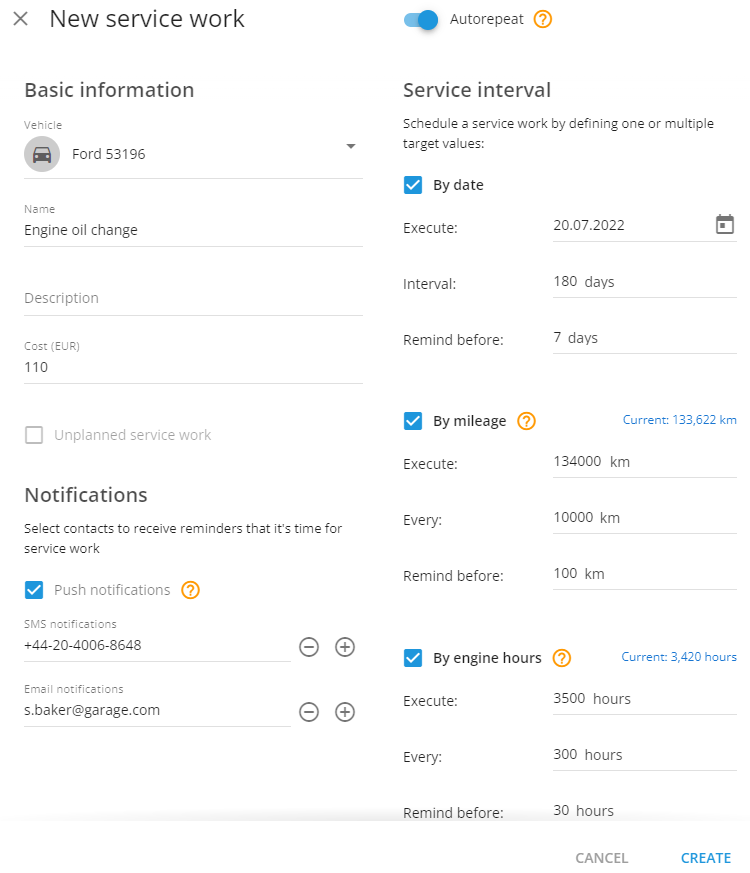

# Mantenimiento

La pestaña de **Mantenimiento,** en el apartado de Gestión de Flotas, es una completa herramienta diseñada para gestionar eficazmente las tareas de servicio de los vehículos. Esta guía explica cómo crear, gestionar y supervisar las tareas de servicio para mantener su flota en las mejores condiciones.

## Añadir trabajo de servicio

Para garantizar un rendimiento óptimo de la flota, empiece por programar y gestionar sus tareas de servicio.

1. **Ir a mantenimiento:**

* Navegue hasta la **Gestión de flotas** y haga clic en **Mantenimiento**.

2. **Crear un nuevo trabajo de servicio:**

* Haga clic en **Añadir** en la esquina superior izquierda.
* Seleccione el vehículo que desea revisar.
* Elija una o varias de las siguientes condiciones:
  * **Por fecha:** Fije una fecha para el servicio y reciba recordatorios antes de la fecha de vencimiento.
  * **Por kilometraje:** Introduzca el kilometraje en el que debe producirse el servicio y fije un recordatorio.
  * **Por horas de motor:** Especifique el horario del motor para el servicio y que se lo notifiquen con antelación.

3. **Añade detalles:**

* Opcionalmente, añada una **Descripción** y su **Coste**.
* Configura las notificaciones mediante push, SMS o correo electrónico.
* Adjunte archivos como facturas si es necesario.

4. **Guarda la tarea:**

* Guarde la tarea de servicio y el sistema enviará notificaciones en función de su configuración.

## Gestionar los trabajos de servicio

Después de crear tareas de servicio, es posible que necesite modificarlas, eliminarlas o duplicarlas. A continuación te explicamos cómo gestionar estas acciones de forma eficaz:

#### Editar una tarea

* Busque la tarea en el **Mantenimiento** y actualice los datos según sea necesario.

#### Eliminar una tarea

* Si una tarea ya no es necesaria, elimínela de la sección Mantenimiento. Recuerde que las tareas eliminadas no se pueden recuperar.

#### Copiar una tarea

* Para asignar tareas similares a otros vehículos, utilice la función de copia y ajuste los parámetros según sea necesario.

## Establecer un trabajo de servicio repetible

Agilice el mantenimiento de su flota configurando tareas repetibles, una función que genera automáticamente nuevas tareas de servicio a intervalos predefinidos. Siga estos pasos para configurarla.

1. **Activar la repetición automática:**

* Encienda la **Repetición automática** pulsando el interruptor.

2. **Selecciona el vehículo:**

* Elija un vehículo para la tarea de servicio. El sistema utilizará los datos del rastreador GPS para controlar las horas del motor y el kilometraje.

3. **Introduzca los detalles de la tarea:**

* Agregue un **Nombre** y, opcionalmente, una **Descripción** y **Coste**.

4. **Establecer notificaciones:**

* Elige quién debe recibir las notificaciones.

5. **Defina el intervalo de mantenimiento:**

* **Por fecha:** Programe el primer servicio y fije intervalos para las tareas futuras.
* **Por kilometraje:** Introduzca el kilometraje objetivo y establezca intervalos recurrentes.
* **Por horas de motor:** Especifique las horas del motor y fije los intervalos para repetir el servicio.

6. **Adjuntar archivos:**

* Si es necesario, adjunte los documentos pertinentes.

El sistema creará automáticamente nuevas tareas en función de los intervalos que establezca.

## Creación de trabajos de mantenimiento en bloque

Para flotas más grandes, gestione de forma eficaz varios vehículos simultáneamente utilizando tareas de mantenimiento en bloque:

1. **Ir a Mantenimiento:**

* Abra **Gestión de flotas > Mantenimiento** sección.

2. **Crear una tarea masiva:**

* Haga clic en **Añadir** y seleccione el **Mantenimiento de grupo**.

3. **Selecciona vehículos:**

* Elige los vehículos para la tarea.

4. **Establece los parámetros:**

* Defina los detalles de la tarea como lo haría para un solo vehículo. También puede configurar estas tareas como repetibles o no planificadas.

### Supervisión de las tareas de servicio

Supervise eficazmente las actividades de mantenimiento de su flota con el completo resumen de estado:

* **Programado:** Tareas previstas pero aún no vencidas.
* **Debido:** Tareas que se avecinan.
* **Completado:** Tareas finalizadas.
* **Caducado:** Tareas que no se completaron a tiempo.

El cuadro de mandos ofrece un resumen conciso que permite ver al instante el estado de todas las tareas de mantenimiento de un vistazo.
