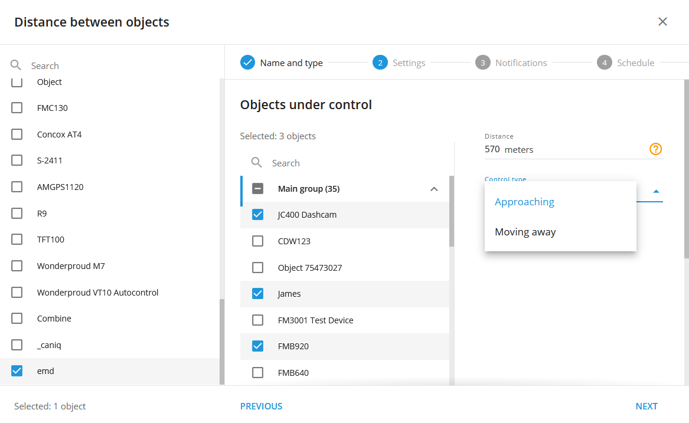

# Distancia entre objetos

He aquí una versión más pulida y empresarial de la regla "Distancia entre objetos", adecuada para la documentación de software telemático profesional:

* * *

## Visión general

La regla "Distancia entre objetos" está diseñada para ayudarle a gestionar y controlar eficazmente la distancia entre varios activos, como entre dos vehículos, un vehículo y su carga, o un camión y sus remolques.

Esta regla permite establecer umbrales de distancia específicos entre los objetos rastreados. Si la distancia supera o queda por debajo de los límites establecidos, se activa un evento, se registra y puede generar una notificación.

### Cómo funciona

Esta regla aprovecha los datos GPS para realizar un seguimiento continuo de la distancia entre un objeto principal designado -como un vehículo líder- y hasta 100 objetos secundarios, como remolques o vehículos seguidores. Estableciendo parámetros de distancia específicos, los usuarios pueden recibir notificaciones en tiempo real cuando estos objetos se acercan o alejan más de lo permitido. El sistema calcula automáticamente las distancias basándose en las coordenadas GPS más recientes, lo que garantiza alertas precisas y oportunas.

### Aplicaciones

- **Seguimiento de remolques y activos:** Mantenga el control sobre la distancia entre un vehículo y sus activos acoplados o que le siguen, como los remolques. Esto es esencial para evitar desconexiones accidentales, gestionar la separación entre convoyes y garantizar que los remolques permanezcan dentro de un radio de acción operativo seguro.
- **Cumplimiento de la distancia de seguridad:** Supervise y haga cumplir las distancias de seguridad entre los vehículos de la flota. Esta aplicación es crucial para evitar colisiones y fomentar el cumplimiento de los protocolos de seguridad, sobre todo en entornos con mucho tráfico o cuando se utilizan vehículos pesados.
- **Coordinación de flotas y gestión del tráfico:** Utilice la regla para gestionar el espaciado de los vehículos en un convoy o para supervisar las posiciones relativas de varios activos de la flota durante las operaciones. Estos datos también pueden agregarse para el análisis del tráfico, lo que ayuda a identificar patrones de congestión y optimizar la planificación de rutas.

## Configuración de reglas

### Parámetros de distancia

- **Acercándonos:** Configure el sistema para que le avise cuando objetos secundarios se acerquen al vehículo principal. Este ajuste es fundamental para mantener distancias de funcionamiento seguras y evitar colisiones u otros peligros para la seguridad.
- **Mudanza:** Establezca alertas para cuando los objetos secundarios aumenten su distancia con respecto al vehículo principal. Esto resulta especialmente útil para detectar si los vehículos se alejan de un convoy o si los remolques se separan del vehículo principal.
- **Rango de distancia:** Defina un rango específico de distancia permitida entre los objetos primario y secundario, que oscila entre 5 y 200.000 metros. El sistema generará notificaciones cada vez que la distancia se sitúe dentro o fuera de este rango predefinido, lo que permitirá una gestión proactiva de las operaciones de la flota.

Para los ajustes habituales, consulte [Normas y notificaciones](https://squaregps.atlassian.net/wiki/spaces/USERDOCS/pages/2761228324/Rules+and+Notifications#Manage-rules).

### Detalles del funcionamiento del sistema

- **Cálculo de la distancia mediante GPS:** La regla calcula las distancias basándose en las últimas coordenadas GPS disponibles, lo que garantiza la precisión en el seguimiento de la proximidad de los objetos.
- **Reinicia el temporizador:** La alerta "Distancia entre objetos" cuenta con un temporizador de reinicio de 10 segundos, lo que significa que las alertas no se activarán con más frecuencia que una vez cada 10 segundos. Esto ayuda a evitar notificaciones redundantes y garantiza que las alertas sean significativas y procesables.
- **Múltiples dispositivos:** Esta regla es independiente del hardware y puede aplicarse a varios rastreadores simultáneamente, lo que ofrece flexibilidad en la gestión de grandes flotas con diversos activos.