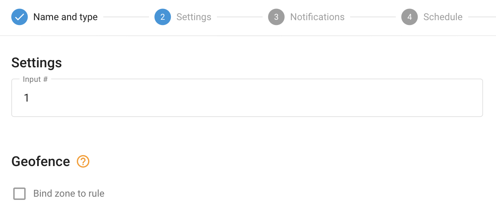

# Activación de entrada

La activación de entrada (o, cambio de entrada) se refiere a un cambio en el estado de una entrada en un dispositivo de seguimiento de vehículos. Esta entrada puede estar conectada a varios sensores o interruptores del vehículo, como los sensores de las puertas, el estado del encendido u otros componentes del vehículo. Cuando la entrada cambia de estado, por ejemplo, de encendido a apagado o viceversa, el dispositivo GPS detecta este cambio y puede activar un evento o notificación en consecuencia.

> [!INFO]
> El tipo de cambio de entrada de la regla se aplica a las entradas discretas que toman dos posiciones lógicas (0 ó 1). Para las entradas que indican valores continuos (por ejemplo, entradas analógicas que muestran un rango de tensión), existe un tipo de regla específico denominado Parámetro en rango.

## Visión general

Muchos rastreadores GPS de vehículos vienen equipados con entradas que pueden conectarse a diferentes herramientas, como un sensor de apertura del rastreador de coches, el estado del encendido o un botón de emergencia. Configurando el sistema en consecuencia, los usuarios pueden recibir notificaciones de activación de entradas a través de la interfaz de usuario, notificaciones push, SMS o correo electrónico.

La regla está diseñada para supervisar entradas discretas específicas y notificar a los usuarios siempre que se produzca un cambio en su estado. Estas entradas discretas sólo pueden tener dos valores: 0 ó 1, de ahí el término "discretas". La regla espera a que la entrada especificada pase de verdadero (1) a falso (0), o viceversa, y genera notificaciones por cada cambio detectado.

Esta funcionalidad permite a los usuarios mantenerse informados sobre el estado de las herramientas o sensores conectados, proporcionando actualizaciones en tiempo real sobre diversos eventos, por ejemplo, la activación de un botón SOS. La posibilidad de recibir notificaciones a tiempo mejora las capacidades de supervisión y facilita respuestas rápidas a situaciones críticas o eventos detectados por entradas discretas.

## Configuración de reglas

#### Número de entrada

El campo número de entrada especifica el número de hardware o hardware virtual de la entrada que se está utilizando. Para determinar qué entrada corresponde a una funcionalidad específica, consulte la documentación del fabricante del rastreador GPS. El número de entrada debe coincidir con el sensor discreto creado en el widget "Dispositivo y configuración" → "Sensores y botones".

## Detalles del funcionamiento del sistema

### Detalles del funcionamiento del sistema

- **Reiniciar temporizador**: La alerta "Cambio de entradas" tiene un temporizador de reinicio de 10 segundos, lo que garantiza que la alerta no se activará más de una vez cada 10 segundos. Si se produce un evento durante este periodo de reinicio, la plataforma lo omitirá, incluso en los informes.
- **Asignación de múltiples seguidores**: Se pueden asignar varios rastreadores a una misma regla. El número de entrada especificado en la configuración de la regla se utiliza como fuente de datos para cada rastreador. Por ejemplo, si se elige la 2ª entrada y se seleccionan varios rastreadores, la regla notificará al usuario cada vez que cualquiera de los rastreadores seleccionados envíe un cambio en su entrada nº 2.
- **Validez del evento**: Si la plataforma identifica un evento de entrada (1 verdadero/nivel alto o 0 falso/nivel bajo) de un paquete de datos del rastreador sin coordenadas válidas, contará el evento como válido y lo mostrará, independientemente de si el evento ocurrió dentro o fuera de las geovallas delimitadas. La lógica de los botones de opción Dentro/Fuera se ignora en este caso, ya que mostrar un evento controvertido una vez más es mejor que omitirlo.
- **Alertas selectivas**: Los usuarios pueden elegir recibir alertas de activación de entrada sólo para cambios específicos en la entrada (por ejemplo, de 1 a 0 o de 0 a 1) borrando el texto de notificación para el campo respectivo para el que no quieren alertas. Por ejemplo, los usuarios pueden configurar las alertas para recibir notificaciones sólo para los cambios de "ON a OFF", ignorando los eventos de "OFF a ON".

