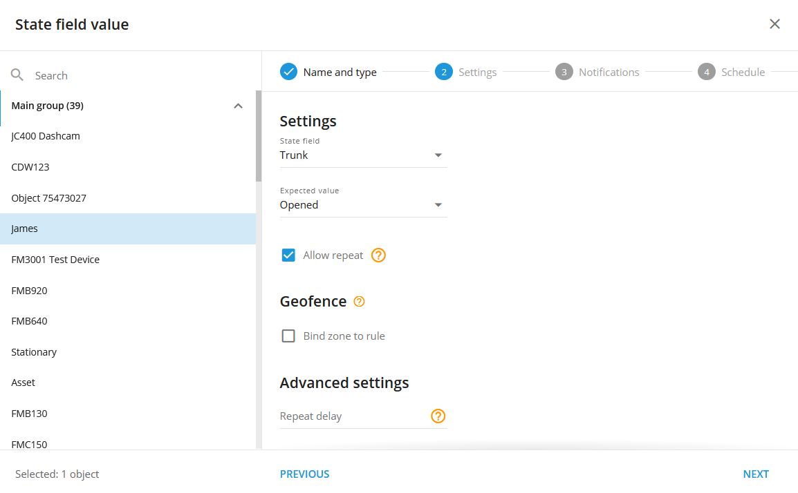
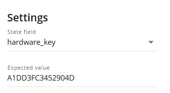

# Valor del campo Estado

## Visión general

En telemática, un **ámbito estatal** representa el estado actual de un componente o sistema específico del vehículo, como por ejemplo si una puerta está abierta o cerrada, si el freno de mano está accionado o si se ha desplegado un airbag. Proporciona datos en tiempo real sobre estos elementos, lo que permite supervisarlos y alertarlos en función de los cambios en su estado.

La regla "Valor de campo de estado" está diseñada para utilizar estos datos mediante la supervisión de campos de estado específicos y la activación de alertas cuando se cumplen condiciones predefinidas. Esta regla es esencial para mantener informados a los usuarios sobre eventos críticos, como cuando se abre inesperadamente una puerta, se suelta el freno de mano o se activa un sistema avanzado de asistencia al conductor (ADAS).

**Por ejemplo:**

- Si el airbag de un vehículo se despliega, el campo de estado del airbag cambiará, lo que hará que la regla envíe una alerta.
- Si se detecta un código de diagnóstico de problemas (DTC), el sistema puede notificarlo instantáneamente al usuario, lo que permite una rápida acción de mantenimiento.

Mediante el uso de esta norma, las organizaciones pueden aumentar la seguridad, mejorar la protección y agilizar los procesos de mantenimiento a través de notificaciones en tiempo real e informes detallados de incidencias.

## Configuración de reglas

### Campo estatal

Especifique el campo que se va a supervisar (por ejemplo, Troncal). Establezca el valor esperado (por ejemplo, Abierto) para activar una notificación cuando se cumpla la condición. La opción "Permitir repetición" controla la frecuencia con la que el mismo evento activará las notificaciones.

### Valor esperado

Elija el valor que debe coincidir con el campo de estado para activar una notificación (por ejemplo, Abierto/Cerrado). Para eventos especiales, como una llave hardware o un código de evento, introduzca el valor específico proporcionado por el fabricante del dispositivo.

Ejemplo

En el siguiente ejemplo, si una clave de hardware tiene un valor personalizado, como A1DD3FC3452904D, la plataforma supervisará este valor específico en el campo hardware\_key y notificará al usuario cuando se detecte.

### Permitir la repetición

- **Sin seleccionar:** El evento se activa sólo cuando el estado cambia al valor esperado después de recibir un valor diferente.
- **Seleccionado:** El evento se dispara cada vez que se recibe el valor esperado, pero no con más frecuencia de la que permite el "Retardo de repetición".

### Repetir retraso

Establece el temporizador de reinicio en segundos para controlar la frecuencia con la que el evento puede activar las notificaciones. Por ejemplo, si se establece en 1800 segundos, las notificaciones se limitan a una vez cada 30 minutos.

Ejemplo - Funcionamiento de la opción "Permitir repetición

**Si la opción "Permitir repetición" no está seleccionada:**

Si la opción "Permitir repetición" no está seleccionada, el evento sólo se activará de nuevo si se recibe un valor diferente antes de que el valor esperado llegue de nuevo en un nuevo paquete de datos. Así es como funciona

- **09:00 AM:** La última clave recibida es A1DD3FC3452904D.
- **09:15 AM:** La plataforma recibe otro paquete de datos con el mismo valor de clave de hardware (A1DD3FC3452904D). No se activa ninguna notificación porque es el mismo valor que antes.
- **09:20 AM:** Se recibe un nuevo valor de clave de hardware, B99978233FDD1. No se genera ninguna notificación porque no se esperaba este valor. Sin embargo, el sistema está ahora preparado para activar una notificación si la clave original esperada (A1DD3FC3452904D) llega de nuevo.
- **09:30 AM:** La plataforma vuelve a recibir el valor de la clave de hardware A1DD3FC3452904D. Esta vez, se activa una notificación porque se ha recibido un valor diferente entre medias.

En resumen, las notificaciones sólo se activan cuando el valor esperado llega después de haber recibido un valor diferente.

**Cuando se selecciona "Permitir repetición":**

Si se selecciona la opción "Permitir repetición", el evento se activará cada vez que se reciba el valor esperado, dentro de los límites del temporizador "Retraso de repetición":

- **09:00 AM:** La última clave recibida es A1DD3FC3452904D.
- **09:15 AM:** La plataforma recibe otro paquete de datos con el mismo valor de clave de hardware (A1DD3FC3452904D). Se activa una notificación.
- **09:25 AM:** La plataforma vuelve a recibir el mismo valor de clave de hardware (A1DD3FC3452904D). Se activa otra notificación.
- **09:34 AM:** Se recibe un nuevo valor de clave de hardware, B99978233FDD1. No se activa ninguna notificación porque no se esperaba este valor.
- **09:45 AM.** La plataforma vuelve a recibir el valor de la clave de hardware A1DD3FC3452904D. Se activa una notificación.

En resumen, con la opción "Permitir repetición" seleccionada, las notificaciones se activan cada vez que se recibe el valor esperado, pero no más a menudo de lo permitido por el temporizador "Retraso de repetición".

**Nota:** Si se selecciona "Permitir repetición", el evento sólo se activará tantas veces como lo permita el temporizador de "Retardo de repetición". Para este tipo de regla, el temporizador de repetición por defecto es de 5 minutos, pero puede ajustarse mediante el campo "Retraso de repetición".

Para los ajustes habituales, consulte [Normas y notificaciones](../../reglas-y-alertas.md).

## Detalles del funcionamiento del sistema

- **Disponibilidad de sensores virtuales.** Los usuarios también pueden seleccionar sensores virtuales como fuentes de datos en la regla de campo de estado. Esto permite personalizar las notificaciones y los informes en función de los datos de los sensores virtuales, lo que posibilita una supervisión y una gestión más adaptadas de los eventos críticos.
- **Reinicia el temporizador:** La alerta "Valor del campo de estado" tiene un temporizador de reinicio predeterminado de 5 minutos, lo que significa que el evento no se activará con más frecuencia que una vez cada 5 minutos.
- **Compatible con un solo dispositivo:** Cada regla se aplica a un solo dispositivo, ya que no se pueden cruzar diferentes campos de estado en varios rastreadores.
- **Procesamiento independiente del GPS:** La plataforma procesa y muestra los eventos de campo estatales incluso si faltan datos GPS, lo que garantiza que no se pasen por alto eventos importantes debido a problemas de localización.