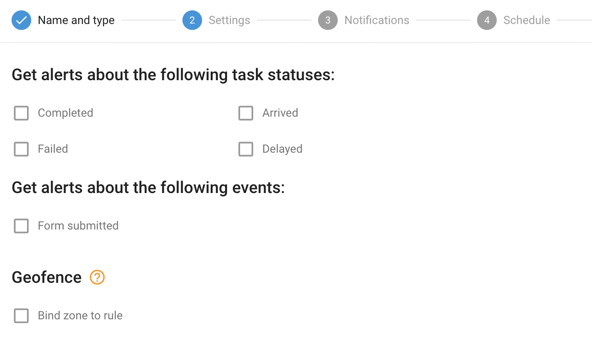

# Realización de tareas

## Visión general

La regla Desempeño de tareas está diseñada para ayudar a las empresas a realizar un seguimiento y gestionar el progreso y la finalización de las tareas asignadas a los empleados de campo. Tanto si supervisa una gran plantilla remota como un equipo más pequeño, esta regla le garantiza que se mantendrá informado sobre los eventos críticos relacionados con las tareas, como la finalización de tareas, los retrasos, los fallos y los envíos de formularios.

El sistema proporciona notificaciones puntuales a través de SMS, correo electrónico, notificaciones push o directamente en la interfaz de usuario web. Gracias a esta funcionalidad, las empresas pueden mantener el control sobre el proceso de finalización de tareas, lo que mejora la eficiencia y la toma de decisiones.

## Configuración de reglas

#### Eventos y estados de las tareas

En la configuración de las reglas, especifique los estados de las tareas y los eventos para los que desea recibir notificaciones. Puede elegir entre opciones como finalización de tareas, retrasos, fallos, llegadas y envío de formularios. Seleccionando las opciones pertinentes, las empresas pueden mantenerse informadas de los acontecimientos clave en sus operaciones sobre el terreno, lo que ayuda a minimizar las interrupciones y a garantizar una ejecución fluida de las tareas.

Para los ajustes habituales, consulte [Normas y notificaciones](../).

## Detalles del funcionamiento del sistema

* La alerta "Desempeño de tareas" se activa cada vez que se produce un evento relacionado con una tarea, sin temporizador de reinicio, lo que significa que la alerta le notificará inmediatamente con cada evento. Esto difiere de otras reglas de la plataforma que tienen temporizadores de reinicio para limitar la frecuencia de notificación.
* Esta regla se procesa en la nube y no depende de un hardware específico, lo que permite aplicarla a varios rastreadores simultáneamente. Esta flexibilidad permite a los usuarios gestionar varios rastreadores con una sola regla de forma eficiente.
