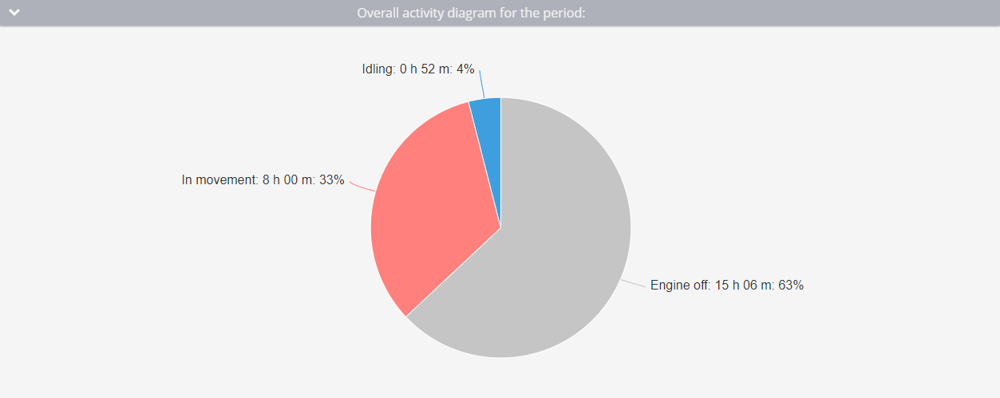

# Reporte de horas de motor

En las **Horas de motor** de Navixy se proporciona información detallada sobre la duración del funcionamiento del motor de su vehículo, tanto en movimiento como en ralentí. Este reporte es esencial para los gestores de flotas que necesitan supervisar el uso del motor, optimizar la eficiencia operativa y planificar los programas de mantenimiento. A continuación encontrará una guía completa sobre cómo funciona este reporte, los parámetros implicados y cómo interpretar los datos.

## Visión general

El reporte Horas de motor está diseñado para mostrarle el tiempo total que estuvo encendido el motor de su vehículo, segmentado en periodos de movimiento y ralentí. Este reporte incluye varias ayudas visuales clave, como un gráfico de actividad por periodos y un gráfico de barras de actividad diaria, para ayudarle a comprender y analizar rápidamente los datos.

## Cómo funciona

El reporte calcula las horas motor a partir de los puntos de datos recibidos por la plataforma Navixy. Para que los cálculos sean precisos, deben cumplirse las siguientes configuraciones y condiciones:

1. **Configuración del sensor de encendido:**

* El sensor de encendido debe estar correctamente conectado al dispositivo y registrar con precisión el estado de encendido. Puede tratarse de un sensor de encendido discreto o de un sensor virtual basado en el encendido de la plataforma.

2. **Duración del encendido:**

* El encendido debe estar activado durante al menos 60 segundos para que la hora se registre en el reporte.

3. **Detección de aparcamiento:**

* La plataforma utiliza los ajustes de detección de aparcamiento para diferenciar entre las horas de motor en movimiento y al ralentí. Por ejemplo, si la velocidad de detección de aparcamiento se establece por debajo de 3 km/h y el vehículo permanece a esta velocidad o por debajo de ella durante más de 5 minutos, este tiempo se registrará como ralentí, no como movimiento.

4. **Frecuencia de puntos de datos:**

* La frecuencia con la que el dispositivo envía puntos de datos afecta a la precisión del reporte. Los retrasos en la transmisión de datos pueden provocar imprecisiones, sobre todo si el estado del encendido cambia, pero no se notifica inmediatamente.

### Ejemplo de cálculo

| Punto | Tiempo   | Estado de ignición | Horas de motor                                             |
| ----- | -------- | ------------------ | ---------------------------------------------------------- |
| 1     | 16:00:00 | Fuera de           | 0 minutos                                                  |
| 2     | 16:01:00 | En                 | 0 minutos (el encendido estaba apagado en el último punto) |
| 3     | 16:01:32 | En                 | 0 minutos (menos de 60 segundos)                           |
| 4     | 16:05:32 | Fuera de           | 4 minutos y 32 segundos                                    |

## Parámetros del reporte

El reporte de horas de motor incluye varios parámetros configurables que le permiten personalizar el resultado para satisfacer sus necesidades específicas:

* **Mostrar detalles:** Proporciona información detallada sobre el lugar y la hora concretos en que estuvo encendido el motor.
* **Resumen de la pantalla:** Muestra un resumen de todos los dispositivos. Puede activar o desactivar esta función en función de si necesita una página de resumen.
* **Mostrar solo resumen:** Agrega los datos de varios rastreadores en un único resumen. Esta opción requiere al menos dos dispositivos.
* **Utiliza un filtro inteligente:** Excluye los trayectos cortos del reporte. Un trayecto se considera corto si recorre menos de 300 metros y el dispositivo transmite menos de cuatro puntos de datos.

## Visualizaciones

### Diagrama general de actividades

* Este diagrama proporciona una visión completa del tiempo total que el motor estuvo encendido durante el periodo seleccionado. Distingue entre el tiempo que el motor estuvo apagado, el tiempo que estuvo en movimiento y el tiempo que estuvo al ralentí.

### Histograma de actividad diaria

* El histograma desglosa las horas de motor en segmentos diarios, mostrando tanto los tiempos de movimiento como los de inactividad. Si se pasa el ratón por encima de cada día, se obtiene una vista más detallada de la actividad del motor en ese día.

### Tabla de horas del motor

* El cuadro presenta datos diarios detallados, que incluyen:
  * **Date:** El día concreto para el que se calculan los datos.
  * **Horas del motor:** Total de horas de motor del día.
  * **En movimiento:** Tiempo en movimiento y su porcentaje sobre el total de horas motor.
  * **Ralentí:** Tiempo pasado al ralentí y su porcentaje del total de horas del motor.
  * **Intervalo medio:** Duración media del funcionamiento del motor después de cada encendido.
  * **Kilometraje:** La distancia recorrida con el motor en marcha.
  * **Velocidad media:** La velocidad media del día.
  * **Intervalos:** El número de intervalos durante los cuales el motor estuvo encendido a lo largo del día.

> \[!INFO] Si observa una discrepancia entre el kilometraje en el reporte de Viaje y el reporte de Horas de motor, compruebe dos cosas:
>
> 1. Asegúrese de que la configuración del filtro inteligente se aplica de forma coherente en todos los reportes. Las incoherencias en su uso pueden causar discrepancias.
> 2. Verifique que el encendido fue detectado durante todos los movimientos del vehículo comparando las horas de inicio y fin del viaje con los datos de horas motor.

## Interpretación del reporte

Para utilizar eficazmente el reporte de horas de motor, tenga en cuenta lo siguiente:

* **Discrepancias:** Si observa una discrepancia entre el kilometraje del reporte de viaje y las horas de motor, compruebe si el filtro inteligente se aplica de forma coherente en todos los reportes y si el encendido se detectó correctamente durante el movimiento.
* **Analizar los datos:** El reporte permite analizar el uso del motor por parte de los empleados, evaluar la eficiencia del vehículo, estimar los plazos de sustitución, calcular los costes de depreciación y reconfigurar los costes de combustible y lubricante en función del tiempo de inactividad.
