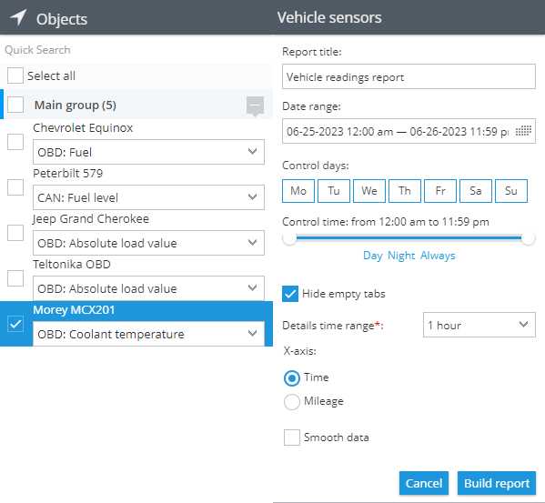
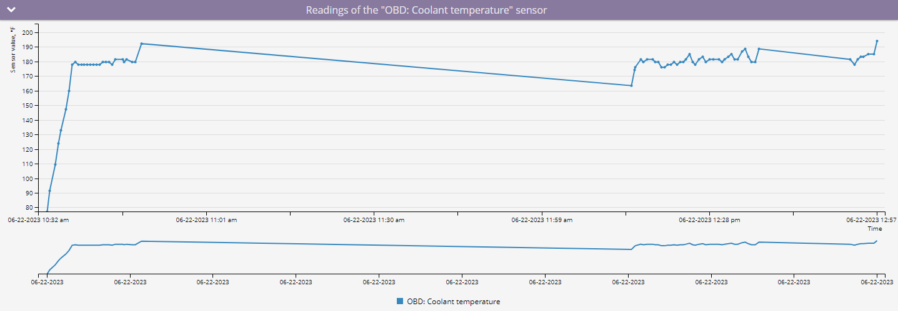
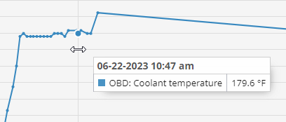

# Reporte de lecturas CAN / OBDII del vehículo

El **Reporte de lecturas del vehículo** en Navixy ofrece una visión detallada de los datos recibidos de los instrumentos de su vehículo a través de sensores CAN/OBD o sensores virtuales durante un periodo seleccionado. Este reporte incluye información como el kilometraje, las RPM del motor, la velocidad, el consumo de combustible, la temperatura del refrigerante y otras métricas críticas, lo que ayuda a los gestores de flotas y a los operadores de vehículos a supervisar y optimizar el rendimiento del vehículo.

## Requisitos para generar el reporte

Para generar el **reporte de lecturas del vehículo** deben cumplirse los siguientes requisitos previos:

* **Compatibilidad con dispositivos:** El dispositivo debe soportar lecturas CAN/OBD en la plataforma. Puede comprobar si un tipo específico de sensor es compatible revisando la lista de entradas compatibles para su [modelo de dispositivo](https://www.navixy.com/devices/).
* **Capacidad del vehículo:** El vehículo debe ser capaz de transmitir los datos CAN/OBD requeridos al modelo de dispositivo instalado. Esto se puede confirmar con el fabricante del vehículo.
* **Transmisión activa de datos:** El dispositivo y los sensores deben estar configurados para transmitir datos y enviarlos activamente a la plataforma.
* **Configuración del sensor:** Los sensores CAN/OBD o virtuales deben estar correctamente configurados en la plataforma.

## Parámetros del reporte

El reporte utiliza varios parámetros para personalizar la salida:

* **Intervalo de detalle:** Muestra las lecturas recibidas en la tabla de detalle de datos en incrementos de 30 minutos, 1 hora, 3 horas o 6 horas. El gráfico mostrará todos los puntos recibidos del sensor.
* **Eje X del gráfico:** Elija si desea mostrar la información en el gráfico en relación con el tiempo o el kilometraje.
* **Gráfico suave:** Aplica suavizado al gráfico para filtrar los valores máximos y promediar los datos cuando haya una variación significativa.

Para cada dispositivo, debe seleccionar el sensor para el que desea generar un reporte. Solo aparecerán en la lista los dispositivos con sensores CAN/OBD o virtuales configurados. Si un sensor virtual utiliza un método de cálculo distinto de [valor fuente](../../dispositivos-y-ajustes/sensores-de-vehculos/sensores-de-vehculos/sensores-virtuales/), el reporte indicará "Este no es un sensor de medición".

## Visualizaciones

### Gráfico con las lecturas de los sensores

En **gráfico** muestra las lecturas de los sensores CAN/OBD o virtuales en un formato visual, proporcionando una visión clara de las tendencias de los datos a lo largo del tiempo o la distancia.

* **Pasar el ratón por encima de los puntos:** Cuando pase el ratón por encima de un punto del gráfico con el eje X ajustado a la hora, verá la hora exacta y el valor del sensor registrado. Si el eje X está configurado como kilometraje, verás el valor del sensor junto con el kilometraje en el que se registró.

### Tabla de datos estadísticos

El reporte incluye una tabla **de datos estadísticos** que resume las lecturas de los sensores por día.

**Columnas de la tabla de datos estadísticos:**

* **Date:** La fecha específica de los datos registrados.
* **Mínimo:** El valor más bajo registrado por el sensor en esa fecha.
* **Máximo:** El valor más alto registrado por el sensor en esa fecha.
* **Valor medio:** La media de todas las lecturas de los sensores para esa fecha.

Nota: Las unidades de medida variarán en función del tipo de sensor utilizado.

### Tabla de desglose de datos

En **tabla de desglose de datos** presenta las lecturas de los sensores en intervalos de tiempo especificados, empezando por la hora establecida y pasando al siguiente incremento. Por ejemplo, si el reporte utiliza incrementos de 30 minutos, los datos de la fila 00:00 corresponden al tiempo transcurrido entre las 00:00 y las 00:30.

* **Interpretación de la tabla:** Si aparece "Sin datos", indica que no se han recibido lecturas durante ese intervalo de tiempo. Las posibles razones son:
  * El dispositivo no envió datos CAN/OBD o de sensor virtual durante ese periodo debido a los ajustes del sensor.
  * El dispositivo no transmitía ningún dato, posiblemente debido a que estaba apagado o desconectado del objeto.
