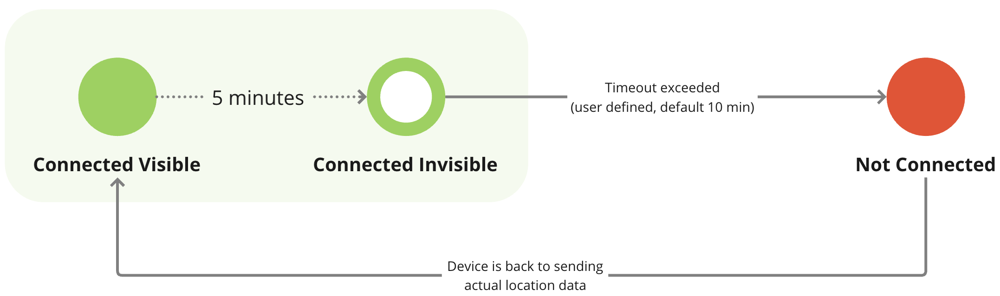

# Estado de la conexión

Cada dispositivo GPS de la plataforma tiene un estado que indica su estado actual de conexión con el servidor. Estos estados están codificados por colores y son visibles en la ventana [lista de objetos](https://squaregps.atlassian.net/wiki/spaces/USERDOCS/pages/2732164204/Object+list#For-Objects-in-the-List).

Los indicadores codificados por colores ofrecen a los usuarios una forma rápida y sencilla de evaluar el estado de sus dispositivos GPS de un vistazo. El verde indica que todo funciona correctamente, mientras que el rojo, el amarillo y el gris señalan que puede haber problemas que requieran atención.

En la siguiente tabla se describen los posibles estados de los dispositivos GPS y se ofrece una descripción de cada estado y de lo que significa en relación con la conexión y la actividad del dispositivo. Esta información ayuda a los usuarios a comprender el estado en tiempo real de sus dispositivos, identificar cualquier problema y tomar las medidas adecuadas para garantizar un rendimiento óptimo.

| Estado | Descripción |
| --- | --- |
| Dispositivos activados |     |
|  | **Conectado Visible**   El dispositivo GPS del objeto está conectado y ha informado de las coordenadas como se esperaba. |
|  | **Conectado Invisible**  El dispositivo GPS del objeto está conectado al servidor pero no ha transmitido las coordenadas actuales durante más de 5 minutos. Las posibles razones son:  - La última actualización del GPS fue hace más de 5 minutos - Los datos recibidos de la memoria del dispositivo tienen marcas de tiempo obsoletas. - Pérdida de señal GPS (por ejemplo, bajo un tejado, en un túnel, en un aparcamiento subterráneo). - Dispositivo en modo de ahorro de energía o reposo, enviando las últimas coordenadas conocidas o paquetes heartbeat. - La configuración de la zona horaria del dispositivo difiere de UTC+0 |
|  | **No conectado**  El dispositivo GPS del objeto no ha enviado datos durante el tiempo especificado por el usuario (por defecto son 10 minutos). Los posibles motivos son:  - Señal GPRS débil - Dispositivo en modo de reposo profundo - Roaming no activado en la tarjeta SIM - Límite de tráfico GPRS o saldo de tarjeta SIM agotado - Dispositivo desconectado de la plataforma |
|  | **Suspendido (Suscripción caducada)**  Durante el periodo de suspensión, la plataforma no acepta datos del dispositivo, y los datos de este periodo no estarán disponibles incluso después de que se levante la suspensión. Para reanudar el servicio, recargue saldo o póngase en contacto con el servicio de asistencia. El dispositivo se desbloqueará automáticamente en los 15 minutos siguientes al pago. |
| **Dispositivos añadidos, pero aún no activados** |     |
|  | **Activar ahora**  El dispositivo GPS ha sido añadido recientemente. Este estado se mostrará hasta que finalice la activación, lo que suele tardar entre 2 y 3 minutos (excepción: para la aplicación móvil X-GPS Tracker, este estado se prolonga indefinidamente). |
|  | **La activación tarda más de lo previsto**  Se ha añadido el dispositivo GPS, pero hasta ahora no se ha establecido ninguna conexión con la plataforma. Es posible que se necesiten acciones adicionales, consulte los artículos sobre problemas de activación para solucionarlos. |
|  | **Configuración manual necesaria**  El dispositivo GPS requiere [configuración manual](https://squaregps.atlassian.net/wiki/spaces/USERDOCSOLD/pages/2909016770/Manual+device+activation) ya que no admite [activación automática](../../inicio-rpido/activar-el-dispositivo-gps.md). Siga las instrucciones de configuración del dispositivo o póngase en contacto con el equipo de asistencia de su proveedor de servicios para obtener ayuda.  Consejos:  - La dirección y el puerto del servidor figuran en la información detallada ("i") y también se facilitan en el [Sitio web de Navixy](https://navixy.com/device) - Establezca la zona horaria del dispositivo en UTC+0h para procesar correctamente la fecha y hora de los datos. |
|  | **No se reciben datos del dispositivo**   La plataforma no ha recibido ningún dato del dispositivo GPS después de activarlo o de sustituir un dispositivo averiado. |

## Secuencia de estados de conexión

El siguiente diagrama ilustra la secuencia de estados de conexión para un dispositivo GPS activado correctamente en la plataforma, mostrando las transiciones entre diferentes estados en función de los datos recibidos y el tiempo transcurrido.

He aquí la explicación detallada:

- Inicialmente, el dispositivo **Conectado Visible**, indicado por un círculo verde, lo que significa que está conectado al servidor y transmite coordenadas GPS y marca de tiempo válidas. Si no se reciben nuevas coordenadas GPS durante 5 minutos, el estado cambia a **Conectado Invisible**representado por un círculo verde con un agujero. Esto puede ocurrir si el dispositivo pierde la señal GPS, entra en modo de ahorro de energía o envía datos obsoletos desde su memoria.
- Si se alcanza el tiempo de espera de la conexión (fijado por el usuario o 10 minutos por defecto) sin recibir nuevos datos, el estado cambia a **No conectado**que se muestra como un círculo rojo. Esto puede ocurrir si el dispositivo está en una zona con mala señal de telefonía móvil, en modo de reposo profundo o si tiene problemas con la tarjeta SIM o se ha agotado el tráfico GPRS.
- Cuando el dispositivo reanuda el envío de coordenadas GPS y marca de tiempo válidas, el estado vuelve a ser **Conectado Visible** y el ciclo se repite mientras el dispositivo funcione, pasando de un estado a otro en función de los datos recibidos y del tiempo transcurrido.

Esta secuencia ayuda a los usuarios a controlar la conectividad en tiempo real y el estado de transmisión de datos de sus dispositivos GPS, garantizando que se puedan tomar medidas oportunas si surge algún problema.