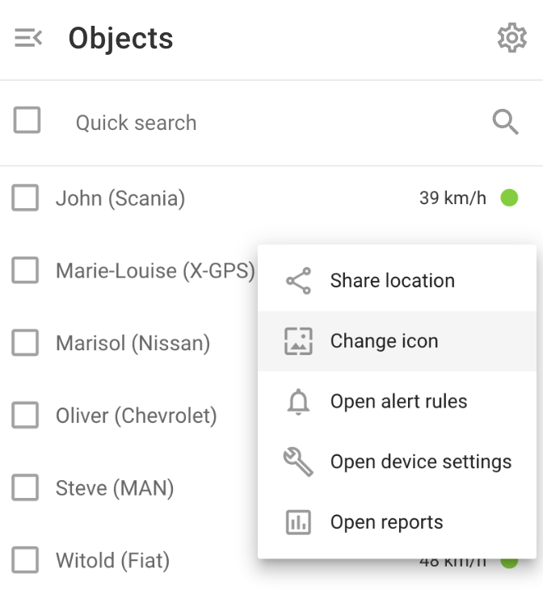

# Iconos de objetos

Los iconos asociados a cada objeto proporcionan pistas visuales importantes sobre el estado actual del objeto, como en movimiento, parado o estacionado.

Además de los iconos estándar, puede utilizar iconos personalizados para representar objetos. Los iconos personalizados son especialmente útiles cuando se gestionan muchos objetos, ya que mejoran la identificación visual y la organización, permitiéndole diferenciar rápidamente entre objetos y seguir supervisando eficazmente sus estados.

## Iconos estándar

En función del estado actual del objeto (en movimiento, parado, estacionado), su icono en el mapa cambiará en consecuencia. La transición de un estado a otro está estrechamente relacionada con la función ***"Detección de aparcamiento"*** configuración del dispositivo GPS asociado al objeto.

A continuación figuran los distintos iconos y sus significados:

| **Icono** | **Estado de la mudanza y Descripción** |
| --- | --- |
|  | **En movimiento**   El rastreador se está moviendo y el viaje se está grabando. |
|  | **Parado (aún no estacionado)**   El rastreador se ha detenido, su velocidad es cero, pero el viaje aún no ha terminado. |
|  | **Aparcado**   El viaje ha terminado y el rastreador está aparcado. |
|  | **Localización aproximada ( sin señales GPS**, **utilizando LBS)**   No hay señal GPS y la ubicación se determina mediante estaciones base de telefonía móvil y/o puntos de acceso Wi-Fi. No hay pistas, aparcamientos o paradas registradas en este estado debido a la baja precisión de las coordenadas. |

## Iconos personalizados

Los iconos personalizados mejoran la identificación visual, permitiendo una rápida diferenciación entre los distintos objetos del mapa, y mejoran la organización mediante iconos específicos para los distintos tipos de activos o estados. También facilitan una supervisión eficaz al permitir el reconocimiento inmediato del estado o tipo de un objeto, lo que agiliza la toma de decisiones y los tiempos de respuesta.

Para cambiar el icono personalizado de un objeto en la plataforma Navixy, siga estos pasos:

1. **Navegue hasta la Lista de objetos:** Abra la sección "Objetos" del menú principal.
2. **Haga clic con el botón derecho en el objeto deseado:** Localice el objeto cuyo icono desea cambiar. Haga clic con el botón derecho del ratón en el nombre del objeto para abrir el menú contextual.
3. **Seleccione "Cambiar icono":** En el menú contextual, seleccione la opción "Cambiar icono". Se abrirá el diálogo de selección de iconos.

4. **Elija un nuevo icono:** En el cuadro de diálogo de selección de iconos, elija un nuevo icono entre las opciones disponibles. Confirme su selección para aplicar el nuevo icono al objeto.

Si decide utilizar iconos personalizados, el estado del objeto se mostrará junto a la etiqueta del objeto.

