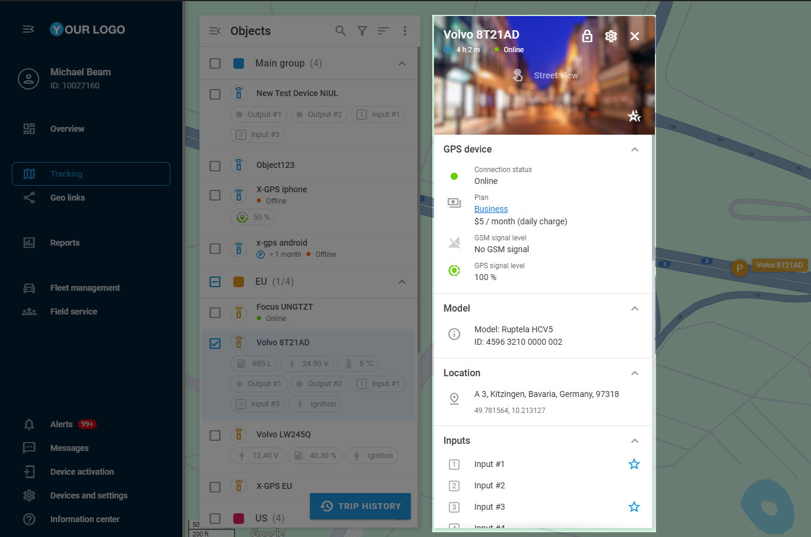
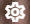
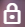

# Vista detallada del objeto

El widget del **Objeto** sirve como una colección completa de bloques de datos telemáticos en la plataforma Navixy para supervisar y gestionar sus activos. Este widget proporciona una visión en profundidad de sus dispositivos GPS y los sensores conectados a ellos.

> \[!NOTE] **Navegación**
>
> * Por defecto, para acceder a la vista detallada de un objeto concreto, haga doble clic sobre el objeto en la lista o pase el ratón por encima y haga clic en el icono que aparece  .
> * Si la opción **Mostrar información al hacer clic** está activada en [Ajustes adicionales](https://squaregps.atlassian.net/wiki/spaces/UDOCES/pages/edit-v2/2922547887#Ajustes-adicionales), al hacer clic en un objeto también se abre el [Vista detallada del objeto](https://squaregps.atlassian.net/wiki/spaces/UDOCES/pages/2922547998/Vista+detallada+del+objeto)[.](https://squaregps.atlassian.net/wiki/spaces/USERDOCSOLD/pages/edit-v2/2909015397#Object-Widget)

Una vez abierto, el widget muestra amplia información sobre el objeto seleccionado, incluido el estado actual, la ubicación GPS y otros datos telemáticos. Todas las herramientas de gestión operativa están convenientemente ubicadas en un solo lugar, lo que permite una gestión eficiente de la flota y una respuesta rápida a cualquier problema que surja.

## Visión general del dispositivo

La sección superior del panel de widgets proporciona detalles esenciales sobre el dispositivo GPS, como su etiqueta, estado de movimiento y estado de conexión. Además, ofrece algunos controles útiles:

* **Opciones de personalización**\
  El diseño del widget ofrece sólidas posibilidades de personalización para ayudarle a organizar la información según sus necesidades:
  * Visibilidad de los bloques telemáticos: haz clic en  para abrir los ajustes del widget y seleccionar los bloques de datos que quieres que se muestren. Todos los bloques disponibles están seleccionados por defecto.
  * Organización del diseño: haga clic en el botón  situado junto al icono de engranaje para activar el modo de gestión del diseño. Una vez activado, puedes arrastrar los bloques de datos a las posiciones que prefieras. En este modo, también puedes cambiar manualmente el orden de la información dentro de los bloques de la misma manera que arrastras y sueltas.
* **Acceso a Street view**\
  Al hacer clic en el widget se activa **Street view**, que muestra imágenes reales de la posición del dispositivo en el mapa para mejorar el contexto y la navegación.
* Aplicar favoritos a todos\
  El icono  permite marcar instantáneamente todos los bloques de telemetría como favoritos, asegurando que su información aparezca bajo la etiqueta del dispositivo en la **lista de Objetos**. Para más detalles sobre esta función, consulte [Favoritos](https://squaregps.atlassian.net/wiki/spaces/UDOCES/pages/edit-v2/2922547998#Favoritos).

## Bloques de datos telemáticos

El **widget Objeto** organiza la información crucial a través de bloques de datos especializados. Cada componente sirve a un propósito específico al proporcionar capacidades integrales de supervisión y gestión.

> \[!INFO] La disponibilidad de los bloques y su contenido dependen del objeto para el que se abra un widget. Sólo contienen la información transmitida por un rastreador GPS o sensores conectados a él. Para más detalles, consulte [Opciones de personalización en Visión general del dispositivo .](https://squaregps.atlassian.net/wiki/spaces/UDOCES/pages/edit-v2/2922547998#Visi%C3%B3n-general-del-dispositivo)

Aquí tienes una descripción detallada de los bloques disponibles:

|                                    |                                                                                                                                                                                                                                                                                                                                                |
| ---------------------------------- | ---------------------------------------------------------------------------------------------------------------------------------------------------------------------------------------------------------------------------------------------------------------------------------------------------------------------------------------------- |
| **Widget**                         | **Descripción**                                                                                                                                                                                                                                                                                                                                |
| **Información sobre la ubicación** | Proporciona datos de posicionamiento precisos, incluida la última ubicación conocida con una dirección o coordenadas GPS, acompañada de marcas de tiempo. El widget también registra la velocidad actual y las mediciones de altitud.                                                                                                          |
| **Estado del dispositivo**         | Proporciona una supervisión completa del dispositivo mostrando el modelo, el ID, el estado actual de la conexión, el estado de movimiento, el nivel de batería y la intensidad de la señal GSM. Además, rastrea si el dispositivo está funcionando en modo roaming.                                                                            |
| **Información sobre el plan**      | Gestiona la información relacionada con las suscripciones mostrando el plan actual del dispositivo y realizando un seguimiento de la próxima fecha de pago programada.                                                                                                                                                                         |
| **OBD2 Y CAN**                     | Se conecta a los sistemas de a bordo del vehículo para proporcionar datos de diagnóstico en tiempo real, incluidos el nivel de combustible, la velocidad del motor, la temperatura del refrigerante y cualquier código de diagnóstico de problemas cuando el rastreador está conectado correctamente al bus CAN o al puerto OBD2 del vehículo. |
| **Lecturas de los sensores**       | Supervisa y muestra los datos de todos los sensores configurados del dispositivo, proporcionando lecturas recientes con marcas de tiempo. Los usuarios pueden marcar sensores importantes como favoritos para acceder rápidamente a mediciones críticas.                                                                                       |
| **Cuentakilómetros**               | Realiza un seguimiento del kilometraje total del dispositivo y proporciona funcionalidad para ver y corregir estos datos a través de un botón "Editar", garantizando registros de distancia precisos.                                                                                                                                          |
| **Horas de motor**                 | Controla el tiempo total de funcionamiento del motor y, al igual que el cuentakilómetros, incluye la posibilidad de realizar correcciones manuales mediante un botón "Editar" para un seguimiento preciso del uso.                                                                                                                             |
| **Entradas**                       | Supervisa el estado actual de varios sensores conectados, incluido el estado del encendido y otros sensores del vehículo, como los sensores de las puertas, proporcionando información en tiempo real sobre el estado del vehículo.                                                                                                            |
| **Salidas**                        | Permite el control activo de los dispositivos conectados al localizador GPS, incluidas funciones como la inmovilización remota del vehículo, lo que permite intervenir directamente cuando sea necesario.                                                                                                                                      |
| **Conductor**                      | Mantiene las asignaciones actuales de conductores y permite la gestión directa de estas asignaciones, permitiéndole ver y cambiar el conductor asignado directamente a través del widget.                                                                                                                                                      |
| **Estados de trabajo**             | Gestiona los estados operativos mostrando y permitiendo cambios en el estado actual del dispositivo, como "En tránsito" o "Ralentí", lo que ayuda a realizar un seguimiento de la utilización del vehículo.                                                                                                                                    |
| **Acontecimientos recientes**      | Rastrea y muestra alertas recientes relacionadas con el objeto, con la funcionalidad añadida de ocultar eventos específicos de la vista para una experiencia de supervisión más centrada.                                                                                                                                                      |
| **Candado electrónico**            | Proporciona gestión de seguridad para dispositivos equipados con funciones de cerradura inteligente, permitiendo el control remoto del estado de la cerradura, incluidas las capacidades de bloqueo y desbloqueo.                                                                                                                              |

## Favoritos

La **Lista de objetos** puede mostrar no sólo nombres de dispositivos y estados de conexión, sino también datos telemáticos seleccionados de rastreadores GPS y sensores conectados. Para incluir datos específicos en la lista, las entradas de datos individuales deben marcarse como **Favorito**, para hacerlo:

1. Pase el ratón por encima de la entrada de datos deseada dentro **del widget Objeto**.
2. Haga clic en el icono  que aparece para marcarlo como **Favorito**.

Una vez marcada como **Favorita**, la entrada de datos telemáticos seleccionada aparecerá bajo la etiqueta del dispositivo correspondiente en la **Lista de objetos**, garantizando un acceso rápido y sencillo. Para eliminar una entrada de la visualización de la lista, vuelva a hacer clic en el icono de la estrella.
