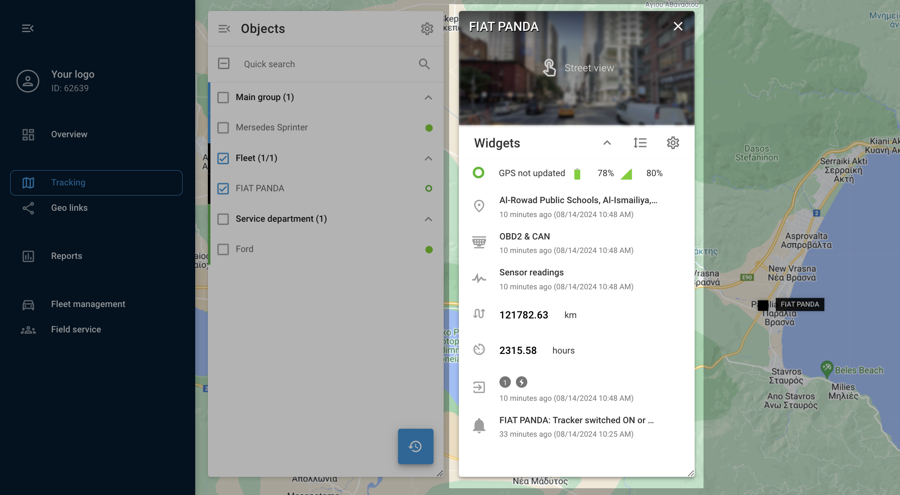
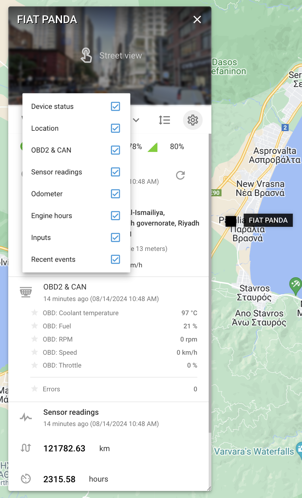

# Widgets de información sobre dispositivos

En la plataforma Navixy, el panel de control de dispositivos es un centro que proporciona información detallada y herramientas para gestionar objetos y los dispositivos y sensores GPS asociados.

Para acceder a este panel, basta con pulsar el botón "info" o hacer doble clic en un dispositivo de la lista. [Lista de objetos](./). Una vez abierto, el panel de control muestra datos completos sobre el objeto seleccionado y sus dispositivos IoT, incluidos el estado actual, la ubicación GPS y los datos de telemetría. Además, ofrece varias herramientas de gestión operativa, todas cómodamente ubicadas en un mismo lugar.

## Personalización de widgets

La lista de widgets del panel de control del dispositivo es altamente personalizable para adaptarse a tus necesidades. Puedes expandir o contraer fácilmente todos los widgets para obtener una vista completa o compacta. Para ello, utiliza el botón "Mostrar todo" para expandir todos los widgets y el botón "Ocultar todo" para contraerlos. Si prefieres un orden diferente para tus widgets, haz clic en el botón "Cambiar orden" para arrastrarlos y reordenarlos a tu gusto. Además, puedes personalizar qué widgets se muestran haciendo clic en el icono "Engranaje" y desmarcando las casillas junto a los widgets que desees ocultar.

Widgets - vista detallada (ejemplo)

### Explicación de los widgets clave

* **Información general**: Muestra detalles críticos como el modelo de dispositivo, ID, estado de conexión, estado de movimiento, nivel de batería, intensidad de la señal GSM, etc. Este widget también proporciona información sobre si el dispositivo está en modo roaming.
* **Ubicación**: Proporciona información detallada sobre la ubicación actual del rastreador, incluida la dirección, la latitud, la longitud, la velocidad y la dirección.
* **OBD2 Y CAN**: Si el rastreador está conectado al bus CAN o al conector OBD2 del vehículo, este widget mostrará datos como el nivel de combustible, la velocidad del motor, la temperatura del refrigerante y los códigos de diagnóstico de problemas (DTC).
* **Lecturas de los sensores**: Muestra los datos de los sensores configurados en los ajustes del dispositivo, como la temperatura o los niveles de combustible. Este widget también te permite marcar con una estrella los sensores favoritos para acceder a ellos rápidamente.
* **Cuentakilómetros**: Muestra el kilometraje del dispositivo. Puedes ajustar manualmente el kilometraje pulsando el botón "Editar".
* **Horas motor**: Muestra el tiempo total de funcionamiento del motor. Al igual que el cuentakilómetros, las horas del motor pueden ajustarse pulsando el botón "Editar".
* **Entradas y salidas**: Muestra el estado de los sensores conectados y permite controlar las salidas, como el encendido, enviando comandos directamente desde el widget.
* **Conductor**: Proporciona información sobre el controlador asignado y permite cambiar el controlador directamente desde el widget.
* **Estados de trabajo**: Muestra y permite cambiar el estado asignado al dispositivo, como "En tránsito" o "Inactivo".
* **Acontecimientos recientes**: Muestra las alertas recientes y permite ocultar de la vista determinados eventos.
* **Candado electrónico**: Para dispositivos con función de bloqueo inteligente, este widget te permite gestionar el estado de bloqueo, incluido el bloqueo o desbloqueo remoto del dispositivo.

Mediante el uso de estos widgets, puede personalizar y controlar totalmente la forma en que interactúa con sus dispositivos GPS, garantizando que todos los datos y controles relevantes estén al alcance de su mano. Este nivel de personalización y accesibilidad le ayuda a gestionar su flota con mayor eficacia y precisión.
