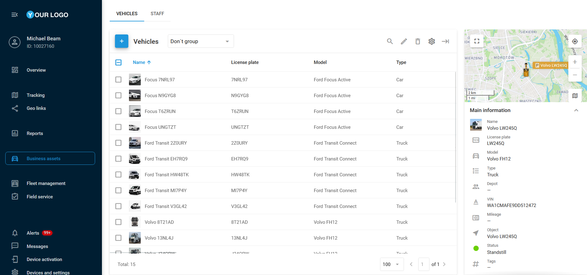

# Espacio de trabajo de activos

El módulo **Activos operativos** contiene los tipos de activos disponibles, organizados en pestañas separadas. Estas pestañas están estructuradas de forma similar, lo que le permite gestionar cómo se muestran los registros y qué columnas se visualizan.

El panel superior, común a todas las pestañas, permite crear, agrupar, editar y eliminar sus activos. También puede seleccionar qué columnas desea mostrar. La barra lateral ubicada a la derecha de la pantalla muestra un fragmento del mapa centrado en la unidad seleccionada y proporciona una referencia rápida. Para seleccionar el tipo de mapa, como Google o OSM, haga clic en el icono correspondiente.

## Contenido del módulo:

* [Vehículos](vehculos.md)
* [(new)Personal](newpersonal.md)
