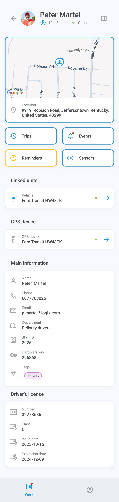
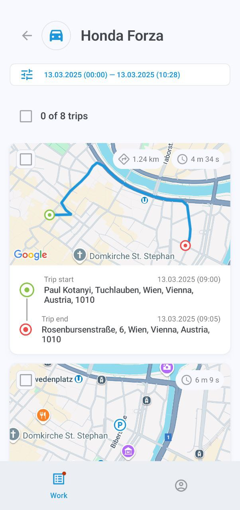
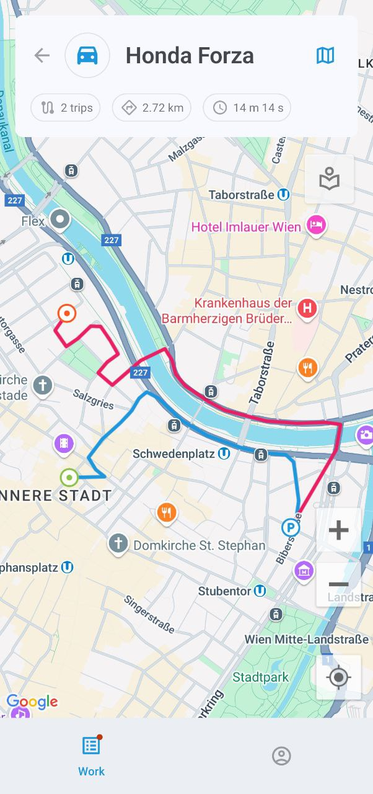
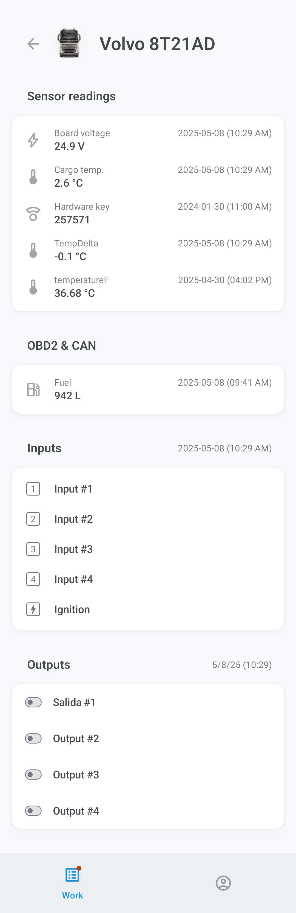

# Información del activo

La pantalla de información del activo muestra información detallada sobre el activo, incluyendo su ubicación en el mapa, historial de viajes y eventos, recordatorios, unidades vinculadas, dispositivo GPS asignado, etiquetas y otros datos.

### Mapa

Por defecto, el mapa aparece en la parte superior de la pantalla de información. Mantenga pulsada la dirección para copiarla, o toque la imagen para cambiar a la vista de pantalla completa. El mapa sigue automáticamente la ruta del activo si está en movimiento. También puede acercar y alejar el mapa y centrarlo en sus propias coordenadas GPS.

Toque 

para mostrar el menú de opciones del mapa, donde puede seleccionar lugares, geocercas y tipo de mapa. Tenga en cuenta que la selección del tipo de mapa actualmente solo está disponible en dispositivos Android.

### Viajes

Toque **Viajes** para mostrar la lista de viajes realizados por su activo. Toque cualquier viaje para ver sus detalles, incluidos los POI y geocercas visitados. También puede ver el historial de uno o varios viajes en el mapa en pantalla completa.

Para filtrar la visualización de viajes, como por período de tiempo y otros parámetros, toque 

y abra el **Rango de fechas y configuración**:

### Eventos

Toque **Eventos** para ver el historial de eventos del activo, como salir o entrar en una geocerca, quedarse inactivo, exceso de velocidad, completar tareas, choques, desviaciones de la ruta, llegadas a puntos de control y más.

El menú debajo del nombre del activo muestra sus filtros actuales, todos los cuales se pueden configurar: período de tiempo, vehículos o personal específicos y tipos de eventos. El filtro **No leídos** mostrará solo las notificaciones no leídas, mientras que **Emergencia** reducirá su búsqueda a eventos urgentes.

Toque un evento para mostrar sus detalles. También puede tocar el mapa en la parte superior de la pantalla para verlo en pantalla completa. El botón 

permite cambiar entre diferentes mapas.

> \[!WARNING] La selección del tipo de mapa actualmente solo está disponible en dispositivos Android.

### Recordatorios

El botón **Recordatorios** solo se muestra cuando hay problemas pendientes, como una licencia de conducir o un seguro de vehículo que está por vencer o ya ha vencido. Tóquelo para obtener más información sobre el problema.

### Sensores

Toque el botón **Sensores** para ver las lecturas proporcionadas por el dispositivo o dispositivos GPS del activo, incluidas las horas del motor, el nivel de combustible, la temperatura y las entradas y salidas personalizadas.

Las salidas permiten enviar comandos de control a los dispositivos, como detener el motor. Para enviar un comando, toque 

y elija **Enviar** en el mensaje de confirmación.

Los sensores del vehículo se configuran a través de la plataforma principal de Navixy. Para obtener más información sobre ellos, lea [Documentación de usuario de Navixy](https://squaregps.atlassian.net/wiki/spaces/UDOCES/pages/2922551598/Sensores+de+veh+culos?atlOrigin=eyJpIjoiZTkwNzZhM2RlMDhkNGQ0ZGI3ZWI1M2QzZWU4ODlkYmYiLCJwIjoiYyJ9).

### Unidades vinculadas

Toque el nombre o etiqueta en la entrada **Unidades vinculadas** para acceder a la pantalla de información de la unidad vinculada al activo, como el conductor o el vehículo conducido.

### Dispositivo GPS

Toque la etiqueta del dispositivo en la entrada **Datos GPS** para mostrar sus detalles, incluidos el ID, modelo, estado de conexión y movimiento, ubicación, velocidad y otros datos técnicos.

