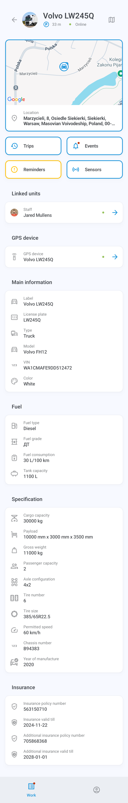
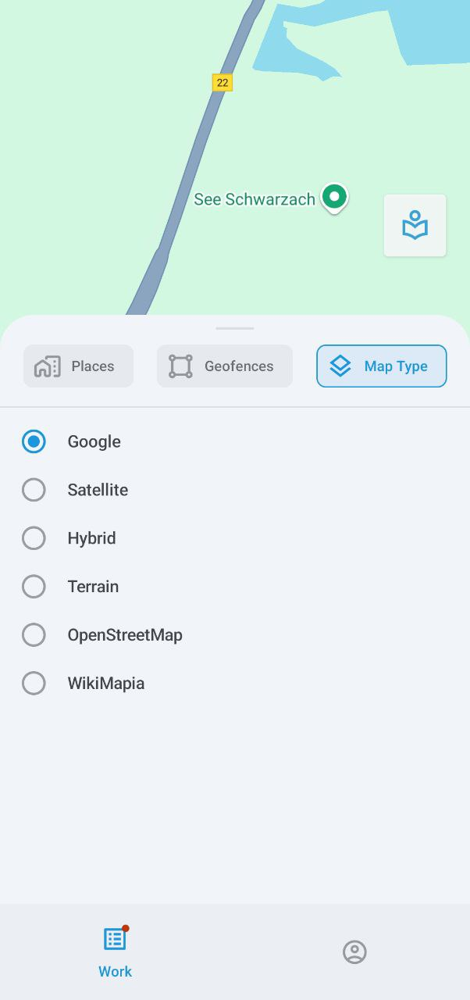
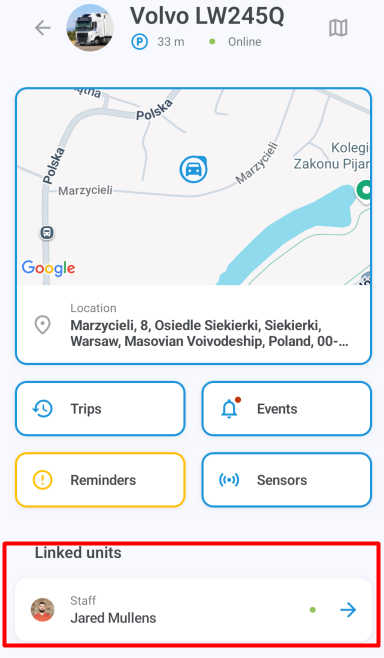

# Información del activo

La pantalla de información del activo muestra información detallada sobre el activo, incluyendo su ubicación en el mapa, historial de viajes y eventos, recordatorios, unidades vinculadas, dispositivo GPS asignado, etiquetas y otros datos.











#### Mapa



Por defecto, el mapa aparece en la parte superior de la pantalla de información. Toque y mantenga presionada la dirección para copiarla, o toque la imagen para cambiar a vista de pantalla completa. El mapa sigue automáticamente la ruta del activo si está en movimiento. También puede hacer zoom de acercamiento y alejamiento y centrar el mapa en sus propias coordenadas GPS.







Toque  para mostrar el menú de opciones del mapa, donde puede seleccionar lugares, geocercas y tipos de mapa. Tenga en cuenta que la selección del tipo de mapa actualmente solo está disponible en dispositivos Android.

| 

<figure><figcaption>
Lugares
</figcaption></figure>
 | 

<figure><figcaption>
Geocercas
</figcaption></figure>
 | 

<figure><figcaption>
Tipo de mapa
</figcaption></figure>
 |
| -------------------------------------------------------------------------------------------------------------------------------------------------------------------------------------------------------------------- | ------------------------------------------------------------------------------------------------------------------------------------------------------------------------------------------------------------------------ | ------------------------------------------------------------------------------------------------------------------------------------------------------------------------------------------------------------------------------ |

#### Viajes

Toque **Viajes** para mostrar la lista de viajes realizados por su activo. Toque cualquier viaje para ver sus detalles, incluyendo cualquier POI y geocerca visitados. También puede ver el historial de uno o varios viajes en el mapa en pantalla completa.

<table data-header-hidden><thead><tr><th valign="top"></th><th></th><th valign="top"></th></tr></thead><tbody><tr><td valign="top">

</td><td>

</td><td valign="top">

</td></tr></tbody></table>

Para filtrar la visualización de viajes, como por período de tiempo y otros parámetros, toque  y abra **Rango de fechas y configuración**:

#### Eventos

Toque **Eventos** para ver el historial de eventos del activo, como salir o entrar a una geocerca, quedarse inactivo, exceso de velocidad, completar tareas, chocar, desviarse de la ruta, llegar a un punto de control y más.

El menú debajo del nombre del activo muestra sus filtros actuales, todos los cuales se pueden configurar: período de tiempo, vehículos o personal específicos, y tipos de eventos. El filtro **No leídos** mostrará solo las notificaciones no leídas, mientras que **Emergencia** reducirá su búsqueda a eventos urgentes.

Toque un evento para mostrar sus detalles. También puede tocar el mapa en la parte superior de la pantalla para verlo en pantalla completa. El botón  permite cambiar entre diferentes mapas.


La selección del tipo de mapa actualmente solo está disponible en dispositivos Android.


<table data-header-hidden><thead><tr><th valign="top"></th><th valign="top"></th><th valign="top"></th></tr></thead><tbody><tr><td valign="top">

</td><td valign="top">

</td><td valign="top">

</td></tr></tbody></table>

#### Recordatorios



El botón **Recordatorios** solo se muestra cuando hay problemas pendientes, como una licencia de conducir o seguro de vehículo que está por vencer o vencido. Tóquelo para obtener más información sobre el problema.







#### Sensores



Toque el botón **Sensores** para ver las lecturas proporcionadas por el dispositivo o dispositivos GPS del activo, incluyendo horas del motor, nivel de combustible, temperatura, y entradas y salidas personalizadas.

Las salidas permiten enviar comandos de control a los dispositivos, como detener el motor. Para enviar un comando, toque  y elija **Enviar** en la confirmación.

Los sensores del vehículo se configuran a través de la plataforma principal de Navixy. Para obtener información sobre ellos, consulte la [Documentación del Usuario de Navixy](../../dispositivos-y-ajustes/sensores-de-vehculos/).







#### Unidades vinculadas



Toque el nombre o etiqueta en la entrada **Unidades vinculadas** para acceder a la pantalla de información de la unidad vinculada al activo, como el conductor o el vehículo conducido.







#### Dispositivo GPS



Toque la etiqueta del dispositivo en la entrada de **Datos GPS** para mostrar sus detalles, incluyendo el ID, modelo, estado de conexión y movimiento, ubicación, velocidad y otros datos técnicos.






