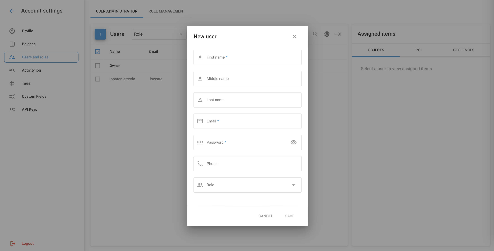

# Añadir usuarios a la cuenta

Los usuarios de la cuenta de la organización incluyen al Propietario y a los Usuarios. El Propietario es el titular principal de la cuenta con pleno control y derechos administrativos, mientras que los Usuarios son cuentas adicionales con funciones y permisos específicos asignados por el Propietario.

## Propietario y usuarios

El Propietario en Navixy es el titular de la cuenta principal con acceso y control total sobre la plataforma. Esta cuenta tiene el nivel más alto de permisos y puede realizar todas las tareas administrativas. El Propietario tiene derechos exclusivos que no pueden transferirse a otras cuentas, lo que garantiza que mantiene el control último sobre la cuenta.

El propietario puede limitar las operaciones disponibles para los usuarios:

* [Definición de las funciones de los usuarios](definir-las-funciones-de-los-usuarios.md) - especificar qué acciones pueden realizar los usuarios;
* [Limitar el acceso de los usuarios a la información](restringir-el-acceso-a-la-informacin.md) - controlar a qué dispositivos GPS y datos pueden acceder los usuarios.

Los usuarios son cuentas adicionales a las que el propietario concede acceso. Como cuentas subordinadas, los usuarios no pueden tener derechos específicos del propietario, incluyendo:

* Crear, editar o eliminar otros usuarios
* Editar dispositivos GPS, Geofences o Lugares a los que no pueden acceder
* Limitar el acceso del propietario a su cuenta

### **Ver y editar la lista de usuarios**

Para añadir un nuevo usuario o editar la lista de usuarios, vaya a Configuración de la cuenta → Usuarios y funciones en el menú principal.

1. **Añadir un nuevo usuario**:

* Haga clic en el botón "+" para añadir un nuevo usuario.
* Rellene los campos obligatorios: Nombre, Segundo nombre, Apellidos, Correo electrónico, Contraseña, Teléfono y [Papel](definir-las-funciones-de-los-usuarios.md).
* Haga clic en "Guardar" para crear el nuevo usuario.

3. **Editar la información del usuario**:

* Seleccione un usuario de la lista para ver sus datos.
* Modifique los campos necesarios y actualice la información del usuario.
* Haga clic en "Guardar" para aplicar los cambios.

4. **Asignación de elementos a los usuarios**:

* Después de seleccionar un usuario, puede [asignar objetos específicos, PDI y geocercas](restringir-el-acceso-a-la-informacin.md) a ellos.
* Elija los elementos de las pestañas respectivas (Objetos, PDI, Geocercas) y asígnelos al usuario.
