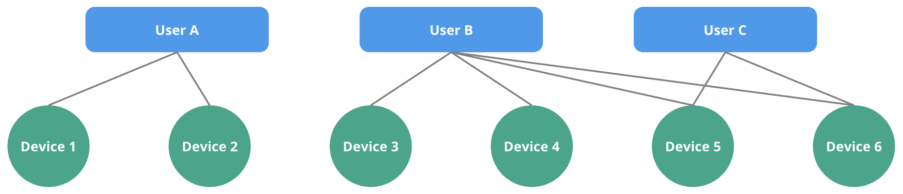

# Restringir el acceso a la información

Navixy permite a las organizaciones gestionar eficazmente el acceso a la información creada por los usuarios, incluidos los dispositivos GPS y los artefactos asociados, como geocercas, lugares y reglas de notificación. Esta capacidad es vital para mantener la seguridad de los datos y la eficiencia operativa, especialmente en organizaciones con múltiples divisiones o unidades de negocio. Este enfoque garantiza que:

* La información sensible está protegida de accesos no autorizados
* Los usuarios pueden centrarse en los datos y herramientas relevantes para sus funciones
* Se mantiene la eficiencia operativa en las distintas divisiones y unidades de negocio.

Este documento describe cómo se protegen los dispositivos GPS y la información creada por los usuarios y cómo se comparten con otros empleados de la organización.

## Dispositivos GPS

Cuando un usuario añade un dispositivo GPS, éste se crea efectivamente bajo la cuenta del Propietario, por lo que incluso después de que se elimine el usuario, el dispositivo GPS permanece en la cuenta de la organización. El Propietario puede especificar qué usuarios pueden ver los datos del dispositivo GPS, como los viajes o los datos de los sensores, lo que garantiza que sólo las personas autorizadas puedan ver y gestionar el dispositivo.

## Artefactos asociados

* **Normas de notificación**: Las reglas de notificación permiten a los usuarios configurar alertas basadas en diversos criterios, como el exceso de velocidad o la salida de una geo-valla. Cuando un usuario crea una regla, ésta se crea efectivamente en la cuenta del Propietario. Otros usuarios que tengan acceso al dispositivo en cuestión también podrán ver y utilizar estas reglas.
* **Lugares y geocercas**: Los usuarios pueden crear Lugares y Geocercas para definir áreas específicas de interés. Aunque estos artefactos son gestionados por el usuario que los creó, están efectivamente vinculados a la cuenta del Propietario. El Propietario puede conceder acceso a estas geo-vallas a otros usuarios dentro de la organización. Sólo los usuarios con los permisos adecuados pueden ver y modificar estas geovallas.
