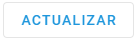
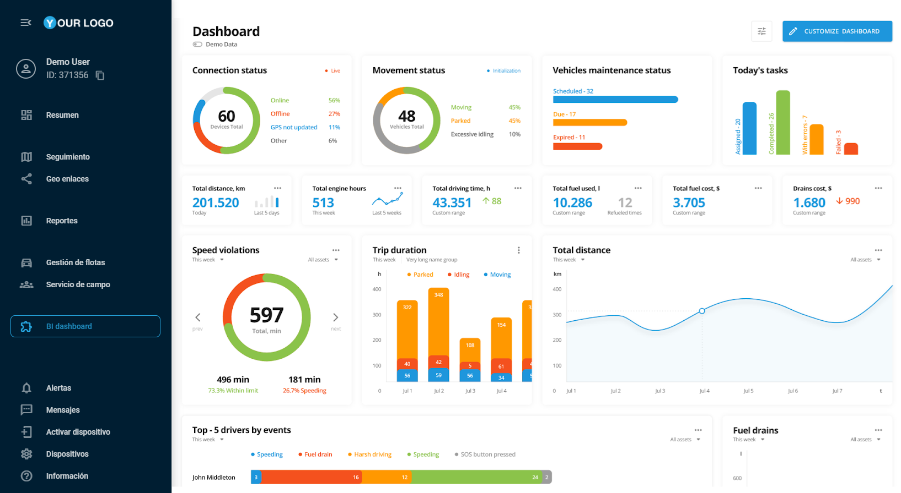

# Creación para nuevas Aplicaciones de usuario

Al configurar una nueva **Aplicación de usuario**, trabajarán con varias configuraciones clave que determinan cómo se integra su aplicación externa con la plataforma. Exploremos cada componente esencial:

Comience haciendo clic en el botón de la lista de **Aplicaciones de usuario**. En el formulario de configuración que aparece, siga los siguientes pasos:



### **Configurar la URL**

Especifique la URL de su aplicación: la dirección donde está alojada su aplicación, sirve de base para la integración.


**Importante**

* Asegúrese de que la URL es válida, utilice una conexión HTTPS, conduzca a una fuente de confianza y no contenga más de 1000 caracteres.
* Asegúrese de que la aplicación tenga activada la opción iFrame, de lo contrario no podrá abrirla en la interfaz de la plataforma.




### **Configurar parámetros básicos**

Para personalizar su aplicación, puede incluir varios parámetros en la URL. Puede añadir parámetros manualmente en el campo URL o utilizar una de nuestras sugerencias: idioma, ID de usuario o zona horaria. Haga clic en una sugerencia de parámetro para añadirla al final de la URL. Amplíe la descripción a continuación para obtener más información sobre los parámetros sugeridos y ejemplos.

Comprender los parámetros de URL sugeridos

Sugerimos algunos parámetros básicos para la personalización

1. `?locale={código_local}`\
   Parámetro de idioma que coincide automáticamente con el idioma de la plataforma del usuario.

* Ejemplo: `https://your-app.com/dashboard?locale=en`

2. `?user_id={identificador_de_usuario}`\
   Parámetro de contexto de usuario que pasa la identidad del usuario para filtrar la información personalizada.

* Ejemplo: `https://your-app.com/dashboard?user_id=12345`

3. `Zona horaria={zona horaria}`\
   Parámetro de hora que coincide automáticamente con la zona horaria de la plataforma del usuario.

* Ejemplo: `https://your-app.com/dashboard?timezone=UTC+1`

Puede editar el nombre del parámetro sugerido o especificar un valor determinado para él.


Prueba tu configuración para asegurarte de que la aplicación se carga correctamente. Haga clic  en para mostrar una vista previa.




### **Ajustar la apariencia**

Cree una identidad reconocible para su aplicación para que sea fácil acceder a ella. Los siguientes ajustes le ayudarán a hacerlo:

* **Etiqueta**: Añade un nombre único y descriptivo para tu aplicación (hasta 24 caracteres). Se mostrará en la barra lateral de la plataforma.
* **Descripción**: Añada una breve explicación con detalles sobre la funcionalidad de la aplicación o resalte información importante (hasta 50 caracteres). Una descripción informativa ayudará a los usuarios a comprender mejor el propósito de la aplicación.
* **Icono**: Seleccione un icono que represente la función de su aplicación para una navegación aún más nativa.



### **Seleccione el método de visualización**

Decida cómo se abrirá su aplicación eligiendo una de las dos opciones del desplegable **Abrir en**:

* **Integrada**: la aplicación aparece en la interfaz de la plataforma.
* **Nueva pestaña**: la aplicación se abre en otra pestaña del navegador.


Nuestra plataforma utiliza iFrame para la incrustación. Dado que no todas las URL pueden procesarse correctamente con esta tecnología, asegúrese de previsualizar el resultado de la incrustación. Si tiene algún problema con este método de visualización, considere la posibilidad de utilizar **Nueva pestaña**.




### **Configurar la autenticación (opcional)**

Configure la autenticación si su aplicación depende de la API de la plataforma. En este caso, la plataforma proporcionará los datos de autenticación directamente a la aplicación cuando se abra, eliminando la necesidad de implementar una funcionalidad de inicio de sesión adicional en el lado de tu aplicación.\
Puedes elegir uno de los dos métodos de autenticación:

* **Clave API**
  * Este método es para aplicaciones donde la gestión de roles o los permisos de usuario no son necesarios.
  * La clave API corresponde al nivel de acceso del propietario de la cuenta. Esto significa que proporcionar a un usuario común una clave API puede concederle acceso a **todos los datos** disponibles para el usuario principal.\
    Por ejemplo, si su aplicación trabaja con rastreadores a los que un usuario tiene derechos limitados o ningún acceso en absoluto, el uso de la clave API seguirá exponiendo todos los rastreadores de la cuenta principal.
* **Clave de sesión**
  * Este método se recomienda cuando se trata de la gestión de roles.
  * Transmite la clave de sesión del usuario actual a la aplicación.


Al seleccionar el método de la **clave API** se desactivará automáticamente el método de la **clave de sesión**, y viceversa. Solo se puede utilizar un método a la vez.


Cuando la autenticación está activada, la plataforma añade el parámetro `?session_key=` a la URL de tu aplicación.

* Si ha seleccionado una **clave API**, el valor del parámetro contendrá esta clave.
* Si ha optado por una **clave de sesión**, el valor del parámetro incluirá la clave de la sesión de usuario actual desde la que se accede a la aplicación.

Asegúrese de que la aplicación sea capaz de leer y utilizar este parámetro.



### **Guardar la nueva aplicación**

Haga clic en el botón **Guardar**. Su aplicación aparecerá en la lista de **Aplicaciones de usuario** y en la barra lateral de la plataforma. Las aplicaciones activadas estarán disponibles automáticamente para los usuarios de la cuenta.



Consejos rápidos para solucionar problemas

Si su aplicación no se muestra correctamente al incrustarla, pruebe:

* Abrirlo en una nueva pestaña
* Comprobar que su URL es correcta y accesible
* Comprobar que el formato correcto de todos los parámetros

Las aplicaciones creadas siguen siendo totalmente configurables una vez guardadas. Puede ajustar sus parámetros y apariencia en cualquier momento. Para obtener más información sobre la gestión de aplicaciones, consulte [Gestión de aplicaciones de usuario existentes](gestin-de-las-aplicaciones-de-usuario-existentes.md).
