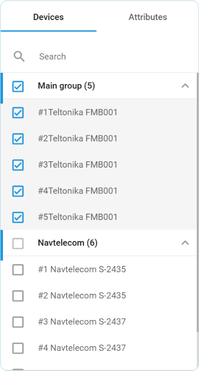
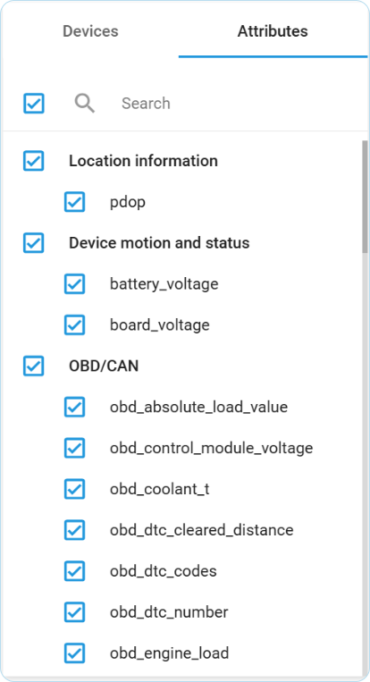
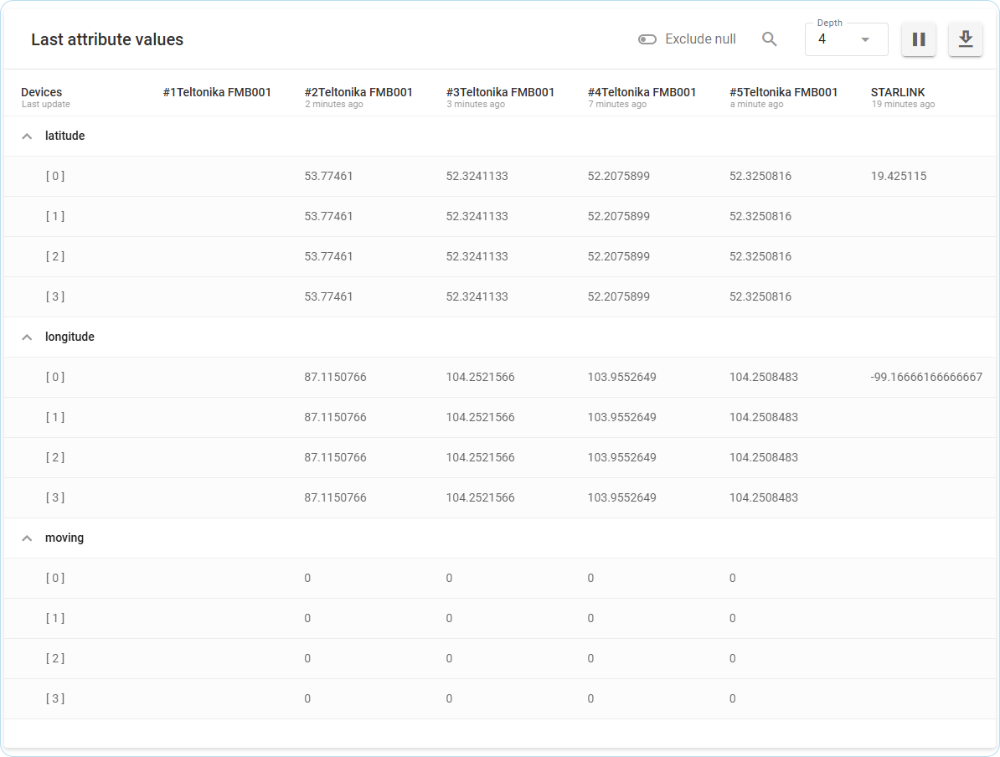

# Analizador de flujo de datos

**Analizador de flujo de datos** es una herramienta de solución de problemas especializada que proporciona diagnósticos en tiempo real para la transmisión de datos de dispositivos IoT. Cuando sus dispositivos no informan como se esperaba, esta potente herramienta permite la verificación y depuración inmediatas en toda su flota, independientemente del fabricante o el protocolo. Para una resolución eficaz de los problemas, puede:

* Realizar comprobaciones de estado en tiempo real de la transmisión de datos del dispositivo sin intervención del proveedor.
* Depurar atributos específicos mediante un análisis específico del flujo de datos.
* Validación de la integridad de los datos mediante el registro exhaustivo de valores (incluidos los valores nulos).
* Verificar los procesos de transformación de datos y los atributos calculados.
* Acceder a los volcados TCP y a los registros de nodos para realizar diagnósticos técnicos en profundidad.
* Referencia cruzada de múltiples fuentes de datos para identificar problemas de integración.

A diferencia de las soluciones convencionales de proveedores específicos, **Analizador de flujo de datos** ofrece compatibilidad universal de dispositivos y funciones de solución remota de problemas a través de una única interfaz técnica, lo que reduce significativamente el tiempo y la complejidad de los diagnósticos de dispositivos.


**Navegación**&#x20;

**Analizador de flujo de datos** está disponible para los **Propietarios** de cuentas en la sección **Ajustes** (de la cuenta). Para acceder a él:

1. Haga clic en el icono de perfil en la esquina superior izquierda de la pantalla para abrir la configuración de su cuenta
2. En la barra lateral de ajustes, seleccione **IoT Logic**
3. Abra el flujo cuyos datos desea supervisar en la lista **Flujo de datos**
4. Haga clic en


Profundicemos en todas las posibilidades y funciones que puede encontrar aquí.

## Espacio de trabajo principal

Las principales opciones de control de la herramienta Analizador están reunidas en el menú superior.

Flujo **de datos**: Esta lista le permite seleccionar un flujo ya creado en su cuenta. Este es el principal parámetro de agrupación, por lo que podrá buscar dispositivos y atributos que pertenezcan únicamente al flujo elegido.

**Modo**: Hay dos modos en la herramienta, y la vista de la herramienta depende del modo elegido.

* **Vista de tabla** (por defecto): Este modo muestra los datos descodificados de los dispositivos en formato tabular.
* **Registros de flujo** (próximamente): Este modo muestra registros generales, volcados TCP y registros de nodos en el flujo elegido. Se añadirá en las próximas iteraciones.


Las opciones anteriores están inactivas por el momento y contienen las selecciones por defecto. Estarán disponibles con nuevas mejoras de la funcionalidad de IoT Logic. Permanezca atento.


Al hacer clic en el botón **Cerrar**, volverá a la pantalla principal de IoT Logic.

Veamos ahora con más detalle las secciones de la interfaz y la información disponible en ellas.

## Vista de tabla

### Barra de menú superior

El menú superior contiene los principales controles de la vista de tabla.

**Excluir valores nulos**: Este ajuste permite alternar entre dos modos de visualización de datos:

* **Desactivado**: muestra todos los valores basados en paquetes recibidos del dispositivo, incluidos aquellos en los que el atributo seleccionado tiene valores nulos (ausentes). Este modo proporciona una vista completa de todos los datos de paquetes.
* **Activado**: Muestra sólo los paquetes en los que realmente se recibió información de los dispositivos para el atributo seleccionado, con valores válidos y no nulos. En otras palabras, filtra los datos incompletos.

**Largo de tabla**: Este control es responsable de la profundidad de los datos históricos y define el rango de datos recientes a mostrar. Por ejemplo, cuántos pasos hacia el pasado debemos recorrer para mostrar los valores de los atributos. El máximo es de 12 pasos en el pasado. Puede elegir cuántos pasos desea ver y comprobar cómo cambian los valores. Por ejemplo, si establece profundidad=4, verá los valores de tres pasos del pasado \[3], \[2], \[1] y los últimos valores recibidos \[0].

**Reproducir/Pausar**: Este botón le permite empezar a recibir actualizaciones de valores en la tabla en tiempo real, o pausar las actualizaciones.

**Buscar por valor**: Este campo se utiliza para buscar un valor específico entre todos los atributos de la tabla. El máximo es de 100 símbolos a buscar. Por ejemplo, si está comprobando el trabajo de los eventos y busca uno específico de un dispositivo que debería activarse, se resaltará el valor buscado.

**Exportar**: Puede exportar todos los registros utilizando el botón de exportación para compartir la información con otros especialistas. La información estará en formato JSON para facilitar su lectura.

### Bloque de dispositivos y atributos

El bloque izquierdo del menú contiene una lista de dispositivos y atributos pertenecientes al flujo elegido. Para pasar de una lista a otra, utilice los botones **Dispositivos** y **Atributos** situados en la parte superior de la lista. Puede buscar dispositivos por ID y atributos por su nombre.











Puede seleccionar hasta 10 dispositivos. Una vez seleccionados, se mostrarán todos los atributos soportados por estos dispositivos, permitiéndole elegir cualquier número para mostrar en la tabla. Sólo estarán disponibles los atributos relevantes para los dispositivos seleccionados.

### Tabla de últimos valores de atributos

La información sobre los valores recibidos por los dispositivos y atributos elegidos se mostrará en esta tabla.

La tabla proporciona información de la siguiente manera:

* La fila de cabecera de la tabla es una lista de los dispositivos elegidos para la monitorización. Estos dispositivos se convertirán en columnas que mostrarán valores de cada dispositivo.
* Las filas con nombres de atributos agruparán los datos del atributo elegido. La información recogida en la profundidad elegida de este atributo por cada dispositivo se mostrará a continuación.\
  La primera columna en filas bajo el nombre del atributo con números es responsable de la profundidad de los valores. Donde 0 es el actual, 1 es el anterior, y así sucesivamente.

Cuando pase el ratón por encima de cualquier valor, verá datos adicionales sobre cuándo fue generado este atributo por un dispositivo y cuándo fue recibido por la plataforma:

Una vez recibidos los nuevos valores de cualquier dispositivo, se resaltarán en verde durante unos 2 segundos. De este modo, podrá ver qué atributo de qué dispositivo se ha actualizado. Al hacer clic en la fila de un dispositivo se ampliará, mostrando los valores históricos limitados por la **Profundidad** establecida.

#### Lectura de la tabla

Interpretemos los valores de la tabla utilizando el ejemplo de caso mostrado en la captura de pantalla anterior y veamos qué información podemos obtener:

* El dispositivo **#1Teltonika FMB001** no devuelve ningún valor. Esto puede significar que el dispositivo no puede proporcionar este tipo concreto de datos. Compruebe si hay otros atributos con valores para este dispositivo, si no es así, asegúrese de que el dispositivo está conectado correctamente.
* Los dispositivos **#2Teltonika FMB001** - **#5Teltonika FMB001** devuelven valores coherentes, lo que indica que están conectados correctamente. Su ubicación puede determinarse utilizando los atributos de **latitud** y **longitud**. Dado que sus coordenadas permanecen invariables a lo largo de varios niveles de **Profundidad** recientes, los dispositivos son estacionarios. Así lo confirma el atributo de **movimiento**, que tiene un valor de **0**. Según estas observaciones, los datos parecen ser precisos y actualizados en tiempo real.
* El dispositivo **STARLINK** sólo proporcionó valores para un nivel de **Profundidad**, lo que sugiere que se conectó recientemente. La ausencia de valores para el atributo de **movimiento** probablemente indica que este dispositivo no tiene el sensor correspondiente.
