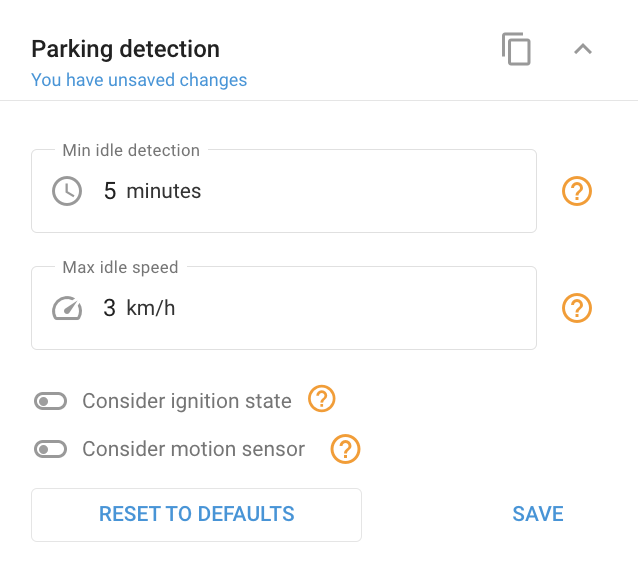

# Widget de detección de estacionado

La detección de estacionado identifica cuándo un objeto ha permanecido inmóvil durante un periodo de tiempo determinado y dentro de un umbral de velocidad establecido, utilizando datos GPS.

**Parámetros para la detección de estacionado:**

* **Tiempo mínimo de detección de inactividad** (`min_parking`): Es el tiempo mínimo que un objeto debe permanecer inmóvil para que se considere estacionado.
* **Velocidad máxima de ralentí** (`min_speed`): Es el umbral de velocidad por debajo del cual debe permanecer el objeto para ser detectado como estacionado.

Por defecto, estos parámetros están fijados en 5 minutos y 3 km/h, respectivamente.

**Condiciones de detección de estacionado:**

* **Por velocidad y tiempo**:\
  El estado de estacionado se detecta cuando la velocidad del objeto desciende por debajo del valor definido `min_speed` y permanece allí más tiempo que `min_parking`. Paradas más cortas que `min_parking` no se consideran estacionado y no interrumpirán el viaje.
* **Considerando el encendido**:
  * El viaje se inicia si la velocidad es mayor o igual a `min_speed` y el encendido está conectado.
  * El viaje finaliza si la velocidad cae por debajo de `min_speed` y el tiempo transcurrido supera `min_parking` o el encendido está desconectado.
* **Considerando sensor de movimiento**:
  * El viaje se inicia si la velocidad es mayor o igual a `min_speed` y el sensor de movimiento detecta movimiento.
  * El viaje finaliza si la velocidad cae por debajo de `min_speed` o el sensor de movimiento no detecta ningún movimiento, y el tiempo transcurrido es superior a `min_parking`.
* **Considerando tanto el movimiento como el encendido**:
  * El estado de encendido tiene prioridad sobre el sensor de movimiento.
  * El viaje se inicia si la velocidad es mayor o igual a `min_speed`y el sensor de movimiento detecta movimiento y el encendido está activado.
  * El viaje finaliza si la velocidad cae por debajo de `min_speed` o el sensor de movimiento no detecta ningún movimiento, y el tiempo transcurrido es superior a `min_parking` con el encendido desconectado.

Estos ajustes permiten afinar la detección de estacionado para reflejar con precisión el comportamiento del vehículo en el mundo real, minimizando las falsas detecciones y mejorando la precisión del seguimiento del viaje.
