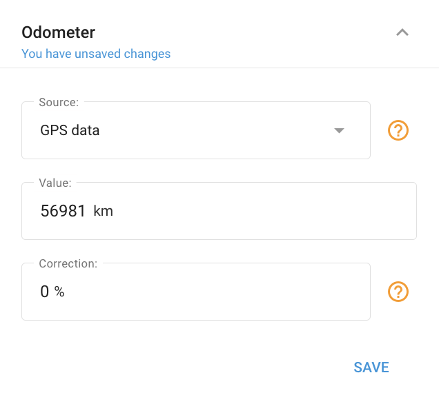

# Widget de odómetro

En el **Widget de odómetro** se permite controlar el kilometraje de un vehículo en tiempo real. Las lecturas del kilometraje pueden derivarse de los datos recibidos a través de un dispositivo de seguimiento GPS o del bus CAN. Además, la función de odómetro se integra con el [Mantenimiento de la flota](../../../gestin-de-flotas/mantenimiento.md) que le permite programar el mantenimiento de un vehículo y recibir recordatorios a tiempo.

## Activación del odómetro

Para activar el odómetro siga los siguientes pasos:

1. Abre la sección "Dispositivos y ajustes", selecciona el objeto deseado y navega hasta el widget Odómetro.
2. Haz clic en el botón "Añadir Odómetro".
3. Elija la fuente de datos apropiada. Las fuentes adicionales pueden estar disponibles después de crear un sensor de medición de kilometraje.
4. Ajuste el valor inicial del kilometraje.
5. Pulsa "Guardar".

## Corrección del Odómetro

* **Factor de corrección.** Puede establecer un factor de corrección para ajustar automáticamente las lecturas del odómetro al alza o a la baja. Introduzca un valor porcentual en el campo "Corrección". Un valor positivo aumentará las lecturas del odómetro, mientras que un valor negativo las disminuirá.
* **Actualizando valor.** También puede actualizar el valor del odómetro siempre que sea necesario. Los valores anteriores del odómetro se pueden ver generando el "Reporte sobre todos los eventos" en la app Reportes.
* **Acceso rápido en la vista Objeto.** Para un acceso rápido, se puede acceder al valor del odómetro y configurarlo en el widget específico en [Vista d](../../../seguimiento/lista-de-objetos/vista-detallada-del-objeto.md)[eta](../../../../../../wiki/pages/createpage.action)[l](../../../seguimiento/lista-de-objetos/vista-detallada-del-objeto.md)[l](../../../../../../wiki/pages/createpage.action)[a](../../../seguimiento/lista-de-objetos/vista-detallada-del-objeto.md)[d](../../../../../../wiki/pages/createpage.action)[a del](../../../seguimiento/lista-de-objetos/vista-detallada-del-objeto.md) [objet](../../../../../../wiki/pages/createpage.action)[o](../../../seguimiento/lista-de-objetos/vista-detallada-del-objeto.md).

## Añadir más fuentes de Odómetros

Los tipos de fuentes de odómetros que puede utilizar dependen del modelo específico de su dispositivo. Comprender y utilizar varias fuentes puede mejorar la precisión del seguimiento del kilometraje de tu vehículo.

Para añadir fuentes de odómetros adicionales:

1. **Cree un nuevo sensor de medición:** Dependiendo de las capacidades de su dispositivo, puede crear sensores tales como CAN Mileage o hardware mileage. Estos sensores recopilan datos directamente de los sistemas de tu vehículo, garantizando lecturas precisas del kilometraje.
2. **Integración con el widget de Odómetro:** Después de crear el sensor, aparecerá como una opción en el widget de odómetro dentro de la plataforma Navixy. Esto te permite elegir la fuente más adecuada para tus datos de kilometraje.

Al aprovechar múltiples fuentes de odómetros, puede mejorar la fiabilidad del seguimiento del kilometraje, lo que resulta especialmente útil para la programación del mantenimiento y la elaboración de reportes precisos. Comprender los diferentes tipos de fuentes y cómo integrarlas en su sistema es clave para optimizar su configuración telemática.
